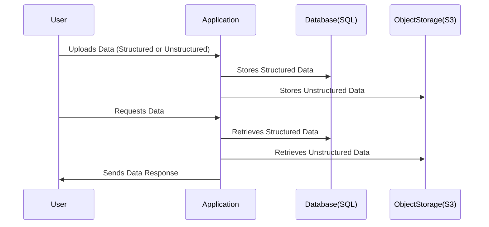

# **🏪 What is Data Storage? (Structured vs. Unstructured Data)**

## **🔍 Introduction**

Data Storage refers to how **digital information is stored, managed, and retrieved** on different types of storage systems. Understanding **structured and unstructured data** is key to choosing the right storage solution.

---

## **1️⃣ Types of Data Storage**

Data can be classified into **two main types**:

### **📊 Structured Data**

- Organized in a predefined **schema** (tables, rows, columns).
- Follows a strict format, making it **easier to query** using SQL.
- Example: **Databases, Spreadsheets, Data Warehouses.**

✅ **Characteristics:**

- Stored in **relational databases (RDBMS)** (MySQL, PostgreSQL, SQL Server).
- Uses **structured query languages (SQL)** for manipulation.
- Requires **data integrity and consistency** (ACID properties).

📌 **Examples:**

| ID  | Name  | Age | City  |
| --- | ----- | --- | ----- |
| 1   | Ahmed | 25  | Cairo |
| 2   | Sarah | 30  | Dubai |

---

### **📦 Unstructured Data**

- Does **not** follow a strict format or schema.
- Cannot be easily stored in traditional databases.
- Example: **Emails, Images, Videos, PDFs, IoT Data, Logs.**

✅ **Characteristics:**

- Stored in **object storage** (Amazon S3, Google Cloud Storage).
- Uses **NoSQL databases** (MongoDB, DynamoDB) for flexible storage.
- **Difficult to analyze directly** without processing.

📌 **Examples:**

- A **text document**: "Meeting notes from today."
- A **video file**: "meeting_recording.mp4"
- A **sensor log**: `{ "temp": 36.5, "humidity": 50 }`

---

## **2️⃣ Why is Data Storage Important?**

Data must be stored properly to ensure:
✅ **Security** – Protect against unauthorized access.  
✅ **Scalability** – Handle large amounts of data efficiently.  
✅ **Performance** – Allow fast retrieval for analysis.  
✅ **Durability** – Prevent data loss over time.

---

## **3️⃣ Differences Between Structured & Unstructured Data**

| Feature          | Structured Data 📊           | Unstructured Data 📦     |
| ---------------- | ---------------------------- | ------------------------ |
| **Format**       | Predefined schema            | No predefined structure  |
| **Storage Type** | Databases (SQL)              | Object Storage, NoSQL    |
| **Querying**     | SQL-based queries            | Custom search methods    |
| **Scalability**  | Moderate                     | Highly scalable          |
| **Examples**     | Sales records, Employee data | Videos, Images, IoT Logs |

---

## **4️⃣ How Does Data Storage Work?**

Here’s a **workflow** of how structured and unstructured data is stored:

📌 **Explanation:**

1. **User uploads data** (structured or unstructured).
2. The **application processes the data** and decides where to store it.
3. **Structured data** goes to a **relational database (SQL-based)**.
4. **Unstructured data** is stored in **object storage** (like Amazon S3).
5. When the **user requests data**, the application retrieves and returns it.

---

## **5️⃣ Benefits of Each Storage Type**

### **📊 Structured Data Benefits:**

✔ **Easier to manage and retrieve** using SQL.  
✔ **Ensures data consistency and integrity**.  
✔ **Efficient for transactional applications** (e.g., banking, e-commerce).

### **📦 Unstructured Data Benefits:**

✔ **Handles massive amounts of data efficiently**.  
✔ **Works well with AI, ML, and analytics**.  
✔ **Highly scalable for cloud storage solutions** (Amazon S3, Google Drive).

---

## **🎯 Summary**

- **Structured data** is organized and stored in relational databases.
- **Unstructured data** is flexible and stored in object storage.
- **Both types are essential**, depending on the use case.

🚀 **Next Step:** Would you like to explore **Object Storage (Amazon S3)** or **Data Warehousing (Amazon Redshift)** next?
