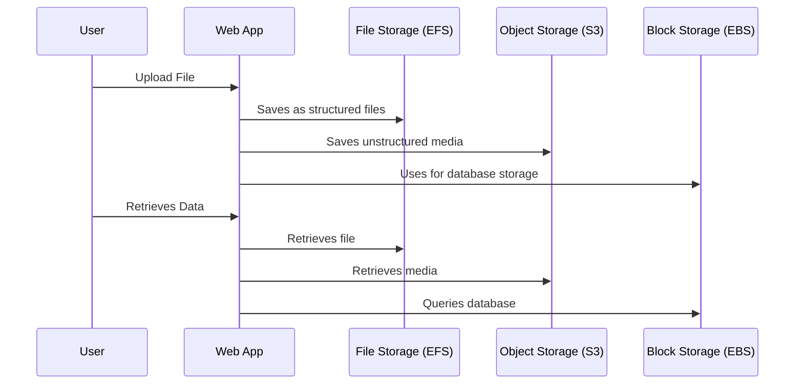

# **🗂️ File Storage vs. Object Storage vs. Block Storage – What's the Difference?**

## **🔍 Introduction**

When storing data in the cloud or on-premises, you need to choose between **File Storage, Object Storage, and Block Storage**. Each has different use cases and performance characteristics.

Think of them as **different ways of organizing your data**:

📁 **File Storage** → Like a file cabinet (organized folders & files).  
📦 **Object Storage** → Like a warehouse (stores data as objects with metadata).  
🔲 **Block Storage** → Like a hard drive (splits data into blocks for fast access).

---

## **1️⃣ What is File Storage? (Traditional Folder-Based) 📁**

File storage organizes data **in a hierarchy of directories and files**, like a computer’s filesystem.

✅ **Characteristics:**

- Uses **folders & directories** to manage files.
- Stores **structured & semi-structured data** (text, images, docs).
- Accessed using **NFS, SMB, or FTP** protocols.
- **Limited scalability** (not ideal for very large datasets).

📌 **Examples of File Storage:**

- **Network File Systems (NFS, SMB, CIFS).**
- **Amazon EFS (Elastic File System) – Cloud-based shared file storage.**
- **Google Cloud Filestore, Azure Files.**

📌 **Use Cases:**  
✔ Shared File Systems (e.g., company documents).  
✔ Content Management Systems (e.g., website images).  
✔ Application Configurations.

---

## **2️⃣ What is Object Storage? (Cloud-Based Scalable Storage) 📦**

Object storage **stores data as individual objects**, each with metadata and a unique identifier.

✅ **Characteristics:**

- Stores **structured & unstructured data** (videos, images, backups, logs).
- **Highly scalable** (petabytes of data).
- Uses **HTTP-based API access** instead of folders.
- **Metadata-rich**, allowing better categorization.
- **Not good for frequent updates** (best for storing & retrieving).

📌 **Examples of Object Storage:**

- **Amazon S3 (AWS Simple Storage Service).**
- **Google Cloud Storage, Azure Blob Storage.**

📌 **Use Cases:**  
✔ Backup & Archiving 📂  
✔ Storing Large Media Files 🎥  
✔ Data Lakes & Big Data Analytics 🌊

---

## **3️⃣ What is Block Storage? (Raw Disk Storage) 🔲**

Block storage **splits data into small chunks ("blocks") and distributes them across storage nodes**.

✅ **Characteristics:**

- Each block has a **unique address** (no metadata like object storage).
- High-speed **low-latency performance** (ideal for databases & VMs).
- Used in **virtual machines, cloud storage, and database storage**.
- Accessed via **iSCSI, Fibre Channel**.

📌 **Examples of Block Storage:**

- **Amazon EBS (Elastic Block Store) – Block storage for EC2.**
- **Azure Managed Disks, Google Persistent Disk.**

📌 **Use Cases:**  
✔ Virtual Machines (e.g., EC2 instances).  
✔ High-performance Databases.  
✔ Enterprise Applications.

---

## **4️⃣ Key Differences: File vs. Object vs. Block Storage**

| Feature            | File Storage 📁                | Object Storage 📦         | Block Storage 🔲                         |
| ------------------ | ------------------------------ | ------------------------- | ---------------------------------------- |
| **Data Structure** | Hierarchical (Folders & Files) | Flat (Objects & Metadata) | Blocks of Data                           |
| **Scalability**    | Limited                        | High                      | Moderate                                 |
| **Access Method**  | File Paths (NFS, SMB)          | API-based (HTTP)          | Low-level Storage (iSCSI, Fibre Channel) |
| **Best for**       | Shared Files & Docs            | Backups, Media, Big Data  | Databases, VMs                           |
| **AWS Example**    | Amazon EFS                     | Amazon S3                 | Amazon EBS                               |

---

## **5️⃣ How Do They Work in a Cloud Environment?**

Here’s a **workflow** showing how different storage types are used in an application.

📌 **Explanation:**  
1️⃣ **User uploads data** (text files, images, database records).  
2️⃣ The **web app decides** the best storage type:

- **File Storage (EFS)** for structured files.
- **Object Storage (S3)** for unstructured media.
- **Block Storage (EBS)** for databases.  
  3️⃣ **User retrieves data**, and the app fetches it from the right storage type.

---

## **6️⃣ When to Use What?**

| **Scenario**                     | **Best Storage Option** |
| -------------------------------- | ----------------------- |
| Shared document storage 📂       | ✅ File Storage (EFS)   |
| Storing backups & media files 🎥 | ✅ Object Storage (S3)  |
| High-performance database 🏦     | ✅ Block Storage (EBS)  |

---

## **🎯 Summary**

- **File Storage (EFS, NFS)** – Folder-based structure, ideal for shared storage.
- **Object Storage (S3, Blob Storage)** – Highly scalable, metadata-driven storage.
- **Block Storage (EBS, Persistent Disks)** – High-performance raw storage for VMs & databases.
- **Use all three** together based on workload needs.

🚀 **Next Step:** Do you want to explore **AWS Storage Services (Amazon S3, EBS, EFS) next, or move to Data Warehousing (Redshift)?**
