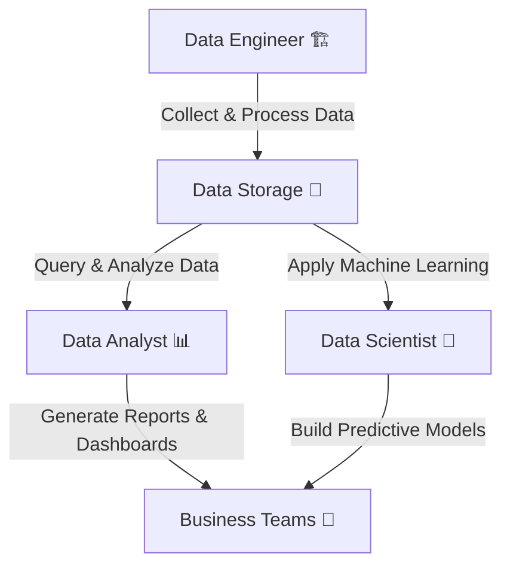

# **Data Engineer 🆚 Data Analyst 🆚 Data Scientist**

## **🔍 Introduction**

Data-driven organizations rely on three critical roles: **Data Engineers, Data Analysts, and Data Scientists**. Each role plays a unique part in the data lifecycle, from data collection and transformation to analysis and predictive modeling.

### **✅ Why Understanding These Roles Matters?**

- Helps businesses **build the right data team**.
- Guides professionals **choosing a career path**.
- Clarifies **how these roles collaborate** in data projects.

---

## **1️⃣ Data Engineer – The Architect of Data Pipelines**

### **📌 What is a Data Engineer?**

A Data Engineer **builds and maintains the infrastructure** that allows organizations to collect, store, and process large volumes of data efficiently.

### **🛠 Key Responsibilities**

✅ **Designing and maintaining data pipelines** (ETL & ELT).  
✅ **Building scalable data architectures** for storage & processing.  
✅ **Optimizing databases, warehouses, and data lakes**.  
✅ **Ensuring data quality, reliability, and security**.  
✅ **Integrating data from multiple sources** (APIs, logs, streaming).

### **📊 Common Tools & Technologies**

- **Data Processing**: Apache Spark, Apache Flink, AWS Glue, Airflow.
- **Data Storage**: Amazon S3, Google BigQuery, Snowflake, Redshift.
- **Streaming Data**: Apache Kafka, AWS Kinesis, Azure Event Hubs.
- **ETL & Orchestration**: dbt, Apache Airflow, Talend, Informatica.
- **Programming**: Python, SQL, Scala.

### **🧑‍💼 Who Should Become a Data Engineer?**

✅ Developers who enjoy **building scalable systems**.  
✅ Those who prefer **working with infrastructure & big data**.  
✅ Anyone who likes **solving performance & optimization challenges**.

---

## **2️⃣ Data Analyst – The Explorer of Business Insights**

### **📌 What is a Data Analyst?**

A Data Analyst **analyzes structured data to generate business insights**, build reports, and support decision-making.

### **🛠 Key Responsibilities**

✅ **Querying and analyzing datasets** to uncover trends and patterns.  
✅ **Creating dashboards and reports** for business intelligence.  
✅ **Communicating insights** to stakeholders.  
✅ **Data cleaning and validation** for accuracy.  
✅ **Using SQL, Excel, and visualization tools** for reporting.

### **📊 Common Tools & Technologies**

- **SQL & Databases**: PostgreSQL, MySQL, Snowflake, Redshift.
- **BI & Visualization**: Power BI, Tableau, Looker, Apache Superset.
- **Excel & Spreadsheets**: Advanced formulas, pivot tables.
- **Basic Python/R**: Pandas, NumPy for lightweight analysis.

### **🧑‍💼 Who Should Become a Data Analyst?**

✅ Anyone who enjoys **finding patterns in data**.  
✅ Professionals who like **creating dashboards and visual reports**.  
✅ Those who **prefer business-facing roles over backend development**.

---

## **3️⃣ Data Scientist – The Predictor of Future Trends**

### **📌 What is a Data Scientist?**

A Data Scientist **applies machine learning (ML) and statistics** to build predictive models that generate business insights.

### **🛠 Key Responsibilities**

✅ **Building predictive models & machine learning algorithms**.  
✅ **Applying statistics & data science techniques**.  
✅ **Experimenting with AI models** for pattern detection.  
✅ **Feature engineering & model evaluation**.  
✅ **Working with unstructured & structured data**.

### **📊 Common Tools & Technologies**

- **Programming & ML**: Python, R, TensorFlow, PyTorch, Scikit-Learn.
- **Big Data Processing**: Apache Spark MLlib, Databricks.
- **Model Deployment**: AWS SageMaker, Azure ML, Google Vertex AI.
- **Statistics & Visualization**: Jupyter Notebook, Matplotlib, Seaborn.

### **🧑‍💼 Who Should Become a Data Scientist?**

✅ People who enjoy **mathematics, statistics, and AI**.  
✅ Anyone passionate about **predictive analytics & ML models**.  
✅ Those who like **exploring complex datasets for future trends**.

---

## **4️⃣ Key Differences Between Data Engineer, Analyst, and Scientist**

| **Aspect**       | **Data Engineer** 🏗️                         | **Data Analyst** 📊                                 | **Data Scientist** 🔬                         |
| ---------------- | -------------------------------------------- | --------------------------------------------------- | --------------------------------------------- |
| **Main Focus**   | **Building data pipelines & infrastructure** | **Analyzing structured data for business insights** | **Applying ML & AI for predictive analytics** |
| **Programming**  | Python, SQL, Scala                           | SQL, Python (basic)                                 | Python, R, ML Libraries                       |
| **Key Skills**   | Database management, ETL, Big Data           | Data visualization, SQL queries                     | Machine learning, statistics, AI              |
| **Common Tools** | Kafka, Spark, Redshift, Airflow              | Tableau, Power BI, MySQL                            | TensorFlow, PyTorch, Jupyter                  |
| **Best For**     | Backend & infrastructure-focused developers  | Business-facing analysts                            | AI-driven researchers & statisticians         |

---

## **5️⃣ How These Roles Work Together in a Data Pipeline**

All three roles play essential parts in building a **data-driven organization**.

### **📌 Collaboration in Real-World Projects**

- **Data Engineers** build & maintain data pipelines.
- **Data Analysts** explore & visualize the data.
- **Data Scientists** apply machine learning for predictions.
- **Business teams use insights** for decision-making.

---

## **🚀 Conclusion: Which Role Should You Choose?**

✔ **Choose Data Engineering** if you love **building scalable systems & working with databases**.  
✔ **Choose Data Analysis** if you enjoy **finding insights & creating reports for business users**.  
✔ **Choose Data Science** if you want to **apply machine learning & predictive analytics**.

Would you like a **career roadmap** for transitioning into any of these roles? 🚀
