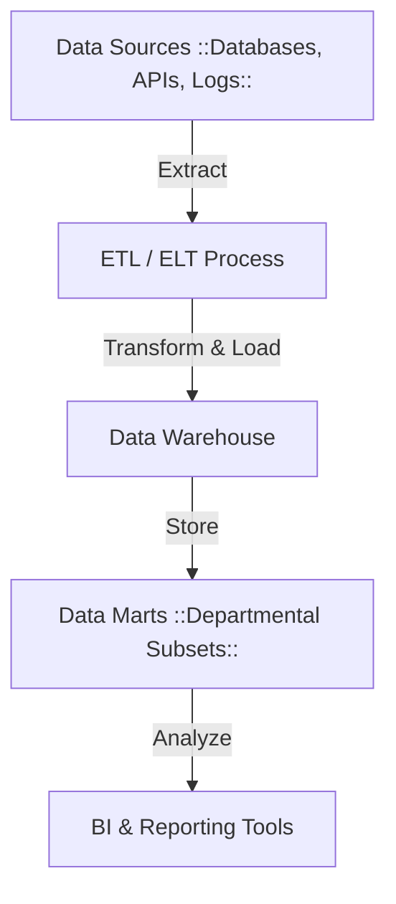

# **🏢 Data Warehouse – A Complete Guide**

## **1️⃣ What is a Data Warehouse?**

A **Data Warehouse (DWH)** is a **centralized repository** designed to store structured and processed data that is ready for analysis. It integrates data from multiple sources, providing a consistent and unified view of the organization's information, which can be used for business intelligence, reporting, and data analysis.

## **2️⃣ Why Do We Need a Data Warehouse?**

Organizations often struggle with **data accessibility, complexity, and inconsistency**, leading to inefficient decision-making. A **data warehouse** helps overcome these issues.

### **Common Problems Without a Data Warehouse**

❌ **"Yes, we have a lot of data, but we don't use it!"** – Data is stored but not utilized for insights.  
❌ **"Our data is very complicated and difficult to access."** – Multiple formats, inconsistent storage.  
❌ **"It's spread all over different systems and difficult to integrate."** – No single source of truth.  
❌ **"I just want to see what is happening in real time!"** – No centralized reporting.  
❌ **"We need to access data quickly and efficiently!"** – Poor query performance.  
❌ **"We want to make fact-based decisions!"** – Lack of structured, reliable analytics.

💡 A **Data Warehouse** solves these challenges by **consolidating, organizing, and optimizing** data for **business intelligence and analytics**.

---

## **3️⃣ Purpose, Requirements & Goals of a Data Warehouse**

### **📌 Purpose**

A Data Warehouse is built to:

- **Store historical data** from multiple sources.
- **Standardize data formats** for consistency.
- **Support decision-making** through analysis and visualization.
- **Improve query performance** for analytical workloads.

### **📌 Requirements**

A well-designed data warehouse should:

- **Handle large-scale data** efficiently.
- **Integrate with various data sources** (OLTP databases, APIs, logs).
- **Support time-series analysis** for historical trends.
- **Enable fast query performance** for reporting.
- **Be scalable and reliable** for business needs.

### **📌 Goals**

- **Enable business intelligence** for strategic decision-making.
- **Improve data accessibility** through a structured repository.
- **Provide a single source of truth** for analytics.
- **Ensure data security and governance**.

---

## **4️⃣ What is Business Intelligence (BI)?**

**Business Intelligence (BI)** is the process of transforming raw data into **meaningful insights** to support business decisions.

### **📌 How BI Relates to Data Warehousing**

A **Data Warehouse** serves as the foundation for BI, allowing organizations to:  
✔ **Analyze historical trends** (e.g., sales growth, customer behavior).  
✔ **Generate real-time dashboards** for performance tracking.  
✔ **Automate reporting** for stakeholders.  
✔ **Integrate machine learning and AI** for predictive analytics.

### **📌 Common BI Tools & Technologies**

| **Category**      | **Examples**                                          |
| ----------------- | ----------------------------------------------------- |
| **Visualization** | Tableau, Power BI, Looker                             |
| **Reporting**     | SQL Server Reporting Services (SSRS), Crystal Reports |
| **Analytics**     | Apache Superset, AWS QuickSight                       |
| **ETL Pipelines** | AWS Glue, Apache Airflow, dbt                         |

---

## **5️⃣ Data Warehouse Architecture**

A **Data Warehouse** follows a multi-layered architecture that ensures **efficient data ingestion, storage, and retrieval**.

### **📌 Data Warehouse Components**

- **Data Sources** → OLTP Databases, APIs, IoT, Logs, External Systems.
- **ETL/ELT Process** → Extract, Transform, Load (AWS Glue, Apache Nifi, dbt).
- **Data Warehouse** → Central storage (AWS Redshift, Snowflake, Google BigQuery).
- **Data Marts** → Subsets for specific departments (Finance, Sales, HR).
- **BI & Reporting Tools** → Power BI, Tableau, Looker for visualization.

---

## **6️⃣ Benefits of a Data Warehouse**

✔ **Improves decision-making** with historical insights.  
✔ **Enhances performance** compared to OLTP systems.  
✔ **Ensures data consistency** across business units.  
✔ **Supports AI & machine learning** on structured datasets.  
✔ **Enables cross-functional analysis** using BI tools.

---

## **🚀 Summary – Key Takeaways**

✔ **A Data Warehouse centralizes and optimizes data for analytics.**  
✔ **Uses ETL/ELT to integrate data from multiple sources.**  
✔ **Follows architectures like EDW, ODS, or Data Marts.**  
✔ **Cloud solutions (Redshift, BigQuery, Snowflake) simplify scalability.**  
✔ **Supports business intelligence, reporting, and AI-driven insights.**

Would you like a **deep dive into Data Warehouse Layers** or a **comparison between Data Warehouses vs. Data Lakes**? 🚀
