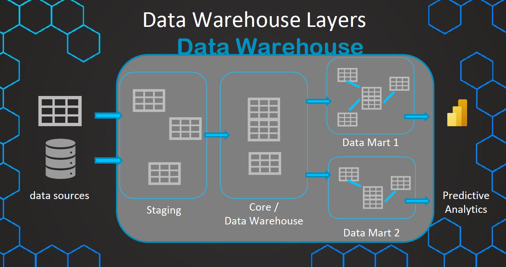
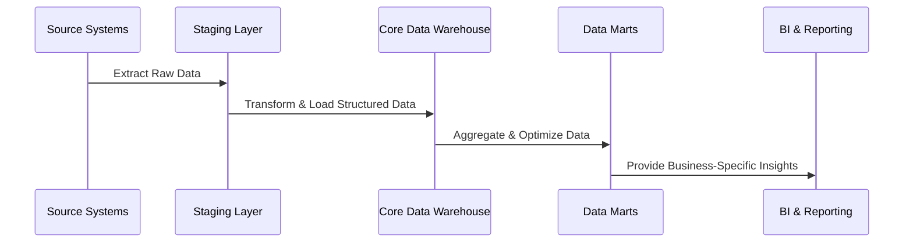

# **🏢 Data Warehouse Layers – A Complete Breakdown**

    

A **Data Warehouse (DWH)** is structured into **layers** to ensure efficient **data ingestion, storage, transformation, and analysis**. These layers provide a **logical separation** between different stages of data processing, ensuring data quality and performance.

**🤔 Why Do We Need Data Warehouse Layers?**

✔ **Improves data organization** and accessibility.  
✔ **Enhances query performance** by structuring data efficiently.  
✔ **Supports ETL (Extract, Transform, Load) processes** effectively.  
✔ **Ensures data integrity and consistency** across reports.  
✔ **Facilitates better governance and security** in data management.

---

## **🏛️ Data Warehouse Layers Overview**

A **typical Data Warehouse** consists of three main layers:

1️⃣ **Staging Layer** – Raw data ingestion.  
2️⃣ **Core Data Warehouse (DWH) Layer** – Processed, structured data storage.  
3️⃣ **Data Mart Layer** – Business-specific reporting and analytics.

---

## **1️⃣ Staging Layer – The Raw Data Repository**

### **📌 What is the Staging Layer?**

The **Staging Layer** is where **raw data** from various source systems is **extracted** and **temporarily stored** before transformation. This layer acts as a buffer, ensuring that **data quality issues are resolved** before moving data further.

### **✅ Key Functions of the Staging Layer**

✔ **Stores raw, unprocessed data.**  
✔ **Handles data cleaning & deduplication.**  
✔ **Acts as a buffer between source systems and the DWH.**  
✔ **Supports incremental and batch processing.**

### **🔧 Example in Retail Data Warehouse**

| **Column**         | **Description**                 |
| ------------------ | ------------------------------- |
| `transaction_id`   | Unique ID for each transaction  |
| `product_id`       | Identifier for the product sold |
| `timestamp`        | Time of transaction             |
| `raw_price`        | Price before discount           |
| `discount_applied` | Discount applied, if any        |

### **🚀 ETL in the Staging Layer**

**ETL (Extract, Transform, Load) Process in Staging Layer:**

- 1️⃣ **Extract Data** from sources (OLTP databases, APIs, logs).
- 2️⃣ **Validate & Clean Data** (handle missing values, remove duplicates).
- 3️⃣ **Store Temporarily** before transformation.

---

## **2️⃣ Core Data Warehouse Layer – The Structured Data Hub**

### **📌 What is the Core Data Warehouse Layer?**

The **Core DWH Layer** is where **structured and transformed data** is stored in an **optimized schema** (Star Schema or Snowflake Schema). This is the main storage for **historical and analytical data**.

### **✅ Key Functions of the Core DWH Layer**

✔ **Stores structured, historical data.**  
✔ **Implements data models (Fact & Dimension tables).**  
✔ **Enables efficient OLAP (Online Analytical Processing).**  
✔ **Ensures consistency and accuracy in reporting.**

### **📊 Example Schema in Core Data Warehouse**

| **Fact_Sales** (Fact Table)      |
| -------------------------------- |
| `transaction_id` (PK)            |
| `date_id` (FK to Dim_Date)       |
| `product_id` (FK to Dim_Product) |
| `sales_amount`                   |
| `quantity_sold`                  |

| **Dim_Product** (Dimension Table) |
| --------------------------------- |
| `product_id` (PK)                 |
| `product_name`                    |
| `category`                        |
| `brand`                           |

### **🚀 ETL in the Core DWH Layer**

**ETL (Extract, Transform, Load) Process in Core DWH:**

- 1️⃣ **Transform Data** – Apply business rules, create calculated fields.
- 2️⃣ **Normalize & Optimize Storage** – Star Schema / Snowflake Schema.
- 3️⃣ **Load Data** – Insert into Fact & Dimension tables.

---

## **3️⃣ Data Mart Layer – The Business-Specific View**

### **📌 What is the Data Mart Layer?**

A **Data Mart** is a **subset of the Data Warehouse** that contains **filtered, business-specific data** for end users. It is designed for **faster querying and reporting**.

### **✅ Key Functions of the Data Mart Layer**

✔ **Optimized for specific business needs (e.g., Sales, Finance, Marketing).**  
✔ **Pre-aggregated for fast reporting.**  
✔ **Used by Business Intelligence tools for analysis.**  
✔ **Enhances performance by reducing complex queries.**

### **📊 Example: Sales Data Mart**

| **Column**            | **Description**                |
| --------------------- | ------------------------------ |
| `date_id`             | Date of transaction            |
| `total_sales`         | Total sales amount for the day |
| `region`              | Sales region                   |
| `top_selling_product` | Best-performing product        |

### **🚀 ETL in the Data Mart Layer**

**ETL (Extract, Transform, Load) Process in Data Mart:**

- 1️⃣ **Filter Relevant Data** – Extract business-specific information.
- 2️⃣ **Aggregate Metrics** – Summarize data (e.g., total sales by region).
- 3️⃣ **Load into Data Mart Tables** – Optimize for BI tools (Power BI, Tableau).

---

## **🤔 Where Does ETL Work in a Data Warehouse?**

### **📌 ETL (Extract, Transform, Load) Process Across Layers**

| **Layer**           | **ETL Function**                                             |
| ------------------- | ------------------------------------------------------------ |
| **Staging Layer**   | Extracts raw data, cleans and validates it.                  |
| **Core DWH Layer**  | Transforms and structures data into Fact & Dimension tables. |
| **Data Mart Layer** | Aggregates and optimizes data for fast querying.             |

---

## **🚀 Summary – Key Takeaways**

✔ **Data Warehouses are structured into Staging, Core DWH, and Data Mart Layers.**  
✔ **Each layer has a specific role in storing, transforming, and optimizing data.**  
✔ **ETL processes ensure smooth data flow across layers.**  
✔ **Data Marts provide fast and business-specific insights.**  
✔ **BI tools use Data Marts for reporting and analytics.**
