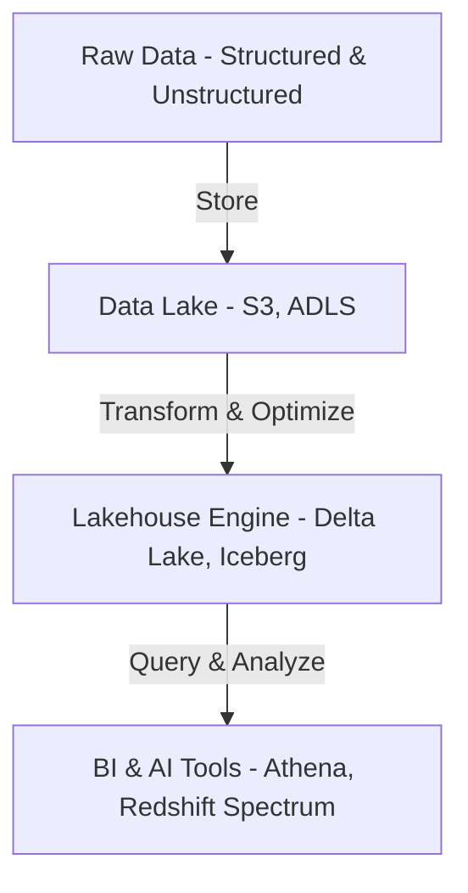

# **🏢 Data Warehouse vs. Data Lake – Understanding the Differences**

## **1️⃣ What is a Data Warehouse?**

A **Data Warehouse (DWH)** is a **centralized, structured database** designed for **analytical processing and business intelligence (BI)**. It stores **historical data** in a **structured format** optimized for **querying, reporting, and analysis**.

### **✅ Key Features of a Data Warehouse**

✔ **Schema-on-Write** – Data is structured before ingestion.  
✔ **Optimized for Analytical Queries** – Fast querying and aggregations.  
✔ **Stores Historical Data** – Maintains structured past data for reporting.  
✔ **Supports Business Intelligence (BI)** – Works with tools like Power BI, Tableau.  
✔ **Uses Structured & Semi-Structured Data** – Works best with predefined schemas.

### **📊 Example of a Data Warehouse**

- **Retail Company** → Stores sales transactions in a structured way.
- **Banking System** → Maintains customer transaction history for fraud detection.
- **Healthcare** → Stores patient records for historical analysis.

---

## **2️⃣ What is a Data Lake?**

A **Data Lake** is a **centralized repository** that stores **structured, semi-structured, and unstructured data** at **any scale**. It is designed to support **big data processing, machine learning, and real-time analytics**.

### **✅ Key Features of a Data Lake**

✔ **Schema-on-Read** – Data is stored as-is and structured when needed.  
✔ **Handles Large-Scale Data** – Supports structured, semi-structured, and unstructured data.  
✔ **Designed for Big Data & AI** – Supports machine learning & real-time analytics.  
✔ **Cost-Effective Storage** – Uses low-cost object storage (e.g., Amazon S3, Azure Data Lake).  
✔ **Highly Scalable & Flexible** – Suitable for streaming and batch processing.

### **📊 Example of a Data Lake**

- **IoT & Sensor Data** → Stores unstructured logs from connected devices.
- **Social Media Analytics** → Processes images, videos, and text from platforms.
- **Machine Learning Pipelines** → Stores raw and processed datasets for AI models.

---

## **3️⃣ Data Warehouse vs. Data Lake – Key Differences**

| Feature          | **Data Warehouse** 🏢                             | **Data Lake** 🌊                          |
| ---------------- | ------------------------------------------------- | ----------------------------------------- |
| **Data Type**    | Structured, Semi-Structured                       | Structured, Semi-Structured, Unstructured |
| **Schema**       | Schema-on-Write (Structured Before Storage)       | Schema-on-Read (Structured at Query Time) |
| **Processing**   | Optimized for OLAP (Online Analytical Processing) | Optimized for Big Data & Machine Learning |
| **Storage Cost** | Expensive (Columnar Storage)                      | Cheap (Object Storage)                    |
| **Performance**  | Fast queries on structured data                   | Slower on raw data (without indexing)     |
| **Use Cases**    | BI Reporting, Dashboards                          | Big Data Processing, AI, ML               |
| **Data Quality** | High (Clean & Consistent)                         | Low (Raw, Needs Processing)               |
| **Technology**   | AWS Redshift, Google BigQuery, Snowflake          | AWS S3, Azure Data Lake, Apache Hadoop    |

---

## **4️⃣ When to Use a Data Warehouse vs. Data Lake?**

### **📌 Use a Data Warehouse When:**

✔ **You need structured, high-quality data** for reporting & analytics.  
✔ **Your queries require fast response times** (e.g., executive dashboards).  
✔ **Your organization relies on BI tools** like Tableau, Power BI, Looker.  
✔ **You need historical tracking** of business transactions.

### **📌 Use a Data Lake When:**

✔ **You handle large volumes of raw data** (IoT, logs, social media).  
✔ **You use AI/ML applications** that need flexible data processing.  
✔ **You work with semi-structured or unstructured data** (JSON, images, audio).  
✔ **You want cost-effective storage** for massive datasets.

---

## **5️⃣ Modern Approach – The Data Lakehouse**

A **Data Lakehouse** combines the best of **Data Warehouses and Data Lakes**.

✅ **Stores raw and structured data in the same system.**  
✅ **Allows schema evolution (flexible schema-on-read).**  
✅ **Supports BI and AI/ML workloads simultaneously.**  
✅ **Example Technologies: Apache Iceberg, Delta Lake, AWS Athena.**

---

## **🚀 Summary – Key Takeaways**

✔ **Data Warehouses** are structured, optimized for BI & analytics.  
✔ **Data Lakes** store all types of data, optimized for big data & ML.  
✔ **Data Lakehouses** combine the strengths of both approaches.  
✔ **Choose the right solution** based on business needs, cost, and flexibility.
