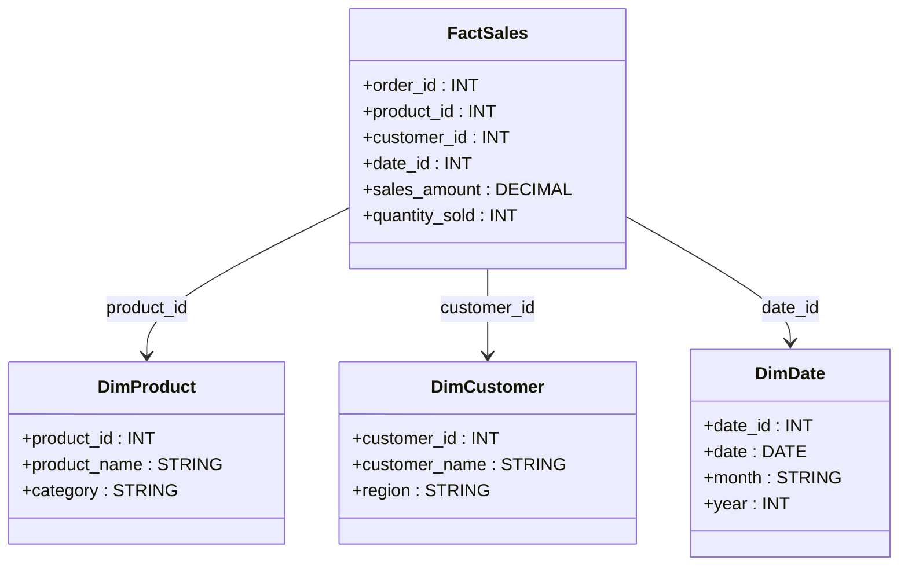

# **🏢 Dimension Modeling in Data Warehousing – A Professional Guide**

## **🔍 Introduction to Dimension Modeling**

Dimension Modeling is a **technique used in data warehousing** to optimize **data organization, storage, and retrieval** for analytical processing. It structures data into **fact and dimension tables**, enabling efficient query performance and business intelligence insights.

### **✅ Why is Dimension Modeling Important?**

- **Enhances query performance** in large data warehouses.
- **Simplifies data retrieval** for analytical queries.
- **Reduces data redundancy** while maintaining high-speed access.
- **Supports Business Intelligence (BI)** and reporting tools.
- **Provides a structured format** for historical data analysis.

---

## **1️⃣ Key Concepts in Dimension Modeling**

### **📌 1. Fact Tables vs. Dimension Tables**

| **Concept**       | **Fact Table 📊**                                                     | **Dimension Table 📂**                                                    |
| ----------------- | --------------------------------------------------------------------- | ------------------------------------------------------------------------- |
| **Purpose**       | Stores **measurable numerical data** (e.g., sales, revenue, quantity) | Stores **descriptive attributes** (e.g., product names, customer details) |
| **Granularity**   | High-volume, transactional data                                       | Low-volume, static reference data                                         |
| **Examples**      | Sales Amount, Order Count, Website Clicks                             | Customer Name, Product Category, Store Location                           |
| **Primary Key?**  | **Yes, a composite key** (combining foreign keys)                     | **Yes, a single primary key**                                             |
| **Foreign Keys?** | **Yes, refers to dimension tables**                                   | **No foreign keys, only descriptive data**                                |

#### **📌 Example Schema: E-commerce Sales Data**

📌 **FactSales** stores sales transactions, while **DimProduct, DimCustomer, and DimDate** store descriptive attributes.

---

## **2️⃣ Dimension Modeling Techniques**

### **📌 1. Star Schema ⭐**

The **simplest and most commonly used** dimension model. It consists of **a single fact table connected to multiple dimension tables**.

✅ **Pros**:

- Simple structure, easy to query.
- Optimized for **BI and analytical tools**.
- Fast query performance.

❌ **Cons**:

- Can cause **data redundancy** in dimension tables.

**Example:**

- A **sales fact table** connected to **product, customer, time, and store dimension tables**.

### **📌 2. Snowflake Schema ❄️**

A **normalized version** of the Star Schema, where **dimension tables are further divided into sub-dimensions** to reduce redundancy.

✅ **Pros**:

- **Reduces data redundancy** by normalizing dimensions.
- **Saves storage space**.

❌ **Cons**:

- More complex queries due to multiple joins.
- Slightly slower query performance than Star Schema.

**Example:**

- Instead of a **flat customer table**, we split it into **Customer (customer_id, name, region_id) and Region (region_id, region_name)**.

---

## **3️⃣ Advanced Dimension Modeling Concepts**

### **📌 1. Slowly Changing Dimensions (SCD)**

In real-world data, dimension attributes **change over time**. **Slowly Changing Dimensions (SCDs)** help track these changes.

| **SCD Type**   | **Definition**                                 | **Example**                                                        |
| -------------- | ---------------------------------------------- | ------------------------------------------------------------------ |
| **SCD Type 1** | Overwrites old data, no history                | Customer name change updates directly                              |
| **SCD Type 2** | Keeps historical records using versioning      | Customer address change creates a new record with `effective_date` |
| **SCD Type 3** | Stores both old and new values in the same row | Keeps `previous_address` and `current_address` in the same row     |

### **📌 2. Junk Dimensions**

Stores miscellaneous attributes that do not fit into a specific dimension table.

Example: Storing **order status (New, Pending, Shipped)** in a **junk dimension** instead of in the fact table.

### **📌 3. Role-Playing Dimensions**

A dimension table that is reused in multiple contexts.

Example: A **Date Dimension** can be used as **Order Date, Shipping Date, and Payment Date**.

---

## **4️⃣ Real-World Use Case: Retail Data Warehouse**

### **📌 Scenario:**

A **retail company** wants to analyze its sales performance across different stores, products, and customer segments.

### **📌 Solution:**

1️⃣ **Star Schema Design:** Create **FactSales** with **DimProduct, DimCustomer, DimStore, and DimDate**.  
2️⃣ **Slowly Changing Dimension (SCD Type 2):** Track **customer address changes** over time.  
3️⃣ **Partitioning & Indexing:** Optimize large datasets for fast query execution.

---

## **🚀 Summary: Why Use Dimension Modeling?**

✔ **Optimized for fast querying** in analytical databases.  
✔ **Supports Business Intelligence (BI)** with structured relationships.  
✔ **Minimizes data redundancy** with Snowflake Schema.  
✔ **Tracks historical changes** with Slowly Changing Dimensions (SCDs).  
✔ **Improves performance** by reducing table joins in queries.

Would you like a **step-by-step guide** on implementing a **Star Schema in AWS Redshift or Snowflake**? 🚀
