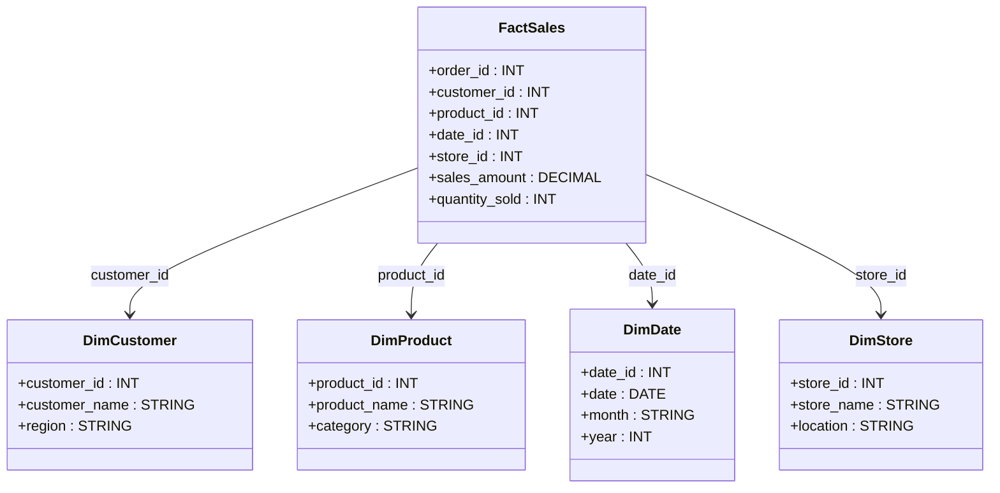

# **⭐ Star Schema in Data Warehousing – A Detailed Guide**

## **🔍 What is a Star Schema?**

A **Star Schema** is the most common and simplest data modeling technique used in data warehousing. It consists of **one central fact table** surrounded by **multiple dimension tables**, forming a star-like structure.

### **✅ Why Use Star Schema?**

✔ **Fast query performance** due to fewer joins.  
✔ **Easy to understand and implement** for analysts.  
✔ **Optimized for OLAP (Online Analytical Processing) and BI tools.**  
✔ **Works well with aggregate queries, reporting, and dashboards.**

---

## **1️⃣ Structure of a Star Schema**

A Star Schema consists of:

- **Fact Table** 📊 – Stores numerical, measurable data (e.g., sales amount, order count, revenue).
- **Dimension Tables** 📂 – Store descriptive attributes (e.g., product names, customer details, time periods).

### **📌 Example: E-commerce Sales Data**



📌 **FactSales stores transactional data**, while **DimCustomer, DimProduct, DimDate, and DimStore** store descriptive attributes.

---

## **2️⃣ Fact Table in Star Schema**

A **Fact Table** contains **quantifiable data** and references **dimension tables** through foreign keys.

### **📌 Fact Table: `FactSales`**

| **Column**      | **Data Type** | **Description**              |
| --------------- | ------------- | ---------------------------- |
| `order_id`      | INT           | Unique transaction ID        |
| `customer_id`   | INT           | Foreign key to `DimCustomer` |
| `product_id`    | INT           | Foreign key to `DimProduct`  |
| `date_id`       | INT           | Foreign key to `DimDate`     |
| `store_id`      | INT           | Foreign key to `DimStore`    |
| `sales_amount`  | DECIMAL(10,2) | Total sale value             |
| `quantity_sold` | INT           | Number of items sold         |

### **📌 Example Fact Table Data**

| order_id | customer_id | product_id | date_id | store_id | sales_amount | quantity_sold |
| -------- | ----------- | ---------- | ------- | -------- | ------------ | ------------- |
| 1001     | 201         | 301        | 5001    | 101      | 150.00       | 2             |
| 1002     | 202         | 302        | 5002    | 102      | 230.00       | 3             |
| 1003     | 203         | 303        | 5003    | 101      | 75.00        | 1             |

---

## **3️⃣ Dimension Tables in Star Schema**

Dimension tables **store descriptive attributes** and are used for filtering, grouping, and aggregating data.

### **📌 Example Dimension Tables**

#### **DimCustomer Table** (Customer Information)

| customer_id | customer_name | region |
| ----------- | ------------- | ------ |
| 201         | John Doe      | North  |
| 202         | Jane Smith    | West   |
| 203         | Alice Brown   | East   |

#### **DimProduct Table** (Product Information)

| product_id | product_name | category    |
| ---------- | ------------ | ----------- |
| 301        | Laptop       | Electronics |
| 302        | Phone        | Electronics |
| 303        | Chair        | Furniture   |

#### **DimDate Table** (Date Information)

| date_id | date       | month | year |
| ------- | ---------- | ----- | ---- |
| 5001    | 2023-01-01 | Jan   | 2023 |
| 5002    | 2023-01-02 | Jan   | 2023 |
| 5003    | 2023-01-03 | Jan   | 2023 |

---

## **4️⃣ Querying Data from a Star Schema**

### **📌 SQL Query Example: Total Sales per Region**

```sql
SELECT c.region, SUM(f.sales_amount) AS total_sales
FROM FactSales f
JOIN DimCustomer c ON f.customer_id = c.customer_id
GROUP BY c.region;
```

### **📌 SQL Query Example: Top-Selling Products**

```sql
SELECT p.product_name, SUM(f.quantity_sold) AS total_sold
FROM FactSales f
JOIN DimProduct p ON f.product_id = p.product_id
GROUP BY p.product_name
ORDER BY total_sold DESC;
```

---

## **5️⃣ Benefits & Limitations of Star Schema**

### **✅ Benefits**

- **Fast query performance** due to fewer joins.
- **Simple and intuitive** design for analysts.
- **Works well with BI tools** (Power BI, Tableau, Looker).
- **Optimized for read-heavy analytical queries.**

### **❌ Limitations**

- **Data redundancy** due to de-normalized dimension tables.
- **Not suitable for complex relationships** (use Snowflake Schema instead).
- **Can be inefficient for transactional updates** due to redundant storage.

---

## **6️⃣ When to Use Star Schema?**

| **Use Star Schema When...**                 | **Avoid Star Schema When...**                       |
| ------------------------------------------- | --------------------------------------------------- |
| You need **fast queries** for reporting     | Your data is highly **normalized**                  |
| Data redundancy is acceptable               | You have **complex relationships** between entities |
| You want easy integration with **BI tools** | Storage optimization is a priority                  |
| Your data is primarily **read-intensive**   | Your system requires **frequent updates**           |

---

## **🚀 Summary – Key Takeaways**

✔ **Fact Tables store numbers (measurable data).**  
✔ **Dimension Tables store descriptive attributes.**  
✔ **Star Schema is fast & simple – great for BI & reporting.**  
✔ **Use Star Schema for read-heavy queries and analytics.**  
✔ **Denormalized design improves performance but increases storage.**

Would you like to see **performance tuning tips** or **best practices for large-scale Star Schema implementations**? 🚀
