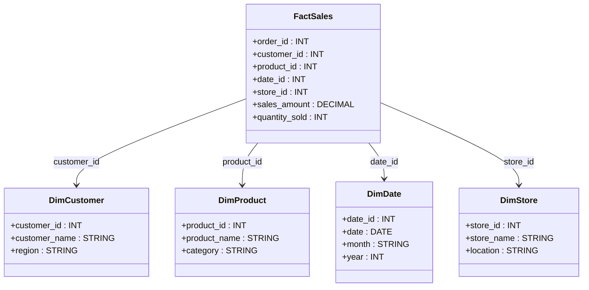
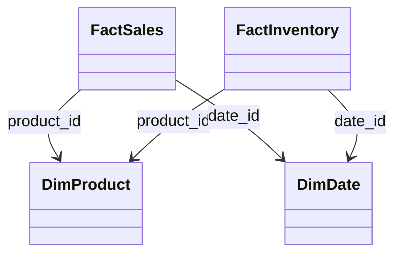

# **🏗️ Converting a Database to Star Schema – Challenges & Best Practices**

## **🔍 Introduction**

Converting a traditional **relational database** to a **Star Schema** is essential for improving **query performance, reporting, and analytics**. However, this process comes with **many challenges**, including **data extraction, transformation, relationships, and normalization trade-offs**.

This guide covers **how to design, transform, and extract data into a Star Schema**, and how to handle **multiple fact tables, relationships, and performance tuning**.

---

## **1️⃣ Understanding the Differences: OLTP vs. OLAP**

| **Aspect**        | **OLTP (Traditional Databases)** | **OLAP (Star Schema in Data Warehousing)** |
| ----------------- | -------------------------------- | ------------------------------------------ |
| **Purpose**       | Transactional operations         | Analytical processing                      |
| **Normalization** | Highly normalized (3NF)          | Denormalized (Fact & Dimension Tables)     |
| **Tables**        | Many small tables, complex joins | Fewer, larger tables, simpler joins        |
| **Performance**   | Optimized for insert/update      | Optimized for fast read queries            |
| **Use Case**      | Banking, e-commerce, CRM         | Business intelligence, dashboards          |

---

## **2️⃣ Steps to Convert a Relational Database to Star Schema**

### **📌 Step 1: Identify Business Requirements**

- What reports and analytics are needed?
- Define **KPIs (Key Performance Indicators)**.
- Identify **main aggregations (e.g., total sales, customer retention)**.

### **📌 Step 2: Identify Fact & Dimension Tables**

- **Fact Table** → Contains numerical/measurable data (e.g., sales amount, clicks, orders).
- **Dimension Tables** → Contain descriptive attributes (e.g., customer name, product name, time, location).

### **📌 Step 3: Data Extraction & Cleaning**

- Extract data from the **OLTP system** (source databases: MySQL, PostgreSQL, Oracle, etc.).
- Remove duplicates, incorrect data, and inconsistent records.
- Format **date, currency, and categorical values consistently**.

### **📌 Step 4: Transform Data for Star Schema**

- Denormalize tables **by merging related tables into dimensions**.
- Assign **surrogate keys** (integer primary keys) to dimension tables.
- Store **aggregated values** in fact tables to improve performance.

### **📌 Step 5: Load Data into the Warehouse**

- Load **dimension tables first**, then **fact tables** (ensuring foreign key consistency).
- Implement **indexing and partitioning** for faster query performance.
- Use **ETL tools** (Apache Airflow, AWS Glue, dbt) to automate this process.

---

## **3️⃣ Example: Converting a Sales Database to Star Schema**

### **📌 Original Relational Database (OLTP)**

| **Table Name** | **Columns**                                          |
| -------------- | ---------------------------------------------------- |
| **Orders**     | order_id, customer_id, product_id, date, total_price |
| **Customers**  | customer_id, name, email, address, region            |
| **Products**   | product_id, name, category, price                    |
| **Stores**     | store_id, name, location                             |
| **Date Table** | date_id, date, month, year                           |

### **📌 Converted Star Schema**

📌 **Key changes:**

- Orders table is **split** into FactSales + DimCustomer + DimProduct.
- Product and customer details **moved to dimension tables**.
- Date table **pre-generated** with all possible dates for fast querying.

---

## **4️⃣ Handling Relationships Between Multiple Fact Tables**

### **📌 Problem:** What if we need **FactSales** and **FactInventory**?

- **FactSales** → Tracks sales transactions.
- **FactInventory** → Tracks stock levels.
- Both share **DimProduct** and **DimDate**.

### **📌 Solution: Conformed Dimensions**

- Ensure **DimProduct and DimDate** are shared across both fact tables.
- Avoid data duplication by maintaining **single-source dimensions**.

📌 **Key Takeaways:**

- **Fact tables should not contain text attributes**, only **foreign keys and numerical measures**.
- **Multiple fact tables can use shared dimensions** for consistency.

---

## **5️⃣ Common Challenges & Best Practices**

### **📌 Challenge 1: Handling Slowly Changing Dimensions (SCDs)**

- **SCD Type 1** → Overwrites old data.
- **SCD Type 2** → Keeps historical records.
- **SCD Type 3** → Stores both old & new values in separate columns.

📌 **Solution:** Use **SCD Type 2** for tracking customer address changes, product price history, etc.

### **📌 Challenge 2: Large Fact Tables & Performance Issues**

- **Partition fact tables** by time (e.g., `date_id` as partition key).
- **Create indexes** on foreign keys for faster lookups.
- Use **columnar storage** (e.g., Redshift, Snowflake) instead of row-based storage.

### **📌 Challenge 3: ETL Pipeline Complexity**

- Use **Apache Airflow, AWS Glue, or dbt** for ETL automation.
- Implement **incremental loading** instead of full table refreshes.
- Store **raw data in a staging area (S3, BigQuery, etc.)** before transformation.

---

## **🚀 Summary – Key Takeaways**

✔ **OLTP (normalized) → OLAP (Star Schema) improves analytics performance.**  
✔ **Fact tables store measurable data, dimension tables store descriptive data.**  
✔ **Conformed dimensions** ensure consistency across multiple fact tables.  
✔ **ETL pipelines must handle data cleaning, transformation, and loading efficiently.**  
✔ **Use partitioning, indexing, and columnar storage for performance tuning.**

Would you like a **step-by-step ETL pipeline example** to automate data extraction and transformation for Star Schema? 🚀
