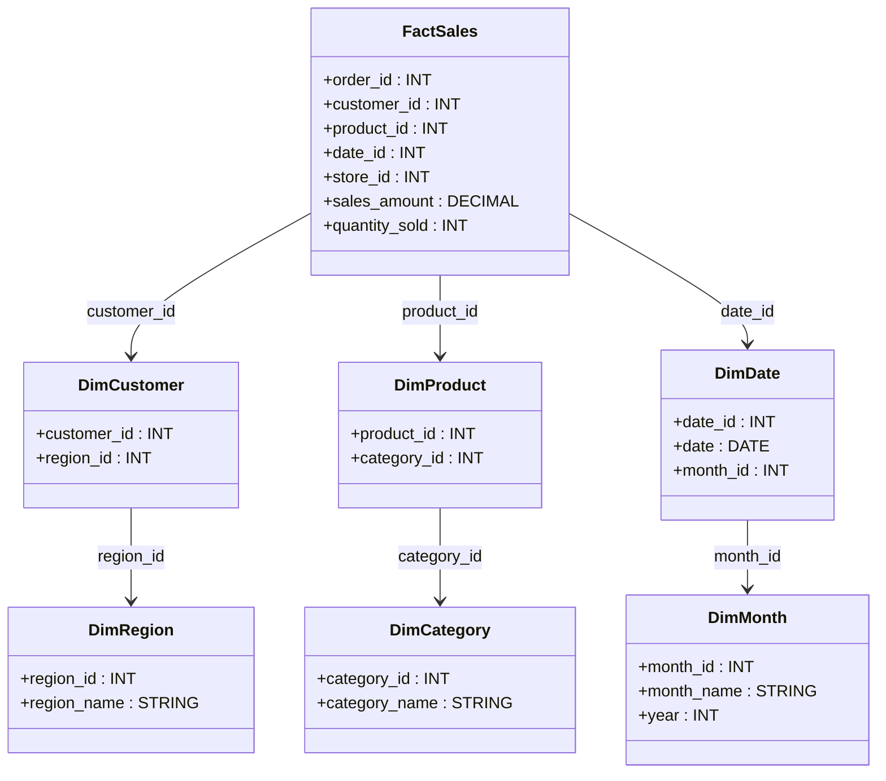

# **❄️ Snowflake Schema in Data Warehousing – A Detailed Guide**

## **🔍 What is a Snowflake Schema?**

A **Snowflake Schema** is a **normalized** form of the **Star Schema**, where **dimension tables are split into multiple related tables** to reduce redundancy. It is called "snowflake" because the structure resembles a **snowflake shape** with multiple layers of dimension tables.

### **✅ Why Use a Snowflake Schema?**

✔ **Reduces data redundancy** by normalizing dimensions.  
✔ **Saves storage space** compared to a Star Schema.  
✔ **Provides better data integrity** with normalized relationships.  
✔ **More scalable** for large data models with many attributes.

❌ **When NOT to Use a Snowflake Schema?**

- ❌ If you need **faster queries** (Star Schema is better).
- ❌ If storage is not a major concern.
- ❌ If you want **simpler joins** and easier reporting.

---

## **1️⃣ Structure of a Snowflake Schema**

A Snowflake Schema consists of:

- **Fact Table** 📊 – Stores numerical, measurable data (e.g., sales amount, order count, revenue).
- **Normalized Dimension Tables** 📂 – Instead of keeping all attributes in one table, they are split into related sub-tables.

### **📌 Example: E-commerce Sales Data (Snowflake Schema)**



📌 **Key differences from Star Schema:**

- **DimCustomer is split into DimCustomer & DimRegion**.
- **DimProduct is split into DimProduct & DimCategory**.
- **DimDate is split into DimDate & DimMonth**.

---

## **2️⃣ Fact Table in Snowflake Schema**

The **Fact Table** remains the same as in a Star Schema, storing numerical data with foreign keys to dimensions.

### **📌 Fact Table: `FactSales`**

| **Column**      | **Data Type** | **Description**              |
| --------------- | ------------- | ---------------------------- |
| `order_id`      | INT           | Unique transaction ID        |
| `customer_id`   | INT           | Foreign key to `DimCustomer` |
| `product_id`    | INT           | Foreign key to `DimProduct`  |
| `date_id`       | INT           | Foreign key to `DimDate`     |
| `store_id`      | INT           | Foreign key to `DimStore`    |
| `sales_amount`  | DECIMAL(10,2) | Total sale value             |
| `quantity_sold` | INT           | Number of items sold         |

---

## **3️⃣ Advantages & Disadvantages of Snowflake Schema**

### **✅ Advantages**

| Benefit                      | Why It Matters?                                     |
| ---------------------------- | --------------------------------------------------- |
| **Reduces Storage**          | Normalization removes duplicate data, saving space. |
| **Maintains Data Integrity** | Each sub-dimension table ensures consistency.       |
| **Good for Complex Models**  | Useful when many hierarchical attributes exist.     |

### **❌ Disadvantages**

| Limitation                                 | Why It Can Be a Problem?                                     |
| ------------------------------------------ | ------------------------------------------------------------ |
| **Slower Queries**                         | More table joins slow down query performance.                |
| **Complex Joins**                          | BI tools need to perform extra joins, increasing complexity. |
| **Not Optimized for Read-Heavy Workloads** | A Star Schema is better suited for analytical queries.       |

---

## **4️⃣ When to Use Snowflake Schema?**

| **Use Snowflake Schema When...**                                           | **Avoid Snowflake Schema When...**                  |
| -------------------------------------------------------------------------- | --------------------------------------------------- |
| You want **normalized data** to remove redundancy.                         | You need **fast queries and reporting**.            |
| Storage space is **a major concern**.                                      | You want **simpler joins** for analytics.           |
| You have **complex hierarchies** (e.g., Category → Subcategory → Product). | You are using **BI tools that prefer Star Schema**. |

---

## **5️⃣ Querying a Snowflake Schema**

### **📌 SQL Query Example: Total Sales per Region**

```sql
SELECT r.region_name, SUM(f.sales_amount) AS total_sales
FROM FactSales f
JOIN DimCustomer c ON f.customer_id = c.customer_id
JOIN DimRegion r ON c.region_id = r.region_id
GROUP BY r.region_name;
```

### **📌 SQL Query Example: Top-Selling Categories**

```sql
SELECT cat.category_name, SUM(f.quantity_sold) AS total_sold
FROM FactSales f
JOIN DimProduct p ON f.product_id = p.product_id
JOIN DimCategory cat ON p.category_id = cat.category_id
GROUP BY cat.category_name
ORDER BY total_sold DESC;
```

---

## **6️⃣ Star Schema vs. Snowflake Schema – Key Differences**

| **Feature**            | **Star Schema ⭐**       | **Snowflake Schema ❄️**           |
| ---------------------- | ------------------------ | --------------------------------- |
| **Structure**          | Single-level dimensions  | Multi-level normalized dimensions |
| **Query Performance**  | Faster (fewer joins)     | Slower (more joins)               |
| **Storage Efficiency** | Higher redundancy        | Lower redundancy (saves space)    |
| **Complexity**         | Simpler                  | More complex                      |
| **Best For**           | BI reporting, dashboards | Scalable, normalized data models  |

---

## **🚀 Summary – Key Takeaways**

✔ **Fact Tables remain the same** in both schemas.  
✔ **Dimension Tables in Snowflake Schema are normalized**, reducing redundancy but increasing complexity.  
✔ **Star Schema is better for performance, Snowflake is better for data integrity & storage.**  
✔ **BI tools like Power BI, Tableau often perform better with Star Schema.**  
✔ **Use Snowflake Schema when hierarchical relationships need to be maintained.**

Would you like a **step-by-step guide** on converting a Star Schema to a Snowflake Schema? 🚀
