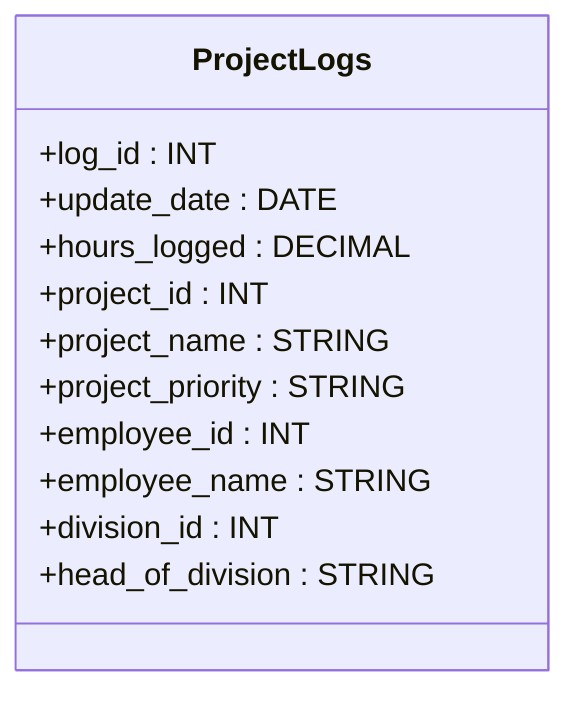
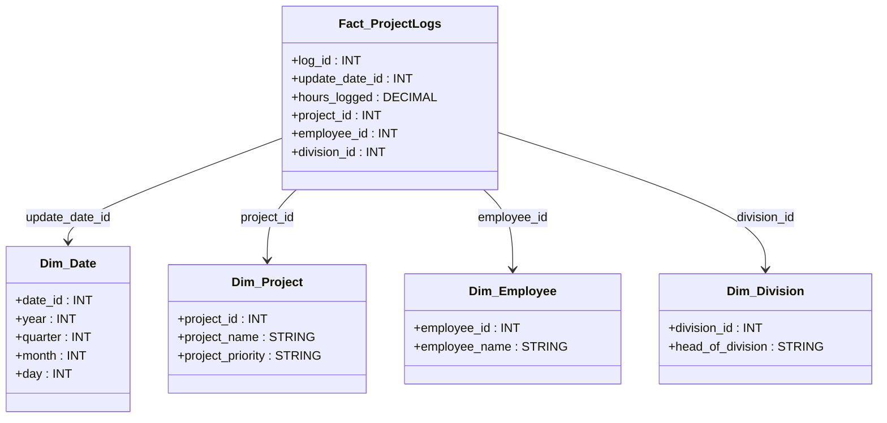

# **📊 Data Warehouse Design for Project Logs**

## **1️⃣ Project Overview**

### **📝 Assignment**

You are assigned as the **BI Consultant** responsible for designing a **data warehouse** based on data coming from a project management tool. The goal is to provide project managers and division managers with analytical insights on **how many hours were logged**, categorized by different attributes.

### **🎯 Requirements**

- Allow **project managers and division managers** to analyze **hours logged** across different attributes.
- Enable **time-based analysis** (monthly, quarterly, yearly breakdowns).
- Optimize data for **fast querying** using a dimensional model.
- Ensure **data accuracy and consistency** by defining fact and dimension tables properly.

---

## **2️⃣ Original Source Table**

The data is initially stored in a **flat structure**, containing both measurable (fact) and descriptive (dimension) attributes.



---

## **3️⃣ Data Warehouse Schema Design (Star Schema)**

The **Fact Table (Fact_ProjectLogs)** connects with **multiple Dimension Tables** using **foreign keys**, enabling efficient **analytical queries**.



---

## **4️⃣ Example Queries**

### **📌 Total Hours Logged per Project**

```sql
SELECT p.project_name, SUM(f.hours_logged) AS total_hours
FROM Fact_ProjectLogs f
JOIN Dim_Project p ON f.project_id = p.project_id
GROUP BY p.project_name;
```

### **📌 Hours Logged Per Quarter**

```sql
SELECT d.year, d.quarter, SUM(f.hours_logged) AS total_hours
FROM Fact_ProjectLogs f
JOIN Dim_Date d ON f.update_date_id = d.date_id
GROUP BY d.year, d.quarter;
```

### **📌 Hours Logged by Division Head**

```sql
SELECT div.head_of_division, SUM(f.hours_logged) AS total_hours
FROM Fact_ProjectLogs f
JOIN Dim_Division div ON f.division_id = div.division_id
GROUP BY div.head_of_division;
```

---

## **5️⃣ Summary**

✔ **Original ProjectLogs Table** contained both facts & dimensions in a flat structure.  
✔ **Fact_ProjectLogs** stores **hours logged** and links to dimensions.  
✔ **Dim_Date** allows **time-based aggregation** (monthly, quarterly, yearly analysis).  
✔ **Dim_Project** provides **project-related details**.  
✔ **Dim_Employee** stores **employee details**.  
✔ **Dim_Division** tracks **department heads**.  
✔ The **Star Schema** enables **efficient, high-performance analytical queries**.
