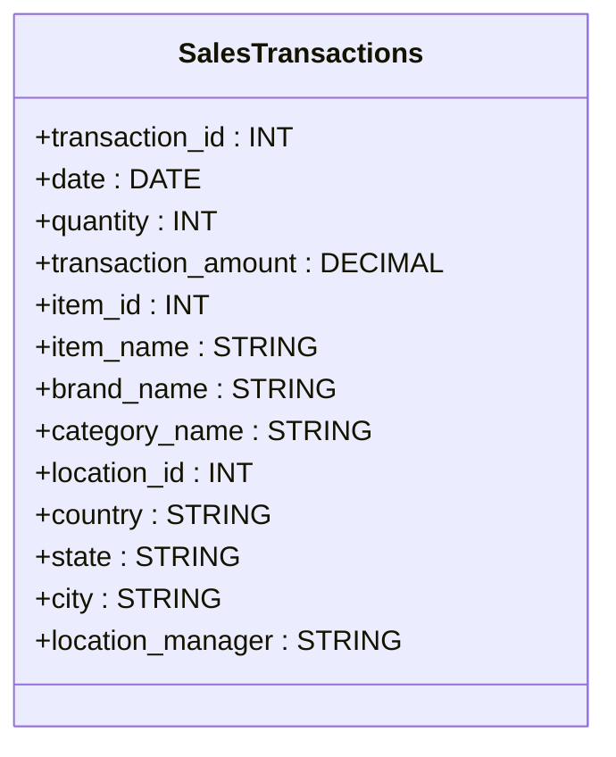
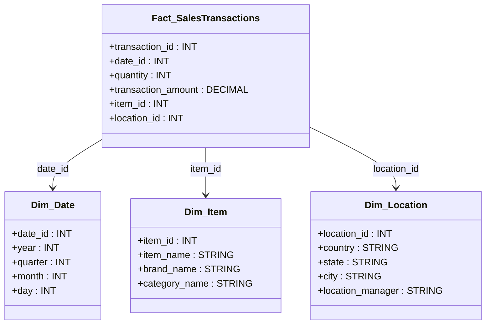

# **📊 Data Warehouse Design for Sales Transactions**

## **1️⃣ Project Overview**

### **📝 Assignment**

You are assigned as the **BI Consultant** responsible for designing a **data warehouse** based on data coming from the sales system used in your company. The goal is to provide responsible managers with analytical insights on **sales quantity and transaction amounts**, categorized by different attributes.

### **🎯 Requirements**

- Allow **managers** to analyze **sales quantity and transaction amounts**.
- Enable **time-based analysis** (monthly, quarterly, yearly breakdowns).
- Optimize data for **fast querying** using a dimensional model.
- Ensure **data accuracy and consistency** by defining fact and dimension tables properly.

---

## **2️⃣ Original Source Table**

The data is initially stored in a **flat structure**, containing both measurable (fact) and descriptive (dimension) attributes.



---

## **3️⃣ Data Warehouse Schema Design (Star Schema)**

The **Fact Table (Fact_SalesTransactions)** connects with **multiple Dimension Tables** using **foreign keys**, enabling efficient **analytical queries**.



---

## **4️⃣ Example Queries**

### **📌 Total Sales Amount per Item**

```sql
SELECT i.item_name, SUM(f.transaction_amount) AS total_sales
FROM Fact_SalesTransactions f
JOIN Dim_Item i ON f.item_id = i.item_id
GROUP BY i.item_name;
```

### **📌 Sales Analysis Per Quarter**

```sql
SELECT d.year, d.quarter, SUM(f.transaction_amount) AS total_sales
FROM Fact_SalesTransactions f
JOIN Dim_Date d ON f.date_id = d.date_id
GROUP BY d.year, d.quarter;
```

### **📌 Sales Amount by Location**

```sql
SELECT loc.city, loc.state, SUM(f.transaction_amount) AS total_sales
FROM Fact_SalesTransactions f
JOIN Dim_Location loc ON f.location_id = loc.location_id
GROUP BY loc.city, loc.state;
```

---

## **5️⃣ Summary**

✔ **Original SalesTransactions Table** contained both facts & dimensions in a flat structure.  
✔ **Fact_SalesTransactions** stores **sales quantities & transaction amounts** and links to dimensions.  
✔ **Dim_Date** allows **time-based aggregation** (monthly, quarterly, yearly analysis).  
✔ **Dim_Item** provides **item-related details**.  
✔ **Dim_Location** stores **location details & managers**.  
✔ The **Star Schema** enables **efficient, high-performance analytical queries**.
