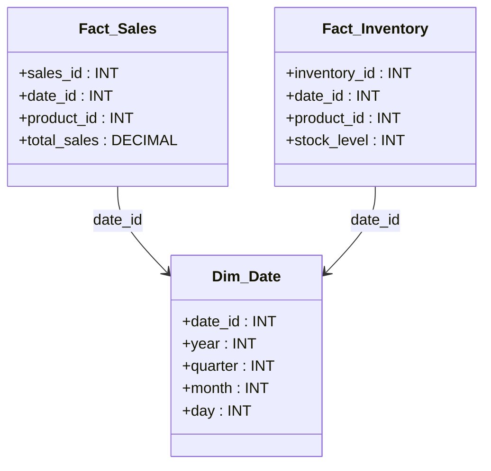
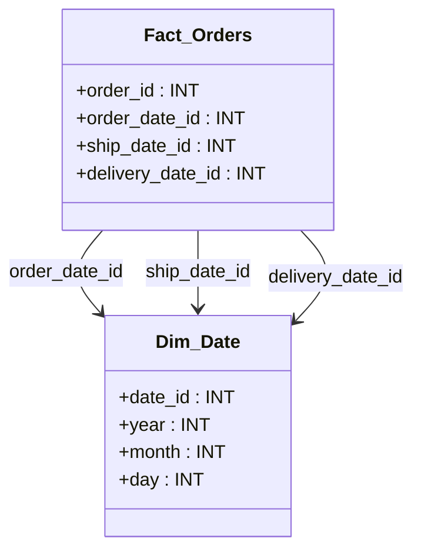

# **📂 Understanding Dimensions in Data Warehousing**

## **1️⃣ What is a Dimension Table?**

A **Dimension Table** stores **descriptive (contextual) attributes** related to business processes. It provides **context** to the numerical data stored in **fact tables**, allowing for filtering, grouping, and drill-down analysis.

### **✅ Why are Dimension Tables Important?**

✔ **Enhance reporting** by providing meaningful labels.  
✔ **Enable filtering & aggregation** in queries.  
✔ **Support slicing and dicing** for business intelligence.  
✔ **Reduce redundancy** by organizing descriptive data separately.

---

## **2️⃣ Key Characteristics of Dimension Tables**

| **Feature**                | **Description**                                                        |
| -------------------------- | ---------------------------------------------------------------------- |
| **Contain Attributes**     | Store descriptive data (e.g., Customer Name, Product Category).        |
| **Use Surrogate Keys**     | Typically use an integer `ID` instead of natural keys for performance. |
| **Denormalized Structure** | Often denormalized to improve query performance.                       |
| **Support Hierarchies**    | Allow drilling down from high-level to detailed views.                 |

---

## **3️⃣ Types of Dimension Tables**

### **📌 1. Conformed Dimensions**

- Shared across multiple fact tables.
- Ensures **consistent reporting** across different subject areas.

📝 **Example:** A `Date` dimension used in **Sales Fact Table** and **Inventory Fact Table**.



### **📌 2. Slowly Changing Dimensions (SCD)**

- Handle **attribute changes over time**.

| **SCD Type**   | **Description**                                 |
| -------------- | ----------------------------------------------- |
| **SCD Type 1** | Overwrites old data, keeps only current values. |
| **SCD Type 2** | Maintains historical changes using versioning.  |
| **SCD Type 3** | Stores both old and new values in the same row. |

📝 **Example: Customer Address Change (SCD Type 2)**

| Customer_ID | Name  | Address | Start_Date | End_Date   |
| ----------- | ----- | ------- | ---------- | ---------- |
| 101         | Alice | NY      | 2020-01-01 | 2022-06-30 |
| 101         | Alice | LA      | 2022-07-01 | NULL       |

### **📌 3. Role-Playing Dimensions**

- A single dimension table used **in multiple roles**.

📝 **Example:** A `Date` dimension in `Fact_Orders` for **Order Date, Shipping Date, and Delivery Date**.



### **📌 4. Junk Dimensions**

- Combines multiple small attributes into a single dimension.

📝 **Example:** `Order_Flag` (Gift Wrap, Urgent, Discounted) stored in **Dim_OrderFlags** instead of separate columns in the fact table.

### **📌 5. Degenerate Dimensions**

- **Dimension values stored in a fact table** (not in a separate table).
- Used for **unique transaction identifiers**.

📝 **Example:** Invoice Number in a `Sales Fact Table`.

```sql
SELECT invoice_number, total_sales
FROM Fact_Sales;
```

---

## **4️⃣ Dimension Table Design Best Practices**

✔ **Use surrogate keys (integer primary keys).**  
✔ **Keep descriptive attributes in dimension tables, not fact tables.**  
✔ **Precompute hierarchical relationships** to optimize queries.  
✔ **Denormalize dimensions for better performance** (avoid excessive joins).  
✔ **Use SCDs for tracking historical changes.**

---

## **5️⃣ Star Schema vs. Snowflake Schema for Dimensions**

| **Feature**       | **Star Schema** ⭐      | **Snowflake Schema** ❄️ |
| ----------------- | ----------------------- | ----------------------- |
| **Normalization** | Denormalized            | Normalized              |
| **Query Speed**   | Faster (fewer joins)    | Slower (more joins)     |
| **Storage Space** | Higher (redundant data) | Lower (normalized data) |
| **Complexity**    | Simpler                 | More complex            |

**📝 Recommendation:** Use **Star Schema** for performance-focused reporting and **Snowflake Schema** for storage efficiency and data integrity.

---

## **6️⃣ Example Queries on Dimension Tables**

### **📌 Query: Total Sales by Product Category**

```sql
SELECT i.category_name, SUM(f.total_sales) AS total_sales
FROM Fact_Sales f
JOIN Dim_Item i ON f.item_id = i.item_id
GROUP BY i.category_name;
```

### **📌 Query: Sales Analysis by Quarter**

```sql
SELECT d.year, d.quarter, SUM(f.total_sales) AS total_sales
FROM Fact_Sales f
JOIN Dim_Date d ON f.date_id = d.date_id
GROUP BY d.year, d.quarter;
```

---

## **🚀 Summary – Key Takeaways**

✔ **Dimension tables provide descriptive attributes for fact tables.**  
✔ **Different types of dimensions exist: Conformed, Slowly Changing, Role-Playing, Junk, Degenerate.**  
✔ **Use Star Schema for better performance, Snowflake Schema for better normalization.**  
✔ **Well-designed dimensions improve query efficiency and reporting flexibility.**
