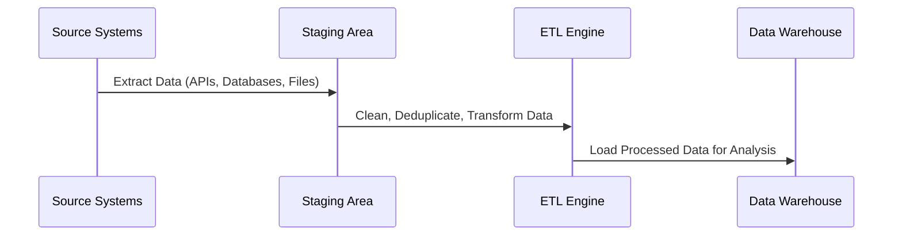
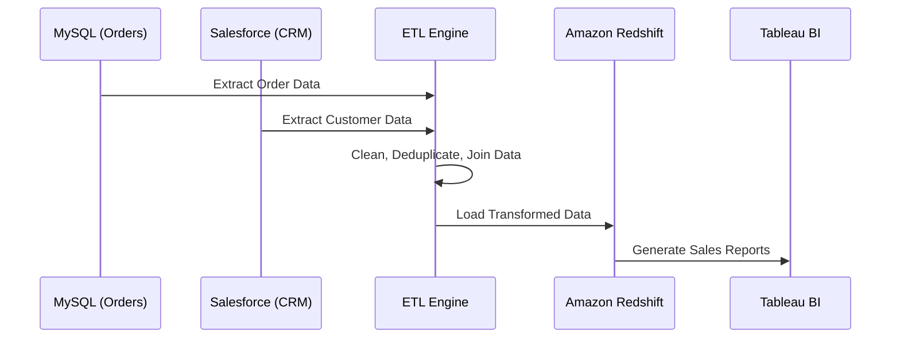

# **🔄 ETL in Data Warehousing – A Comprehensive Guide**

## **1️⃣ What is ETL (Extract, Transform, Load)?**

ETL (Extract, Transform, Load) is a **core process in data warehousing** that moves and transforms data from various sources into a structured **Data Warehouse (DWH)** for analysis and reporting.

### **✅ Why is ETL Important?**

✔ **Integrates data from multiple sources** into a single system.  
✔ **Ensures data consistency, quality, and accuracy**.  
✔ **Optimizes data for analytics, BI, and reporting**.  
✔ **Supports historical tracking and business intelligence (BI)**.

---

## **2️⃣ ETL Workflow in a Data Warehouse**

ETL consists of **three main stages:**
1️⃣ **Extract** – Collects raw data from various sources.
2️⃣ **Transform** – Cleans, structures, and applies business rules.
3️⃣ **Load** – Moves the processed data into the Data Warehouse.

---

## **3️⃣ Step 1: Extract – Collecting Data from Various Sources**

### **📌 What Happens in the Extraction Phase?**

- Data is collected from **multiple, disparate sources**.
- Handles **structured (databases), semi-structured (JSON, XML), and unstructured (logs, media) data**.
- Data can be extracted in **real-time (streaming)** or in **batch mode**.

### **✅ Common Data Sources for Extraction**

| **Source Type**         | **Examples**                             |
| ----------------------- | ---------------------------------------- |
| **Databases**           | MySQL, PostgreSQL, Oracle, SQL Server    |
| **APIs & Web Services** | REST APIs, GraphQL, SOAP APIs            |
| **Flat Files**          | CSV, XML, JSON, Excel                    |
| **Cloud Storage**       | AWS S3, Google Cloud Storage, Azure Blob |
| **Logs & Events**       | Kafka, Apache Flume, AWS Kinesis         |

### **🛠 Tools for Extraction**

✔ **Batch ETL:** Talend, Apache NiFi, Informatica, AWS Glue  
✔ **Streaming Extraction:** Apache Kafka, AWS Kinesis, Google Dataflow

---

## **4️⃣ Step 2: Transform – Cleaning & Structuring Data**

### **📌 What Happens in the Transformation Phase?**

- Applies **business rules, validation, deduplication**.
- Converts data into a **consistent format**.
- **Joins data from multiple sources**.
- Creates calculated fields (e.g., profit margin, revenue growth).
- Implements **Slowly Changing Dimensions (SCDs)** for tracking historical changes.

### **✅ Common Data Transformations**

| **Transformation Type**               | **Example**                                         |
| ------------------------------------- | --------------------------------------------------- |
| **Data Cleaning**                     | Remove duplicates, fix missing values               |
| **Data Type Conversion**              | Convert text to date, currency to a standard format |
| **Aggregation**                       | Total sales per region, monthly customer growth     |
| **Joins & Merging**                   | Combine customer details from multiple databases    |
| **Filtering & Deduplication**         | Remove inactive customers, invalid transactions     |
| **Slowly Changing Dimensions (SCDs)** | Track customer address changes over time            |

### **🛠 Tools for Transformation**

✔ **Batch Processing:** Apache Spark, AWS Glue, dbt, Talend  
✔ **Real-time Processing:** Apache Flink, Google Dataflow, AWS Lambda

---

## **5️⃣ Step 3: Load – Storing Data in the Data Warehouse**

### **📌 What Happens in the Loading Phase?**

- **Inserts transformed data** into the **data warehouse (DWH)**.
- Supports **incremental (new data only) or full refresh (overwrite data)**.
- Optimizes performance using **indexing, partitioning, and compression**.

### **✅ Types of Data Loading Methods**

| **Method**           | **Description**                         | **Use Case**                |
| -------------------- | --------------------------------------- | --------------------------- |
| **Full Load**        | Overwrites the entire dataset each time | Small datasets, data resets |
| **Incremental Load** | Only adds new or modified data          | Large-scale data warehouses |
| **Real-time Load**   | Loads data continuously as events occur | Streaming analytics         |

### **🛠 Tools for Loading Data**

✔ **Batch Loading:** AWS Redshift COPY, Snowflake Bulk Load, Azure Synapse  
✔ **Streaming Loading:** Kafka Connect, Google BigQuery Streaming, AWS Kinesis Firehose

---

## **6️⃣ ETL vs. ELT – What’s the Difference?**

| **Feature**          | **ETL (Extract, Transform, Load)** | **ELT (Extract, Load, Transform)**              |
| -------------------- | ---------------------------------- | ----------------------------------------------- |
| **Processing Order** | Transform before loading           | Load raw data, then transform later             |
| **Best For**         | Traditional Data Warehouses        | Cloud-based analytics (BigQuery, Snowflake)     |
| **Storage Cost**     | Expensive (pre-transformed data)   | Cheaper (raw storage in S3, GCS)                |
| **Performance**      | Fast for structured queries        | More flexible but requires on-demand processing |

📌 **ELT is common in cloud-based systems** where raw data is stored first (e.g., **AWS S3, Google Cloud Storage**), then transformed inside the warehouse (e.g., **Snowflake, Redshift Spectrum**).

---

## **7️⃣ Real-World ETL Pipeline Example**

### **📊 Scenario: E-commerce Data Warehouse**

A company wants to **analyze customer purchases** across different sales channels.

**🔄 ETL Steps:**
1️⃣ **Extract:** Collect data from MySQL (website orders), Salesforce (CRM), and CSV files (store transactions).  
2️⃣ **Transform:** Clean up duplicate transactions, convert all currencies to USD, and join customer details.  
3️⃣ **Load:** Insert structured data into Amazon Redshift for BI dashboards in Tableau.

---

## **🚀 Summary – Key Takeaways**

✔ **ETL is essential for integrating, transforming, and storing data in a Data Warehouse.**  
✔ **Extraction collects data from multiple sources (databases, APIs, logs).**  
✔ **Transformation applies business rules, joins, filtering, and aggregation.**  
✔ **Loading ensures data is structured and ready for BI tools.**  
✔ **Modern ETL processes leverage cloud-based ELT approaches for scalability.**
