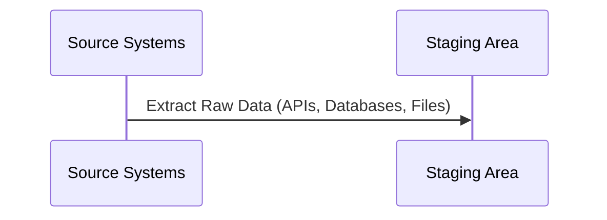
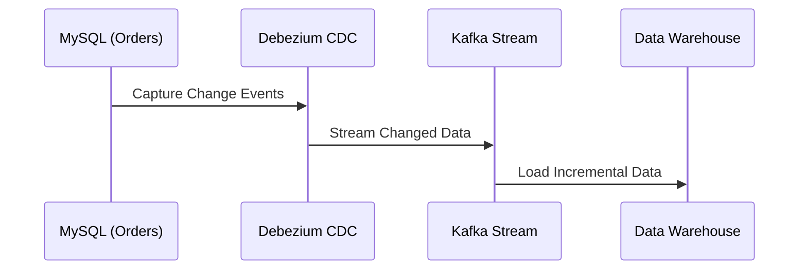
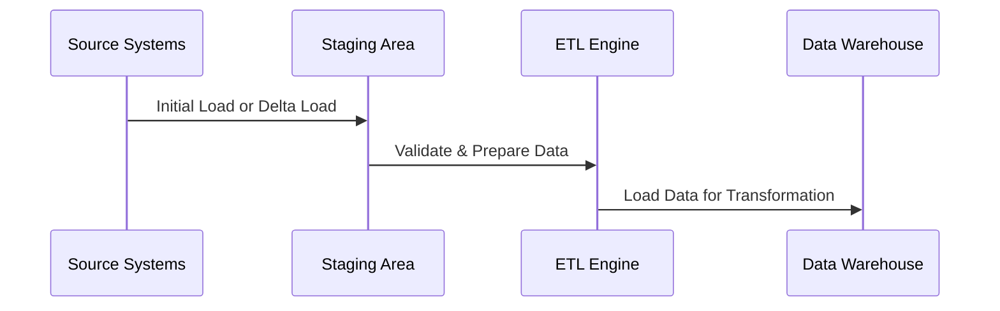
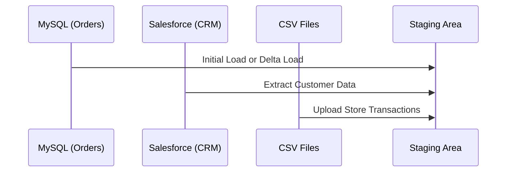

# **🔍 Extract Phase in ETL – Understanding Data Extraction**

## **1️⃣ What is Data Extraction?**

Data extraction is the **first step** in the **ETL (Extract, Transform, Load) process**, where raw data is **collected from multiple sources** before being processed and loaded into a data warehouse.

### **✅ Why is Data Extraction Important?**

- ✔ **Collects data from different sources** for unified analysis.
- ✔ **Ensures data consistency** before transformation.
- ✔ **Reduces manual effort** in data collection and integration.
- ✔ **Supports historical data tracking** for trend analysis.

---

## **2️⃣ Data Extraction Process in ETL**

Data extraction involves three key steps:

- 1️⃣ **Identify data sources** (databases, APIs, files, logs, etc.).
- 2️⃣ **Retrieve data** using batch or real-time methods.
- 3️⃣ **Store raw data** in a **staging area** before transformation.



---

## **3️⃣ Types of Data Extraction**

There are two main types of data extraction:

### **📌 1. Initial Load (Full Extraction)**

- **Extracts all data** from a source at once.
- Used when migrating data for the first time or refreshing datasets.
- **Example:** Copying an entire customer database to a warehouse.

### **📌 2. Delta Load (Incremental Extraction)**

- **Extracts only new or modified data** since the last extraction.
- Reduces **data transfer time and storage costs**.
- Uses **Change Data Capture (CDC), timestamp-based extraction, or trigger-based extraction**.
- **Example:** Retrieving only updated orders from an e-commerce database.

| **Extraction Type**                     | **Use Case**              | **Example**                                   |
| --------------------------------------- | ------------------------- | --------------------------------------------- |
| **Initial Load (Full Extraction)**      | First-time data migration | Copying all historical sales data to Redshift |
| **Delta Load (Incremental Extraction)** | Ongoing updates           | Fetching only new orders from an API          |

---

## **4️⃣ Understanding Delta Load in Detail**

Delta Load, also known as **Incremental Extraction**, is critical for handling **ongoing updates** in large-scale data warehouses. It ensures that only **new or changed data** is moved instead of reloading the entire dataset.

### **📌 How Delta Load Works?**

- 1️⃣ **Identify Changes** – Compare new data with existing records.
- 2️⃣ **Extract Only New or Updated Data** – Using CDC, timestamps, or triggers.
- 3️⃣ **Merge Changes into Data Warehouse** – Append new data, update changed records.

### **🔄 Delta Load Approaches**

| **Method**                      | **How It Works**                                                                        | **Use Case**                                         |
| ------------------------------- | --------------------------------------------------------------------------------------- | ---------------------------------------------------- |
| **Timestamp-based Extraction**  | Extracts records where the `last_updated` timestamp is greater than the last load time. | Databases with `updated_at` column.                  |
| **Change Data Capture (CDC)**   | Detects inserts, updates, and deletes from database logs.                               | Real-time data sync.                                 |
| **Trigger-based Extraction**    | Uses database triggers to track data changes.                                           | High-velocity transactional systems.                 |
| **Comparison-based Extraction** | Compares entire datasets to detect changes.                                             | Used when other tracking mechanisms are unavailable. |

### **🛠 Tools for Delta Load Processing**

- ✔ **Database CDC Tools:** Debezium, AWS DMS, Oracle GoldenGate
- ✔ **Streaming Pipelines:** Apache Kafka, AWS Kinesis
- ✔ **Batch Processing:** Apache NiFi, Talend, AWS Glue

### **📊 Example: Implementing Delta Load in an E-Commerce System**

A company wants to extract customer order updates from MySQL and only move the new or modified orders into the Data Warehouse.

#### **Solution Using Timestamp-based Extraction**

```sql
SELECT * FROM orders
WHERE last_updated > '2024-03-01 00:00:00';
```

#### **Solution Using CDC (Debezium + Kafka)**

- 1️⃣ Debezium listens to database logs for INSERT, UPDATE, DELETE events.
- 2️⃣ Kafka streams the changes to an ETL pipeline.
- 3️⃣ ETL pipeline processes and loads only the changed records into the Data Warehouse.



---

## **5️⃣ Data Extraction Workflow**

### **📌 How Extraction Works in ETL Pipelines**



- 1️⃣ **Extract Data** from databases, APIs, and logs.
- 2️⃣ **Validate & store** in a temporary staging area.
- 3️⃣ **Pass to the ETL engine** for transformation & structuring.

---

## **6️⃣ Common Data Sources for Extraction**

| **Source Type**         | **Examples**                             |
| ----------------------- | ---------------------------------------- |
| **Databases**           | MySQL, PostgreSQL, Oracle, SQL Server    |
| **APIs & Web Services** | REST APIs, GraphQL, SOAP APIs            |
| **Flat Files**          | CSV, XML, JSON, Excel                    |
| **Cloud Storage**       | AWS S3, Google Cloud Storage, Azure Blob |
| **Logs & Events**       | Kafka, Apache Flume, AWS Kinesis         |

### **🛠 Tools for Extraction**

✔ **Batch ETL:** Talend, Apache NiFi, Informatica, AWS Glue  
✔ **Streaming Extraction:** Apache Kafka, AWS Kinesis, Google Dataflow  
✔ **Change Data Capture (CDC):** Debezium, AWS DMS, Fivetran

---

## **7️⃣ Real-World Data Extraction Example**

### **📊 Scenario: Sales Data Extraction**

A company wants to **extract customer order data** from multiple sources for analytics.

🔄 **Extraction Steps:**

- 1️⃣ **Initial Load:** Extracts all historical data from MySQL, Salesforce, and CSV files.
- 2️⃣ **Delta Load:** Fetches only new or modified records daily from MySQL & APIs.
- 3️⃣ **Store raw data** in an Amazon S3 staging area before transformation.



---

## **🚀 Summary – Key Takeaways**

- ✔ **Data Extraction is the first phase of ETL**, responsible for collecting raw data.
- ✔ **Supports Initial Load (Full Extraction) and Delta Load (Incremental Extraction).**
- ✔ **Delta Load improves efficiency using CDC, timestamps, and triggers.**
- ✔ **Works with multiple data sources** (databases, APIs, files, logs).
- ✔ **Modern extraction uses batch, streaming, and CDC techniques.**
