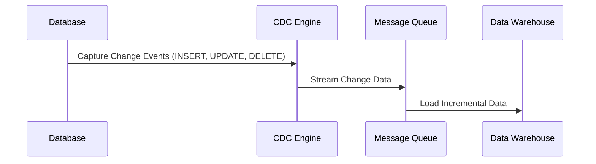
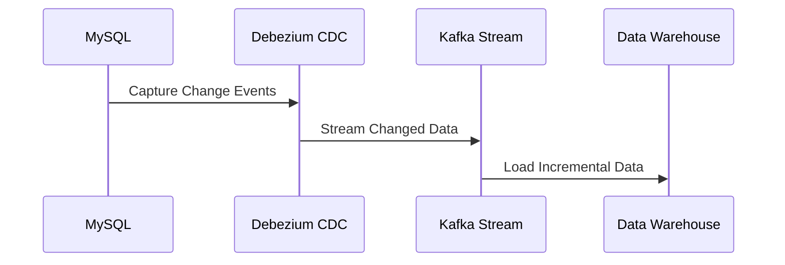

# **🔄 Change Data Capture (CDC) – Real-Time Data Extraction**

## **1️⃣ What is Change Data Capture (CDC)?**

Change Data Capture (CDC) is a **real-time data extraction technique** used to detect and track **inserts, updates, and deletes** in a database. It allows incremental data updates without reloading entire datasets, improving **efficiency and performance**.

### **✅ Why is CDC Important?**

- ✔ **Eliminates unnecessary data reprocessing**, improving efficiency.
- ✔ **Enables real-time data updates**, reducing latency.
- ✔ **Optimized for large-scale databases**, reducing computational overhead.
- ✔ **Supports event-driven architectures** using message brokers like Kafka.

---

## **2️⃣ How Change Data Capture Works**

CDC tracks database changes and propagates them to downstream systems like **Data Warehouses, Data Lakes, or Analytics Engines**.



- 1️⃣ **CDC Engine Monitors the Database** – Tracks changes using logs or triggers.
- 2️⃣ **Streams the Changes** – Pushes updates to a queue (Kafka, Kinesis).
- 3️⃣ **Loads into Target System** – Updates the Data Warehouse or Data Lake.

---

## **3️⃣ CDC Methods & Techniques**

There are multiple ways to implement CDC, depending on the database type and business requirements.

### **📌 1. Log-Based CDC (Most Efficient)**

- Reads **database transaction logs** to detect changes.
- **Minimal impact on database performance**.
- Used by **Debezium, AWS DMS, Oracle GoldenGate**.

📌 **Example:** MySQL Binary Logs (Binlog) or PostgreSQL WAL

```sql
SHOW BINARY LOGS;
```

### **📌 2. Trigger-Based CDC (Moderate Performance)**

- Uses **database triggers** to track changes.
- Writes to a **CDC table** on each modification.
- Used when **log-based CDC is not supported**.

📌 **Example:** SQL Server Trigger

```sql
CREATE TRIGGER track_changes
AFTER INSERT, UPDATE, DELETE ON orders
FOR EACH ROW
INSERT INTO cdc_orders VALUES (NEW.*);
```

### **📌 3. Timestamp-Based CDC (Less Efficient)**

- Queries records based on **last modified timestamp**.
- Suitable for **batch incremental loads**.

📌 **Example:** Extract updated records using timestamps

```sql
SELECT * FROM orders WHERE last_updated > '2024-03-01 00:00:00';
```

### **📌 4. Comparison-Based CDC (Least Efficient)**

- Compares entire datasets to identify changes.
- High **processing cost**, used when **no tracking mechanism exists**.

---

## **4️⃣ Real-World CDC Implementation Examples**

### **📊 Scenario: Real-Time Order Processing with Kafka & Debezium**

A company wants to **track new and modified orders** in real-time and send them to its Data Warehouse.

#### **🛠 Solution Using Log-Based CDC (Debezium + Kafka)**

- 1️⃣ **Debezium listens** to MySQL binlogs for inserts, updates, and deletes.
- 2️⃣ **Kafka streams** the changes as an event.
- 3️⃣ **ETL pipeline** processes and loads the new data into the Data Warehouse.



#### **SQL Example for Verifying Captured Changes**

```sql
SELECT * FROM cdc_orders WHERE operation_type = 'UPDATE';
```

---

## **5️⃣ Tools for CDC Implementation**

| **Tool**              | **Type**            | **Best For**                   |
| --------------------- | ------------------- | ------------------------------ |
| **Debezium**          | Log-Based CDC       | Open-source, Kafka Integration |
| **AWS DMS**           | Log-Based CDC       | Cloud-native, AWS ecosystem    |
| **Oracle GoldenGate** | Log-Based CDC       | Enterprise, High Availability  |
| **SQL Server CDC**    | Built-in DB Feature | Microsoft SQL Server           |
| **Kafka Connect**     | Streaming           | Event-Driven Architectures     |

---

## **🚀 Summary – Key Takeaways**

- ✔ **CDC captures real-time changes (INSERT, UPDATE, DELETE) efficiently.**
- ✔ **Log-based CDC is the most efficient, while comparison-based is the least efficient.**
- ✔ **CDC enables event-driven architectures using Kafka and message queues.**
- ✔ **Common CDC tools include Debezium, AWS DMS, and Oracle GoldenGate.**
