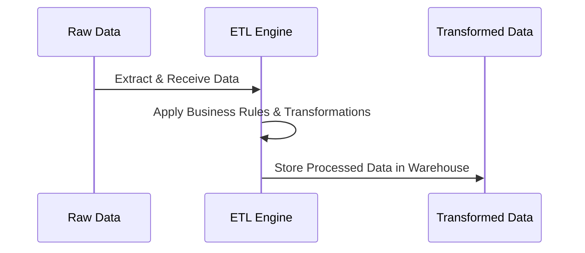
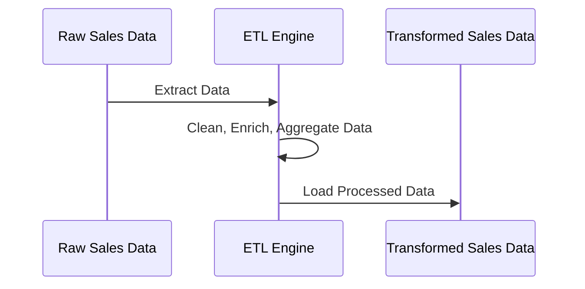

# **🔄 Transform Phase in ETL – Data Processing & Structuring**

## **1️⃣ What is Data Transformation?**

Data Transformation is the **second phase** in the **ETL (Extract, Transform, Load) process**, where raw data is **cleaned, enriched, and structured** before loading into a data warehouse.

### **✅ Why is Data Transformation Important?**

✔ **Ensures data consistency** by standardizing formats.  
✔ **Improves data quality** by handling missing values & duplicates.  
✔ **Applies business rules** to prepare data for analytics.  
✔ **Optimizes data storage** for performance in the warehouse.  
✔ **Enhances compatibility** by converting data types as needed.

---

## **2️⃣ The Data Transformation Process**

Data transformation follows a structured approach to clean, enrich, and structure raw data.



### **📌 Key Steps in Data Transformation**

1️⃣ **Data Cleaning** – Fix missing values, remove duplicates, standardize formats.  
2️⃣ **Data Validation** – Enforce rules (e.g., numeric-only values in price fields).  
3️⃣ **Data Enrichment** – Join with external data sources for more insights.  
4️⃣ **Data Aggregation** – Summarize data for faster reporting.  
5️⃣ **Data Normalization/Denormalization** – Structure data optimally for querying.  
6️⃣ **Data Type Conversion** – Convert strings to dates, numbers, etc.
7️⃣ **Filtering (Rows & Columns)** – Extract only necessary fields to optimize storage.  
8️⃣ **Key Generation** – Generate unique keys for tracking records.  
9️⃣ **Splitting** – Divide columns into multiple components for flexibility.

---

## **3️⃣ Common Data Transformation Techniques**

### **📌 1. Data Cleaning**

Removes inconsistencies, handles missing values, and ensures data integrity.

| **Technique**       | **Example**                                               |
| ------------------- | --------------------------------------------------------- |
| **Deduplication**   | Removing duplicate customer records                       |
| **Handling NULLs**  | Replacing missing values with defaults (e.g., `N/A`, `0`) |
| **Standardization** | Converting `USD` to `US Dollars` for consistency          |

#### **Example: Handling Missing Data in SQL**

```sql
UPDATE customers
SET phone_number = 'Unknown'
WHERE phone_number IS NULL;
```

---

### **📌 2. Data Validation**

Ensures that data follows predefined rules before loading into the warehouse.

| **Validation Rule**      | **Example**                                 |
| ------------------------ | ------------------------------------------- |
| **Format Checking**      | Ensuring emails contain `@domain.com`       |
| **Data Type Validation** | Making sure age fields contain numbers only |
| **Range Checking**       | Ensuring order amounts are non-negative     |

#### **Example: Validating Email Addresses in SQL**

```sql
SELECT * FROM users WHERE email NOT LIKE '%@%.%';
```

---

### **📌 3. Data Enrichment**

Enhancing raw data by adding **external datasets** or deriving new fields.

| **Enrichment Type**       | **Example**                                     |
| ------------------------- | ----------------------------------------------- |
| **Geo-location Mapping**  | Adding country information from IP addresses    |
| **Currency Conversion**   | Converting USD to EUR based on exchange rates   |
| **Customer Segmentation** | Categorizing customers based on spending habits |

#### **Example: Enriching Data with JOIN in SQL**

```sql
SELECT o.order_id, o.amount, c.customer_segment
FROM orders o
JOIN customer_segments c ON o.customer_id = c.customer_id;
```

---

### **📌 4. Data Aggregation**

Summarizing raw data to improve reporting and analytics performance.

| **Aggregation Type** | **Example**                      |
| -------------------- | -------------------------------- |
| **Sum**              | Total revenue per month          |
| **Average**          | Average order value per customer |
| **Count**            | Number of transactions per day   |

#### **Example: Aggregating Sales by Month in SQL**

```sql
SELECT MONTH(order_date) AS month, SUM(order_amount) AS total_revenue
FROM sales
GROUP BY MONTH(order_date);
```

---

### **📌 5. Data Normalization & Denormalization**

| **Type**            | **Definition**                                                          | **Example**                                         |
| ------------------- | ----------------------------------------------------------------------- | --------------------------------------------------- |
| **Normalization**   | Breaking down tables into smaller, related tables to reduce redundancy. | Storing customer data separately from orders.       |
| **Denormalization** | Combining tables to improve query speed by reducing joins.              | Keeping customer names directly in the order table. |

#### **Example: Normalizing Customer Data**

```sql
CREATE TABLE customers (
    customer_id INT PRIMARY KEY,
    customer_name VARCHAR(100)
);

CREATE TABLE orders (
    order_id INT PRIMARY KEY,
    customer_id INT,
    order_amount DECIMAL(10,2),
    FOREIGN KEY (customer_id) REFERENCES customers(customer_id)
);
```

---

## **4️⃣ Real-World Data Transformation Example**

### **📊 Scenario: E-commerce Sales Data Transformation**

A company needs to transform **sales order data** before loading it into a data warehouse for analytics.

#### **🔄 Steps:**

1️⃣ **Extract orders from MySQL.**  
2️⃣ **Clean and standardize data** (convert currency, remove duplicates).  
3️⃣ **Enrich order data** by joining with customer demographics.  
4️⃣ **Aggregate revenue per region.**  
5️⃣ **Load the transformed data into the warehouse.**



#### **SQL Example: Transforming E-commerce Data**

```sql
SELECT
    o.order_id,
    c.customer_name,
    ROUND(o.order_amount * 1.1, 2) AS converted_amount,
    SUM(o.order_amount) OVER (PARTITION BY c.region) AS total_sales_per_region
FROM orders o
JOIN customers c ON o.customer_id = c.customer_id;
```

---

## **5️⃣ Tools for Data Transformation**

| **Category**                  | **Tools**                                                 |
| ----------------------------- | --------------------------------------------------------- |
| **Batch Processing**          | Apache Spark, AWS Glue, Talend                            |
| **Streaming Processing**      | Apache Flink, Google Dataflow                             |
| **Data Quality & Validation** | Great Expectations, dbt (Data Build Tool)                 |
| **Data Aggregation**          | SQL-based transformations (BigQuery, Redshift, Snowflake) |

---

## **🚀 Summary – Key Takeaways**

✔ **Data Transformation is crucial for structuring raw data for analytics.**  
✔ **Includes cleaning, validation, enrichment, aggregation, and structuring.**  
✔ **Ensures high data quality, consistency, and query performance.**  
✔ **Implemented using SQL, ETL tools (AWS Glue, Spark), and real-time pipelines.**
