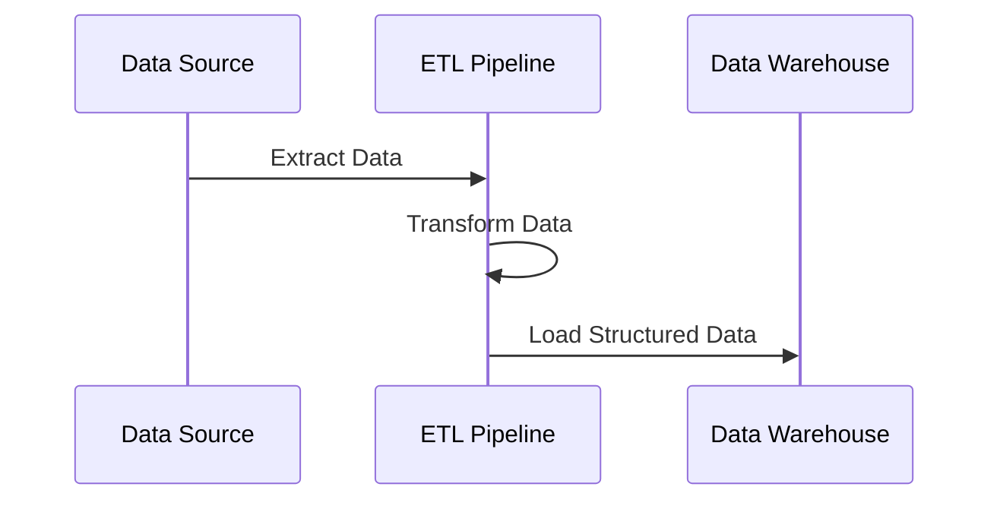
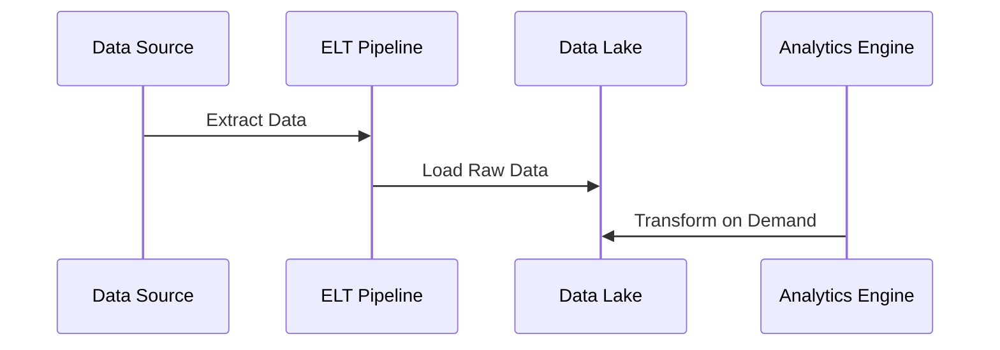

# **🔄 ETL vs. ELT – Understanding the Key Differences**

## **1️⃣ What is ETL (Extract, Transform, Load)?**

ETL is a **traditional data integration process** where data is **extracted from sources, transformed into a structured format, and then loaded into a data warehouse**.

### **✅ Key Characteristics of ETL**

✔ **Data is transformed before loading**, ensuring it is clean and structured.  
✔ Best for **structured data warehouses** (e.g., Amazon Redshift, Snowflake).  
✔ Works well with **on-premise databases** or traditional BI systems.  
✔ **Slower for large datasets**, as transformations occur before storage.

---

## **2️⃣ What is ELT (Extract, Load, Transform)?**

ELT is a **modern data integration process** where data is **extracted from sources, loaded directly into a data lake or warehouse, and then transformed as needed**.

### **✅ Key Characteristics of ELT**

✔ **Raw data is loaded first**, allowing flexible transformations later.  
✔ Best for **cloud-based data lakes and warehouses** (e.g., AWS S3, BigQuery).  
✔ Supports **structured, semi-structured, and unstructured data**.  
✔ **Faster for big data**, as transformations happen after loading.

---

## **3️⃣ ETL vs. ELT – Side-by-Side Comparison**

| **Feature**          | **ETL (Extract, Transform, Load)** | **ELT (Extract, Load, Transform)** |
| -------------------- | ---------------------------------- | ---------------------------------- |
| **Processing Order** | Transform → Load                   | Load → Transform                   |
| **Best for**         | Structured Data Warehouses         | Cloud Data Lakes & Warehouses      |
| **Performance**      | Slower for big data                | Faster for large-scale data        |
| **Flexibility**      | Less flexible, rigid schema        | High flexibility for raw data      |
| **Storage Cost**     | Higher (pre-processed data)        | Lower (raw storage in cloud)       |
| **Scalability**      | Harder to scale                    | Highly scalable with cloud         |
| **Common Tools**     | Informatica, Talend, AWS Glue      | BigQuery, Snowflake, Databricks    |

---

## **4️⃣ When to Use ETL vs. ELT?**

### **📌 Choose ETL If:**

- Your organization **relies on traditional data warehouses**.
- You need **strict data governance and structured schemas**.
- Data transformation **must happen before storage**.

### **📌 Choose ELT If:**

- You work with **big data and cloud-based storage**.
- You need **real-time processing and scalability**.
- You want to store **raw data for future transformations**.

---

## **5️⃣ Real-World Example: ETL vs. ELT in Action**

### **📊 Scenario: Retail Analytics**

A retail company collects sales data from multiple stores and wants to analyze trends.

#### **🛠 Solution Using ETL:**

1️⃣ Extract sales data from POS systems.  
2️⃣ Transform it (clean, aggregate, format).  
3️⃣ Load it into a structured **Amazon Redshift** warehouse.

#### **🛠 Solution Using ELT:**

1️⃣ Extract and Load raw data into **Google BigQuery**.  
2️⃣ Perform transformations later using SQL queries.  
3️⃣ Allow different teams to process data as needed.

---

## **6️⃣ Tools for ETL & ELT**

| **Category**               | **ETL Tools**                | **ELT Tools**               |
| -------------------------- | ---------------------------- | --------------------------- |
| **Cloud Platforms**        | AWS Glue, Azure Data Factory | Google BigQuery, Snowflake  |
| **Workflow Orchestration** | Apache Airflow, Talend       | dbt, Apache Spark           |
| **Streaming Pipelines**    | Apache Nifi, Informatica     | AWS Lambda, Google Dataflow |

---

## **🚀 Summary – Key Takeaways**

✔ **ETL is best for structured data warehouses**, while **ELT is better for cloud-based storage & big data**.  
✔ **ETL transforms data before loading**, while **ELT loads raw data first, then transforms later**.  
✔ **ETL is slower but structured**, while **ELT is flexible and scalable for real-time needs**.  
✔ **Cloud adoption favors ELT**, while **traditional BI workflows still use ETL**.
