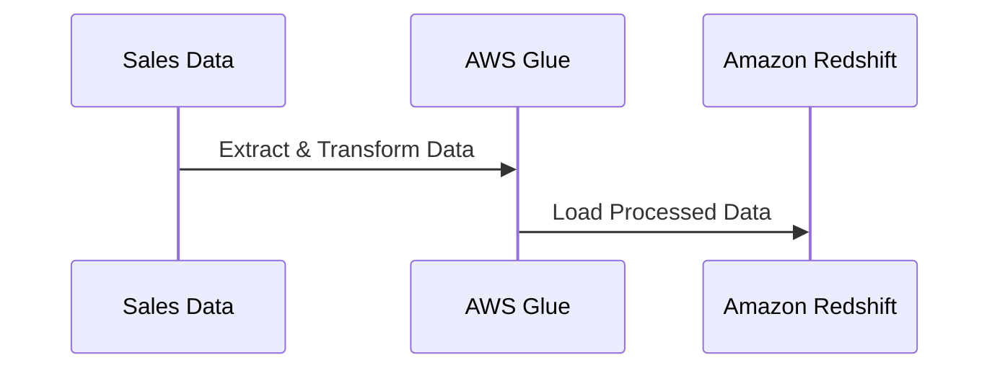
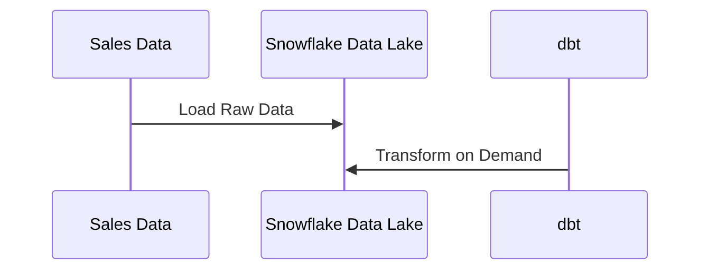

# **🛠 ETL Tools & Choosing the Right ETL Tool**

## **1️⃣ What are ETL Tools?**

ETL (Extract, Transform, Load) tools are software solutions that **automate the process of extracting data from multiple sources, transforming it into a usable format, and loading it into a data warehouse or data lake**.

### **✅ Why Use ETL Tools?**

✔ **Automates data workflows** and reduces manual effort.  
✔ **Handles large-scale data processing efficiently**.  
✔ **Ensures data quality, integrity, and consistency**.  
✔ **Improves scalability and performance** in data integration.  
✔ **Supports structured, semi-structured, and unstructured data processing**.

---

## **2️⃣ Types of ETL Tools**

ETL tools can be categorized based on their **deployment model and processing approach**.

### **📌 1. Cloud-Based ETL Tools**

- **Hosted by cloud providers** and integrated with cloud storage & computing.
- **Examples:** AWS Glue, Google Dataflow, Azure Data Factory.

### **📌 2. On-Premises ETL Tools**

- Installed and maintained on local servers for **full control & security**.
- **Examples:** Informatica PowerCenter, Talend, Apache Nifi.

### **📌 3. Open-Source ETL Tools**

- Community-driven with **customization & cost-efficiency**.
- **Examples:** Apache Airflow, dbt (Data Build Tool), Singer.

### **📌 4. Batch vs. Streaming ETL Tools**

| **ETL Type**      | **Best For**                     | **Examples**                                             |
| ----------------- | -------------------------------- | -------------------------------------------------------- |
| **Batch ETL**     | Large-scale scheduled processing | AWS Glue, Talend, Informatica, Apache Spark              |
| **Streaming ETL** | Real-time data processing        | Apache Kafka, AWS Kinesis, Google Dataflow, Apache Flink |

---

## **3️⃣ Popular ETL Tools & Their Features**

| **ETL Tool**                | **Type**                      | **Best For**                                       |
| --------------------------- | ----------------------------- | -------------------------------------------------- |
| **AWS Glue**                | Cloud ETL                     | Serverless, Fully managed, Big Data Processing     |
| **Google Dataflow**         | Cloud ETL                     | Real-time streaming & batch processing             |
| **Azure Data Factory**      | Cloud ETL                     | Hybrid data integration, Workflow orchestration    |
| **Informatica PowerCenter** | On-Premise ETL                | Enterprise-grade ETL with advanced transformations |
| **Talend**                  | Open-Source & Enterprise      | Cloud & on-premise integration, Data Governance    |
| **Apache Airflow**          | Open-Source ETL Orchestration | Workflow scheduling & monitoring                   |
| **Apache Nifi**             | Open-Source ETL               | Real-time data ingestion & flow management         |
| **dbt (Data Build Tool)**   | ELT Transformation            | SQL-based modeling for cloud warehouses            |
| **Apache Kafka**            | Streaming ETL                 | Real-time event processing & ingestion             |
| **Apache Spark**            | Batch & Streaming ETL         | Distributed data processing, ML, and analytics     |
| **Apache Flink**            | Real-Time ETL                 | Stream processing & event-driven data workflows    |

---

## **4️⃣ How to Choose the Right ETL Tool?**

Choosing the best ETL tool depends on **business needs, data complexity, and budget**.

### **📌 Key Factors to Consider**

| **Factor**                | **ETL Tool Considerations**                                    |
| ------------------------- | -------------------------------------------------------------- |
| **Scalability**           | Can it handle large datasets & growing data volume?            |
| **Real-Time Processing**  | Does it support streaming ETL if needed?                       |
| **Ease of Use**           | Does it have a user-friendly UI or require coding?             |
| **Integration**           | Can it connect with cloud platforms & databases?               |
| **Cost**                  | Does it fit within the budget (free, open-source, enterprise)? |
| **Security & Compliance** | Does it meet industry regulations (GDPR, HIPAA, SOC 2)?        |

### **📌 Choosing Based on Business Needs**

| **Business Requirement**       | **Recommended ETL Tools**                                   |
| ------------------------------ | ----------------------------------------------------------- |
| **Big Data & Cloud-Based ETL** | AWS Glue, Google Dataflow, Snowflake, Apache Spark          |
| **On-Premise Data Processing** | Informatica, Talend, SQL Server Integration Services (SSIS) |
| **Open-Source & Flexible**     | Apache Airflow, dbt, Apache Nifi, Apache Flink              |
| **Real-Time Streaming**        | Apache Kafka, AWS Kinesis, Google Pub/Sub, Apache Flink     |
| **Low-Code / No-Code ETL**     | Talend, Azure Data Factory, Informatica                     |

---

## **5️⃣ Real-World Example: Choosing an ETL Tool**

### **📊 Scenario: E-commerce Data Processing**

A retail company wants to **process sales transactions from different stores** and integrate them into a data warehouse for analytics.

#### **Solution Using ETL:**

1️⃣ **AWS Glue for data extraction** from MySQL, APIs, and CSV files.  
2️⃣ **Apply transformations** (cleaning, aggregations) in AWS Glue.  
3️⃣ **Load structured data** into Amazon Redshift.

#### **Solution Using ELT:**

1️⃣ **Raw data is loaded directly into Snowflake.**  
2️⃣ **Transformations applied later using dbt.**

---

## **🚀 Summary – Key Takeaways**

✔ **ETL tools automate data workflows**, ensuring efficient extraction, transformation, and loading.  
✔ **Choosing the right ETL tool depends on scalability, cost, real-time needs, and integrations.**  
✔ **Cloud-based ETL tools (AWS Glue, Dataflow) are great for modern architectures.**  
✔ **Open-source ETL (Airflow, dbt, Flink, Spark) offers flexibility for custom pipelines.**  
✔ **Real-time streaming ETL (Kafka, Kinesis, Flink) is ideal for event-driven data processing.**
