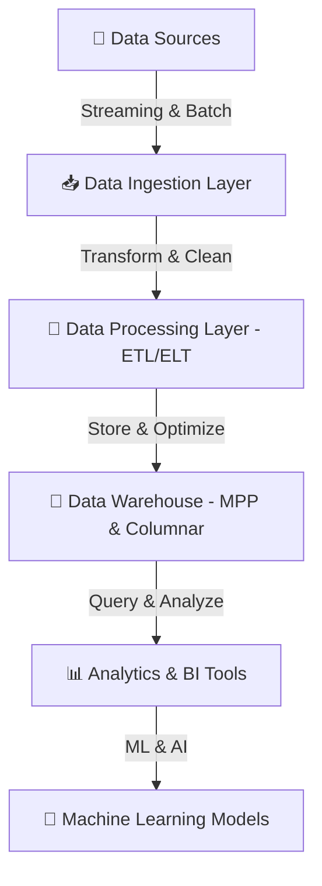
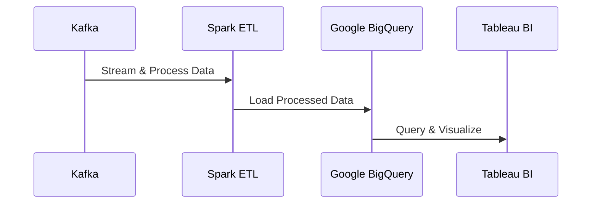

# **🏢 Modern Data Warehouse – Architecture, MPP, and Columnar Storage**

## **1️⃣ What is a Modern Data Warehouse?**

A **Modern Data Warehouse (MDW)** is a **highly scalable, cloud-native, and real-time analytics-driven data warehouse** designed to handle massive data volumes efficiently. It leverages **Massively Parallel Processing (MPP)** and **Columnar Storage** to optimize query performance and scalability.

### **✅ Key Characteristics of a Modern Data Warehouse**

✔ **Cloud-based & scalable** – Supports cloud platforms like AWS, Azure, and GCP.  
✔ **Handles structured & semi-structured data** – Works with JSON, Avro, Parquet, and more.  
✔ **Optimized for analytics** – Uses Columnar Storage and MPP to speed up queries.  
✔ **Integrates with real-time data pipelines** – Works with Kafka, Kinesis, and event-driven processing.  
✔ **Supports machine learning & AI** – Feeds data into ML models for advanced analytics.

---

## **2️⃣ Modern Data Warehouse Architecture**

<div style="text-align: center;">



</div>

---

A modern data warehouse consists of multiple layers that ensure **efficient data ingestion, processing, storage, and analytics**.

### **📌 Layers in a Modern Data Warehouse**

- 1️⃣ **Data Ingestion Layer** – Captures **batch & real-time** data from multiple sources.
- 2️⃣ **Data Processing Layer (ETL/ELT)** – Cleans, transforms, and prepares data.
- 3️⃣ **Data Storage Layer (MPP & Columnar)** – Stores structured & semi-structured data.
- 4️⃣ **Analytics & Query Layer** – Optimized for fast querying and reporting.
- 5️⃣ **Machine Learning & AI** – Enables advanced insights and automation.

---

## **3️⃣ Massively Parallel Processing (MPP) in Data Warehouses**

### **📌 What is MPP?**

Massively Parallel Processing (**MPP**) is an architecture that enables **multiple nodes to process data simultaneously**, significantly improving query speed and scalability.

### **✅ How MPP Works**

- ✔ **Data is distributed across multiple nodes** (computing units).
- ✔ **Each node processes queries in parallel**, reducing bottlenecks.
- ✔ **Query results are combined and returned** in milliseconds.

### **📌 Example: How MPP Works in Amazon Redshift**

- When a query is run, **Amazon Redshift** distributes it across multiple nodes.
- Each node **processes part of the data in parallel**.
- Results are merged and returned to the user **in a fraction of the time** compared to traditional databases.

#### **Example: MPP-Based Query Execution**

```sql
SELECT category, SUM(sales)
FROM sales_data
GROUP BY category;
```

- Traditional databases process this **sequentially** (slower).
- MPP databases **distribute the workload** across multiple compute nodes (faster).

### **🛠 MPP Data Warehouse Platforms**

| **Platform**        | **Cloud Provider** | **Best Features**                       |
| ------------------- | ------------------ | --------------------------------------- |
| **Amazon Redshift** | AWS                | Fully managed, optimized for analytics  |
| **Google BigQuery** | GCP                | Serverless, pay-as-you-go, auto-scaling |
| **Azure Synapse**   | Azure              | Deep integration with Azure ecosystem   |
| **Snowflake**       | Multi-cloud        | Elastic scaling, built-in security      |

---

## **4️⃣ Columnar Storage – Optimizing Query Performance**

### **📌 What is Columnar Storage?**

Columnar storage is a technique where **data is stored in columns instead of rows**, significantly improving analytics performance.

### **✅ Why Use Columnar Storage?**

✔ **Faster queries** – Only relevant columns are scanned, reducing I/O.  
✔ **Better compression** – Column values are similar, leading to higher compression ratios.  
✔ **Optimized for analytical workloads** – Ideal for data aggregation and reporting.

### **📌 Example: Row vs. Columnar Storage**

#### **Traditional Row-Based Storage**

| ID  | Name  | Sales |
| --- | ----- | ----- |
| 1   | John  | 100   |
| 2   | Alice | 200   |
| 3   | Bob   | 150   |

- When querying `SUM(Sales)`, the database **reads all rows**, causing high I/O.

#### **Columnar Storage Format**

| ID    | 1    | 2     | 3   |
| ----- | ---- | ----- | --- |
| Name  | John | Alice | Bob |
| Sales | 100  | 200   | 150 |

- **Only the ‘Sales’ column is scanned**, reducing processing time.

### **📌 Common Columnar Storage Formats**

| **Format**                       | **Best For**                                             |
| -------------------------------- | -------------------------------------------------------- |
| **Parquet**                      | Optimized for cloud data lakes (AWS S3, Azure Data Lake) |
| **ORC (Optimized Row Columnar)** | Best for Hadoop-based analytics                          |
| **BigQuery Native Storage**      | Google Cloud-native, serverless                          |

---

## **5️⃣ Real-World Use Case: Implementing a Modern Data Warehouse**

### **📊 Scenario: Retail Analytics Platform**

A large e-commerce company wants to process **millions of transactions daily** for real-time analytics.

### **📌 Solution Using Modern Data Warehousing**

- 1️⃣ **Data Ingestion** – Streaming data from Kafka into Google BigQuery.
- 2️⃣ **Data Processing** – Using **ETL with Apache Spark** to clean and transform data.
- 3️⃣ **Data Storage** – **Google BigQuery** with columnar storage for high-speed queries.
- 4️⃣ **Analytics & BI** – Integrating with **Tableau** for dashboard visualization.

---



---

## **🚀 Summary – Key Takeaways**

✔ **Modern Data Warehouses leverage MPP for high-performance parallel processing.**  
✔ **Columnar storage optimizes analytical queries by scanning only necessary columns.**  
✔ **Cloud-native warehouses (Redshift, BigQuery, Snowflake) provide scalability & real-time analytics.**  
✔ **Combining MPP & Columnar Storage reduces query latency and storage costs.**
