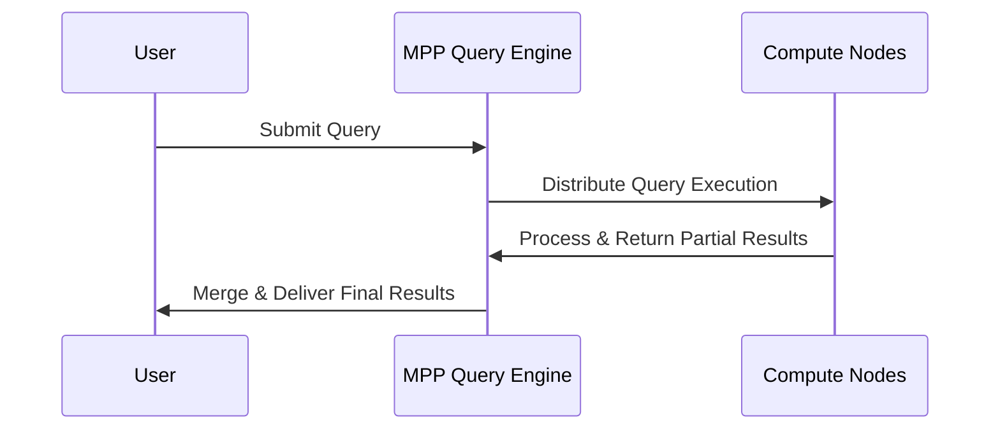
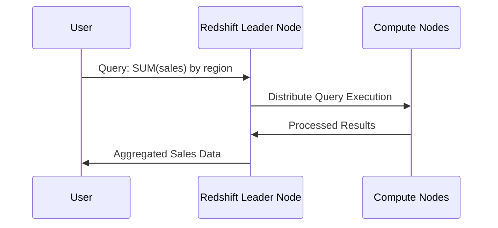

# **🚀 Massively Parallel Processing (MPP)**

<div style="text-align: center;">
    
</div>

## **1️⃣ What is Massively Parallel Processing (MPP)?**

Massively Parallel Processing (**MPP**) is a **data processing architecture** where multiple processors (nodes) work **simultaneously** to execute queries on large datasets. This **parallelism significantly improves performance** compared to traditional single-node databases.

### **✅ Why is MPP Important?**

- ✔ **Processes huge datasets quickly** by distributing workloads across multiple nodes.
- ✔ **Enables scalability**, allowing systems to handle petabytes of data efficiently.
- ✔ **Optimized for analytical workloads** in modern data warehouses (AWS Redshift, Snowflake, BigQuery).
- ✔ **Improves fault tolerance**, as failures in one node do not disrupt the entire system.
- ✔ **Supports real-time querying**, enhancing data-driven decision-making.

---

## **2️⃣ How Does MPP Work?**

### **📌 Traditional vs. MPP Architecture**

| **Feature**          | **Traditional Database (SMP)**     | **Massively Parallel Processing (MPP)** |
| -------------------- | ---------------------------------- | --------------------------------------- |
| **Processing Power** | Single CPU                         | Multiple nodes processing in parallel   |
| **Query Execution**  | Sequential, slower on large data   | Parallel, much faster                   |
| **Scalability**      | Limited by single-server resources | Scales by adding more nodes             |
| **Performance**      | Bottlenecked at a single point     | Distributes load evenly                 |
| **Best For**         | Small to medium workloads          | Large-scale analytical processing       |

### **📌 MPP Workflow Overview**

- 1️⃣ **Query is received** – A user submits a query.
- 2️⃣ **Query is divided** – MPP engine breaks it into smaller tasks.
- 3️⃣ **Distributed execution** – Each node processes its assigned data.
- 4️⃣ **Results are merged** – Partial results are aggregated and returned.



---

## **3️⃣ Components of an MPP System**

### **📌 1. Leader Node (Query Coordinator)**

- Directs query execution.
- Breaks queries into smaller tasks.
- Aggregates results from compute nodes.

### **📌 2. Compute Nodes (Worker Nodes)**

- Execute query fragments in parallel.
- Store data **partitioned** across nodes.
- Perform filtering, aggregations, and joins independently.

### **📌 3. Distributed Storage System**

- Data is spread across multiple nodes for **parallel access**.
- Uses **columnar storage** (e.g., Parquet, ORC) for optimized querying.

---

## **4️⃣ Key Techniques Used in MPP**

### **📌 1. Data Partitioning**

- MPP **divides datasets into smaller partitions** across nodes.
- **Types of Partitioning:**
  - **Hash Partitioning** – Distributes data based on a hash function.
  - **Range Partitioning** – Divides data based on value ranges (e.g., dates).
  - **Round-Robin Partitioning** – Evenly distributes data across nodes.

### **📌 2. Query Parallelization**

- Queries are split into **sub-queries**, processed independently, and merged.
- Uses **query pipelines** to minimize waiting time.

### **📌 3. Fault Tolerance & Node Recovery**

- If a node fails, the workload is **automatically redistributed**.
- Some MPP systems have **replicated partitions** for high availability.

---

## **5️⃣ Real-World MPP Implementations**

### **📌 Popular MPP Databases**

| **Platform**        | **Cloud Provider** | **Best Features**                               |
| ------------------- | ------------------ | ----------------------------------------------- |
| **Amazon Redshift** | AWS                | Columnar storage, integrates with AWS ecosystem |
| **Google BigQuery** | GCP                | Serverless MPP, auto-scaling, pay-as-you-go     |
| **Azure Synapse**   | Azure              | MPP-based SQL analytics service                 |
| **Snowflake**       | Multi-cloud        | Elastic scalability, automatic partitioning     |
| **Greenplum**       | On-Prem & Cloud    | Open-source, supports hybrid environments       |

### **📌 Example: Running an MPP Query in Amazon Redshift**

#### **Scenario:** Analyzing 1 billion sales transactions across multiple regions

```sql
SELECT region, SUM(sales)
FROM sales_data
GROUP BY region;
```

📌 **How MPP handles this query:**

- 1️⃣ The **leader node** breaks the query into sub-queries.
- 2️⃣ Compute nodes **process sales data in parallel** per region.
- 3️⃣ **Results are aggregated** and returned **much faster** than traditional databases.



---

## **6️⃣ Advantages & Challenges of MPP**

### **✅ Benefits of MPP**

- ✔ **Ultra-fast query execution** – MPP databases are optimized for analytical workloads.
- ✔ **Horizontal scalability** – Adding more nodes improves performance.
- ✔ **Handles complex queries efficiently** – Supports joins, aggregations, and window functions.
- ✔ **Cost-effective for large-scale analytics** – Reduces processing time compared to traditional systems.

### **⚠️ Challenges of MPP**

- ❌ **Expensive for small workloads** – Ideal for large datasets, but costly for small queries.
- ❌ **Requires data partitioning strategy** – Poor partitioning can lead to performance issues.
- ❌ **Complexity in query optimization** – Requires tuning and indexing for best performance.

---

## **🚀 Summary – Key Takeaways**

- ✔ **MPP distributes query workloads across multiple nodes**, enabling **high-speed data processing**.
- ✔ **Key techniques include data partitioning, query parallelization, and fault tolerance**.
- ✔ **Cloud-based MPP solutions like Amazon Redshift, Snowflake, and BigQuery dominate modern analytics**.
- ✔ **MPP is best for large-scale analytics, handling petabytes of data efficiently**.
- ✔ **Choosing the right MPP database depends on cost, scalability, and integration needs**.
