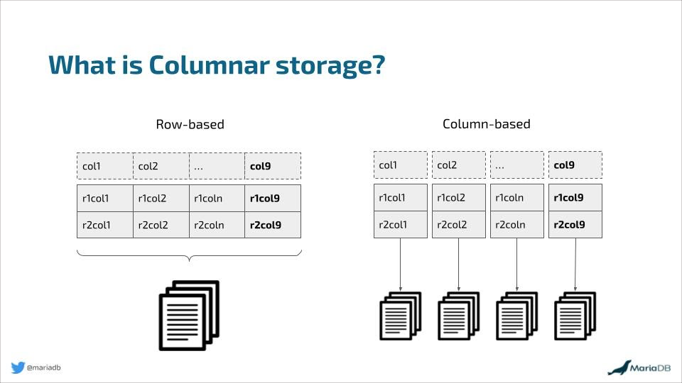
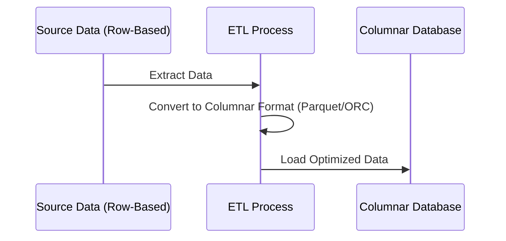
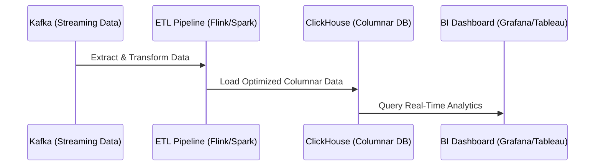

# **📦 Columnar Databases – The Future of Analytical Processing**

<div style="display: flex; justify-content: center;">
  
</div>

## **1️⃣ What is a Columnar Database?**

A **Columnar Database** is a type of database that **stores data by columns instead of rows**, making it **highly optimized for analytical workloads, big data, and real-time processing**.

### **✅ Why Use Columnar Databases?**

✔ **Faster analytical queries** – Reads only relevant columns instead of entire rows.  
✔ **Better compression** – Repetitive column data allows for higher compression ratios.  
✔ **Optimized for big data** – Handles massive datasets efficiently.  
✔ **Scales horizontally** – Can distribute data across multiple servers.  
✔ **Ideal for OLAP (Online Analytical Processing)** – Supports business intelligence (BI) and data warehousing.

---

## **2️⃣ How Columnar Databases Work**

<div style="text-align: center">
    
</div>

---

### **📌 Row-Based vs. Column-Based Storage**

| **Storage Type** | **How Data is Stored**                   | **Best For**                 |
| ---------------- | ---------------------------------------- | ---------------------------- |
| **Row-Based**    | Data stored row-by-row (traditional SQL) | OLTP (Transactional Systems) |
| **Columnar**     | Data stored column-by-column             | OLAP (Analytical Systems)    |

### **📌 Example: How Columnar Storage Works**

#### **Row-Based Storage (Traditional Databases)**

```plaintext
ID   Name   Age   Salary
1    John   30    50000
2    Alice  28    55000
3    Bob    35    60000
```

- Queries must scan the entire table, even if only **Age** or **Salary** is needed.

#### **Columnar Storage Format**

```plaintext
ID: 1, 2, 3
Name: John, Alice, Bob
Age: 30, 28, 35
Salary: 50000, 55000, 60000
```

- Only relevant **columns** are accessed, improving query performance.

### **📌 Example of Columnar Storage in Action**

Imagine a **financial database** that stores stock prices:

#### **Row-Based Storage Example**

| Stock ID | Date       | Price |
| -------- | ---------- | ----- |
| 101      | 2024-03-01 | 500   |
| 102      | 2024-03-01 | 700   |
| 103      | 2024-03-01 | 800   |

🔹 **If we want to find the average price, we need to scan every row.**

#### **Columnar Storage Example**

| Column Name | Data                               |
| ----------- | ---------------------------------- |
| Stock ID    | 101, 102, 103                      |
| Date        | 2024-03-01, 2024-03-01, 2024-03-01 |
| Price       | 500, 700, 800                      |

🔹 **The query only reads the 'Price' column, making it much faster.**

---

## **3️⃣ Key Features of Columnar Databases**

### **📌 1. High-Performance Query Execution**

- Uses **vectorized execution** to process **millions of rows in parallel**.
- Best suited for **SUM(), AVG(), COUNT(), GROUP BY, and WHERE conditions**.

### **📌 2. Advanced Compression**

- Column data is highly repetitive, allowing for **Run-Length Encoding (RLE), Dictionary Encoding, and Delta Encoding**.
- Reduces storage size and increases query speed.

### **📌 3. Parallel Processing & MPP Support**

- Most columnar databases support **Massively Parallel Processing (MPP)**.
- Workloads are distributed across multiple nodes, improving scalability.

### **📌 4. Indexing Optimization**

- Columnar databases use **bitmap indexing** instead of traditional B-Trees.
- Faster filtering and searching in big data environments.

---

## **4️⃣ Popular Columnar Databases**

| **Database**         | **Type**         | **Best For**                        |
| -------------------- | ---------------- | ----------------------------------- |
| **Amazon Redshift**  | Cloud MPP        | Data Warehousing & BI               |
| **Google BigQuery**  | Cloud Serverless | Real-Time Big Data Analytics        |
| **Snowflake**        | Multi-Cloud      | Scalable Data Warehousing           |
| **Apache Cassandra** | NoSQL            | Distributed Columnar Storage        |
| **ClickHouse**       | Open-Source      | High-Speed Analytical Queries       |
| **Apache Druid**     | Real-Time OLAP   | Low-latency Time-Series Data        |
| **MonetDB**          | Open-Source      | Scientific & Financial Applications |

---

## **5️⃣ Columnar Databases vs. Traditional Databases**

| **Feature**               | **Traditional (Row-Based)** | **Columnar (Column-Based)**  |
| ------------------------- | --------------------------- | ---------------------------- |
| **Query Speed**           | Slower for analytics        | 10-100x faster for analytics |
| **Compression**           | Limited                     | High compression ratio       |
| **OLTP (Transactions)**   | Best suited                 | Not optimized                |
| **OLAP (Analytics & BI)** | Slower                      | Optimized for reporting      |
| **Scalability**           | Vertical Scaling            | Horizontal Scaling           |

---

## **6️⃣ How ETL Works with Columnar Databases**

### **📌 Converting Row-Based Data to Columnar Format**

1️⃣ **Extract Data** – Pull structured & semi-structured data.  
2️⃣ **Transform Data** – Convert into columnar formats (Parquet, ORC).  
3️⃣ **Load into Columnar Database** – Optimize for fast querying.



---

## **7️⃣ Real-World Use Case: Implementing Columnar Databases**

### **📊 Scenario: Real-Time Ad Click Analytics**

A digital marketing company needs to analyze **millions of ad clicks per second**.

🔹 **Old Approach (Row-Based Database - MySQL)**

- Queries take **minutes to process**.
- High storage cost due to redundant row data.

🔹 **New Approach (Columnar Database - ClickHouse)**
1️⃣ **Streaming Data from Apache Kafka**.  
2️⃣ **Transforming it into a columnar format (ORC)**.  
3️⃣ **Loading into ClickHouse for real-time queries**.  
4️⃣ **BI Tools (Tableau, Grafana) visualize real-time reports**.



---

## **🚀 Summary – Key Takeaways**

✔ **Columnar databases store data in columns rather than rows, optimizing analytics.**  
✔ **Faster query execution, high compression, and MPP support make them ideal for big data.**  
✔ **Amazon Redshift, Snowflake, and ClickHouse are popular columnar databases.**  
✔ **ETL processes extract data, convert it to columnar format (Parquet/ORC), and load it for analytics.**  
✔ **Perfect for OLAP, reporting, and real-time big data analytics.**
