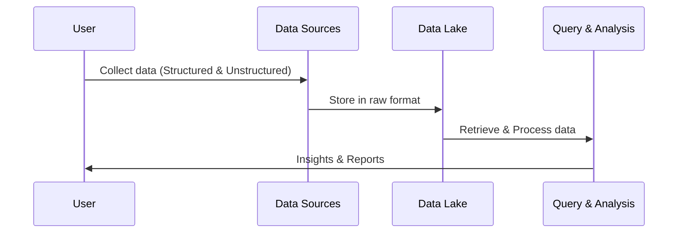
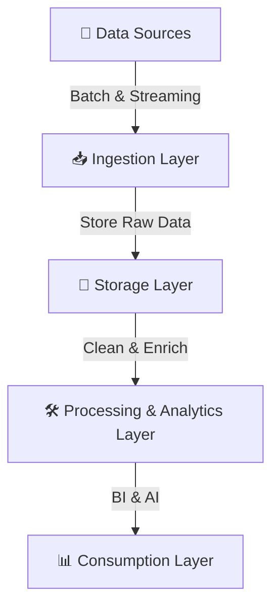
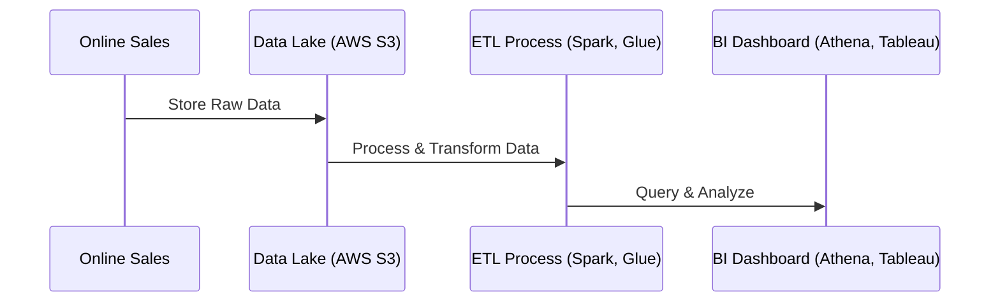
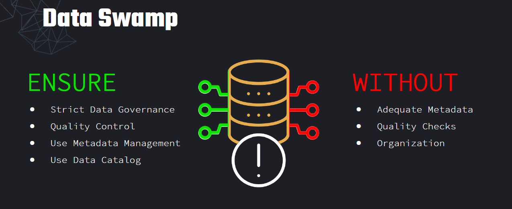

# **🌊 What is a Data Lake?**

Back in the early 2000s, **Big Data** exploded. Companies struggled to manage **large-scale, high-velocity, and diverse** data from various sources (sensors, logs, apps, social media). Traditional **SQL-based** databases weren’t built for this.

> 🔹 **James Dixon** (Pentaho CTO) coined the term **Data Lake** in 2010, describing it as a **large body of raw data** stored in a **natural state**, which can be tapped into when needed.

Let’s break it down in a clear.

## 🏊‍♂️ **What is a Data Lake?**

### **Definition** 📖

A **Data Lake** is a massive **centralized** storage repository that holds raw **structured, semi-structured, and unstructured** data **in its native format**. Unlike Data Warehouses, which enforce rigid schemas, Data Lakes store **everything as-is**—giving organizations the flexibility to process and analyze data later.

### **✅ Why Use a Data Lake?**

- ✔ **Scalability** – Can store petabytes of data efficiently.
- ✔ **Schema-on-read** – Data is stored in raw format and transformed when queried.
- ✔ **Supports multiple data types** – Structured (CSV, Parquet), Semi-structured (JSON, XML), Unstructured (videos, images).
- ✔ **Cost-effective storage** – Built on low-cost cloud storage (e.g., AWS S3, Azure Data Lake Storage, Google Cloud Storage).
- ✔ **Enables AI & Machine Learning** – Provides vast datasets for model training.

---

## 📡 **Data Sources for Data Lakes**

Data Lakes ingest data from multiple sources:

- 1️⃣ **Transactional Databases** – SQL, NoSQL (e.g., PostgreSQL, MongoDB).
- 2️⃣ **Streaming Data** – IoT devices, Kafka, AWS Kinesis.
- 3️⃣ **Files** – CSV, JSON, Parquet, Avro, ORC.
- 4️⃣ **Logs & Machine Data** – System logs, CloudWatch logs.
- 5️⃣ **API & Web Scraped Data** – REST APIs, Web crawlers.
- 6️⃣ **Multimedia** – Images, videos, audio, PDFs.

---

## 🆚 **Data Lake vs. Traditional Data Storage**

| **Feature**     | **Data Lake**                             | **Data Warehouse**           | **Traditional Database**      |
| --------------- | ----------------------------------------- | ---------------------------- | ----------------------------- |
| **Data Type**   | Structured, Semi-structured, Unstructured | Structured & Semi-structured | Structured                    |
| **Schema**      | Schema-on-read                            | Schema-on-write              | Schema-on-write               |
| **Scalability** | High (Petabytes of Data)                  | Moderate (Terabytes of Data) | Limited                       |
| **Use Case**    | Big data, AI, IoT, ML                     | BI, Reporting                | Transactions, CRUD operations |
| **Performance** | Optimized for batch & real-time analytics | Fast for structured queries  | Fast for small transactions   |

- 🔹 **Data Lakes are best for raw data storage and advanced analytics.**
- 🔹 **Data Warehouses are best for structured, business intelligence (BI) queries.**
- 🔹 **Databases are best for real-time transactions.**

---

## 🚦 **How a Data Lake Works**

Here’s a **simple** workflow:

🔹 Data is first **ingested** from multiple sources.  
🔹 It remains **raw** until processed **on demand**.  
🔹 Various tools like **Athena, Spark, and Presto** can query data.  
🔹 **Machine Learning & BI tools** analyze the data.

---

Here’s your detailed and organized section on **Data Lake and Key Concepts**:

---

## 🏛️ **Key Concepts & Terminology**

### 🗂️ **Metadata**

Metadata is data about data! In the context of data lakes, it includes information like file size, type, creation date, and tags, helping you locate and manage data effectively.

**Example:** Think of metadata as the label on a storage box that tells you what's inside—so instead of rummaging through everything, you can quickly find the box you need.

---

### 🌪️ **Data Swamp**

A data swamp is what a data lake turns into when it becomes disorganized and unmanageable. This happens when there’s no proper governance or metadata tagging, making it hard to locate or trust the data.

**Example:** Imagine a warehouse where items are thrown in randomly without labels. Finding a specific product becomes a nightmare!

---

### 🛡️ **Data Governance**

Data governance is the practice of managing data availability, usability, integrity, and security in a data lake. It ensures that data remains reliable and complies with organizational policies and regulations.

**Example:** Like having a librarian in charge of organizing books in a library to ensure everyone can find what they need without violating library rules.

---

### 📖 **Data Catalog**

A data catalog acts as an organized inventory of data within your data lake. It provides metadata, descriptions, and search capabilities to help users find and understand datasets.

**Example:** Think of it as an index in a library catalog that tells you exactly where a book is located and what it contains.

---

### 🔄 **ETL vs. ELT**

- **ETL (Extract, Transform, Load):** Data is transformed before being loaded into the storage system. Often used with traditional data warehouses.
- **ELT (Extract, Load, Transform):** Data is first loaded into the data lake in raw format and transformed later as needed, leveraging the lake's flexibility.

**Example:**

- ETL: Like cleaning and sorting your groceries before putting them in the fridge.
- ELT: Throwing everything into the fridge and deciding later how to prepare the meal.

---

### 📂 **Structured, Semi-Structured, and Unstructured Data**

- **Structured Data:** Organized in rows/columns (e.g., spreadsheets, databases).
- **Semi-Structured Data:** Partially organized (e.g., JSON, XML).
- **Unstructured Data:** Freeform, with no fixed format (e.g., text files, images, videos).

**Example:**

- Structured: A table of customer orders.
- Semi-Structured: JSON of a product’s attributes.
- Unstructured: A folder of customer review images and videos.

---

### ⚖️ **Schema on Read vs. Schema on Write**

- **Schema on Write:** Data structure is defined before data is written to the storage (used in data warehouses).
- **Schema on Read:** Data structure is applied only when reading or processing the data (used in data lakes).

**Example:**

- Schema on Write: Organizing files in a folder hierarchy upfront (e.g., by year/month).
- Schema on Read: Dumping files into a single folder and sorting them as needed later.

---

## **Key Components of a Data Lake**

A modern data lake consists of **four main layers**:

### **📌 1. Data Ingestion Layer**

- Collects data from multiple sources (APIs, databases, IoT, logs).
- Supports **batch & real-time streaming ingestion** (Kafka, AWS Kinesis, Azure Event Hubs).

### **📌 2. Storage Layer**

- Stores raw data in cloud-based, highly scalable storage.
- Examples: **AWS S3, Azure Data Lake Storage, Google Cloud Storage.**
- Supports multiple formats (Parquet, ORC, Avro, JSON, CSV).

### **📌 3. Processing & Analytics Layer**

- Transforms raw data into structured, queryable datasets.
- Uses **ETL/ELT tools** (AWS Glue, Apache Spark, Databricks).
- Supports real-time analytics with **Apache Flink, Kinesis Analytics**.

### **📌 4. Consumption Layer (BI & AI)**

- Query and analyze processed data using **SQL engines (Athena, Presto, BigQuery)**.
- BI dashboards (Tableau, Power BI) and machine learning frameworks (TensorFlow, PyTorch).

---

## **Data Lake Architecture – How It Works**

### **📌 Example: Retail Data Lake for Customer Analytics**

A retail company wants to collect and analyze data from **online sales, store transactions, customer behavior, and product reviews**.

#### **🔄 Data Flow**

- 1️⃣ **Data Ingestion** – Logs, customer orders, and reviews are streamed into the data lake.
- 2️⃣ **Storage** – Data is stored in AWS S3 in raw format.
- 3️⃣ **Processing** – Apache Spark transforms & aggregates data for analytics.
- 4️⃣ **Analysis** – AWS Athena queries structured datasets for BI dashboards.

---

## ⚠️ **Beware of the Data Swamp!**

    

---

A **Data Lake** can **turn into a Data Swamp** 🏚️ if **poor governance** exists.

A data swamp occurs when there is poor management and governance of the data lake, leading to inaccessible, non-compliant and low-quality data, it emphasises the need for strict governance and metadata management.

🚨 **What causes a Data Swamp?**

- ❌ Lack of **Metadata Management**.
- ❌ No **Data Quality Checks**.
- ❌ No **Access Control & Security**.

✅ **Solution**: Implement **strict governance** (Data Catalogs, Metadata, Access Controls).

---

## 💸 **Benefits & Challenges of Data Lakes**

### **✅ Advantages**

- ✔ **Stores massive amounts of raw data for future use**.
- ✔ **Allows flexible schema changes (schema-on-read)**.
- ✔ **Integrates with AI, ML, and real-time analytics tools**.
- ✔ **Supports batch and real-time data ingestion**.
- ✔ **Cost-efficient compared to traditional storage.**

### **⚠️ Challenges & How to Solve Them**

- ❌ **Data Swamp Risk** – Without proper data governance, data lakes become unmanageable.

  - 🔹 **Solution** – Implement **metadata tagging, data catalogs (AWS Glue Data Catalog, Apache Atlas).**

- ❌ **Slow Query Performance** – Raw data is unstructured and needs processing.

  - 🔹 **Solution** – Use **optimized columnar storage formats (Parquet, ORC)** and SQL query engines.

- ❌ **Security & Access Control** – Large-scale data lakes require strong security policies.
  - 🔹 **Solution** – Implement **role-based access control (RBAC)** and encryption for sensitive data.

---

## **🚀 Summary – Key Takeaways**

- ✔ **A Data Lake is a scalable, flexible storage solution for structured & unstructured data.**
- ✔ **Stores raw data for AI, analytics, and real-time processing.**
- ✔ **Schema-on-read allows flexible querying & transformations.**
- ✔ **Supports batch & real-time ingestion with Kafka, Kinesis, and Flink.**
- ✔ **Optimized with metadata tagging, data cataloging, and security controls.**
