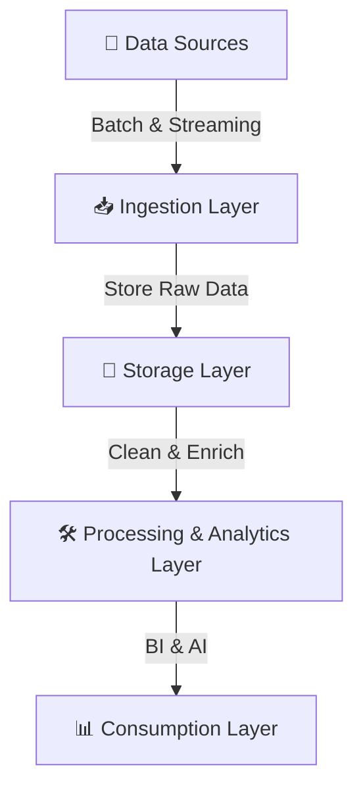

# **🌊 What is a Data Lake?**

## **1️⃣ Introduction to Data Lake**

A **Data Lake** is a centralized repository that **stores structured, semi-structured, and unstructured data** in its raw format. Unlike traditional databases or data warehouses, a data lake **does not require a predefined schema**, making it highly flexible for **big data storage and analytics**.

### **✅ Why Use a Data Lake?**

- ✔ **Scalability** – Can store petabytes of data efficiently.
- ✔ **Schema-on-read** – Data is stored in raw format and transformed when queried.
- ✔ **Supports multiple data types** – Structured (CSV, Parquet), Semi-structured (JSON, XML), Unstructured (videos, images).
- ✔ **Cost-effective storage** – Built on low-cost cloud storage (e.g., AWS S3, Azure Data Lake Storage, Google Cloud Storage).
- ✔ **Enables AI & Machine Learning** – Provides vast datasets for model training.

---

## **2️⃣ Data Lake vs. Traditional Data Storage**

| **Feature**     | **Data Lake**                             | **Data Warehouse**           | **Traditional Database**      |
| --------------- | ----------------------------------------- | ---------------------------- | ----------------------------- |
| **Data Type**   | Structured, Semi-structured, Unstructured | Structured & Semi-structured | Structured                    |
| **Schema**      | Schema-on-read                            | Schema-on-write              | Schema-on-write               |
| **Scalability** | High (Petabytes of Data)                  | Moderate (Terabytes of Data) | Limited                       |
| **Use Case**    | Big data, AI, IoT, ML                     | BI, Reporting                | Transactions, CRUD operations |
| **Performance** | Optimized for batch & real-time analytics | Fast for structured queries  | Fast for small transactions   |

- 🔹 **Data Lakes are best for raw data storage and advanced analytics.**
- 🔹 **Data Warehouses are best for structured, business intelligence (BI) queries.**
- 🔹 **Databases are best for real-time transactions.**

---

## **3️⃣ Key Components of a Data Lake**

A modern data lake consists of **four main layers**:



### **📌 1. Data Ingestion Layer**

- Collects data from multiple sources (APIs, databases, IoT, logs).
- Supports **batch & real-time streaming ingestion** (Kafka, AWS Kinesis, Azure Event Hubs).

### **📌 2. Storage Layer**

- Stores raw data in cloud-based, highly scalable storage.
- Examples: **AWS S3, Azure Data Lake Storage, Google Cloud Storage.**
- Supports multiple formats (Parquet, ORC, Avro, JSON, CSV).

### **📌 3. Processing & Analytics Layer**

- Transforms raw data into structured, queryable datasets.
- Uses **ETL/ELT tools** (AWS Glue, Apache Spark, Databricks).
- Supports real-time analytics with **Apache Flink, Kinesis Analytics**.

### **📌 4. Consumption Layer (BI & AI)**

- Query and analyze processed data using **SQL engines (Athena, Presto, BigQuery)**.
- BI dashboards (Tableau, Power BI) and machine learning frameworks (TensorFlow, PyTorch).

---

## **4️⃣ Data Lake Architecture – How It Works**

### **📌 Example: Retail Data Lake for Customer Analytics**

A retail company wants to collect and analyze data from **online sales, store transactions, customer behavior, and product reviews**.

#### **🔄 Data Flow**

- 1️⃣ **Data Ingestion** – Logs, customer orders, and reviews are streamed into the data lake.
- 2️⃣ **Storage** – Data is stored in AWS S3 in raw format.
- 3️⃣ **Processing** – Apache Spark transforms & aggregates data for analytics.
- 4️⃣ **Analysis** – AWS Athena queries structured datasets for BI dashboards.

```mermaid
sequenceDiagram
    participant Online Sales
    participant Data Lake (AWS S3)
    participant ETL Process (Spark, Glue)
    participant BI Dashboard (Athena, Tableau)
    Online Sales->>Data Lake (AWS S3): Store Raw Data
    Data Lake (AWS S3)->>ETL Process (Spark, Glue): Process & Transform Data
    ETL Process (Spark, Glue)->>BI Dashboard (Athena, Tableau): Query & Analyze
```

---

## **5️⃣ Benefits & Challenges of Data Lakes**

### **✅ Advantages**

✔ **Stores massive amounts of raw data for future use**.  
✔ **Allows flexible schema changes (schema-on-read)**.  
✔ **Integrates with AI, ML, and real-time analytics tools**.  
✔ **Supports batch and real-time data ingestion**.  
✔ **Cost-efficient compared to traditional storage.**

### **⚠️ Challenges & How to Solve Them**

- ❌ **Data Swamp Risk** – Without proper data governance, data lakes become unmanageable.

  - 🔹 **Solution** – Implement **metadata tagging, data catalogs (AWS Glue Data Catalog, Apache Atlas).**

- ❌ **Slow Query Performance** – Raw data is unstructured and needs processing.

  - 🔹 **Solution** – Use **optimized columnar storage formats (Parquet, ORC)** and SQL query engines.

- ❌ **Security & Access Control** – Large-scale data lakes require strong security policies.
  - 🔹 **Solution** – Implement **role-based access control (RBAC)** and encryption for sensitive data.

---

## **🚀 Summary – Key Takeaways**

✔ **A Data Lake is a scalable, flexible storage solution for structured & unstructured data.**  
✔ **Stores raw data for AI, analytics, and real-time processing.**  
✔ **Schema-on-read allows flexible querying & transformations.**  
✔ **Supports batch & real-time ingestion with Kafka, Kinesis, and Flink.**  
✔ **Optimized with metadata tagging, data cataloging, and security controls.**
