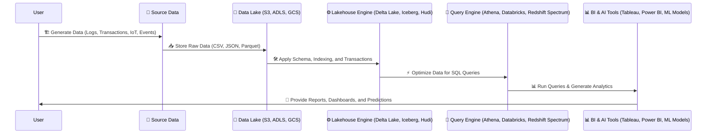

# **🏠 Data Warehouse 🆚 Data Lake 🆚 Lakehouse**

## **🔍 Introduction**

Traditional **Data Warehouses** and **Data Lakes** have limitations:

- **Data Warehouses** → Fast querying, but **expensive & inflexible** for unstructured data.
- **Data Lakes** → Store massive raw data **cheaply**, but **slow querying & lack governance**.

💡 **Lakehouse Architecture** combines the **best of both worlds**, enabling:  
✅ **Fast SQL queries like a Data Warehouse**.  
✅ **Scalability & flexibility like a Data Lake**.  
✅ **Advanced AI/ML analytics** on structured & unstructured data.

---

## **1️⃣ Why Do We Need a Lakehouse?**

### **Problems with Data Lakes & Warehouses**

| Issue                 | Data Lake 🌊                   | Data Warehouse 🏢                          |
| --------------------- | ------------------------------ | ------------------------------------------ |
| **Query Performance** | ❌ Slow (scans raw data)       | ✅ Fast (optimized for analytics)          |
| **Data Governance**   | ❌ Weak (no ACID transactions) | ✅ Strong (strict schemas & security)      |
| **Scalability**       | ✅ High (cheap storage)        | ❌ Limited (expensive & slow for big data) |
| **AI & ML Support**   | ✅ Great (stores all data)     | ❌ Poor (structured data only)             |
| **Real-Time Updates** | ❌ Hard (batch processing)     | ✅ Fast updates & transactions             |

📌 **Solution:** Lakehouse Architecture **fixes these problems** by merging **Data Lake & Data Warehouse capabilities**.

---

## **2️⃣ How Does a Lakehouse Work?**

**📌 How It Works (Step-by-Step):**

- 1️⃣ **🏗️ User Generates Data** → Transactions, logs, IoT events are produced.
- 2️⃣ **📥 Source Data is Stored in the Data Lake** → Unstructured & structured data (CSV, JSON, Parquet).
- 3️⃣ **🛠️ Lakehouse Engine Adds Structure** → Schema, ACID transactions, indexing applied.
- 4️⃣ **⚡ Query Engine Optimizes Data** → SQL queries become faster & more efficient.
- 5️⃣ **📊 BI & AI Tools Analyze the Data** → Dashboards, reports, machine learning insights.
- 6️⃣ **📢 User Receives Insights** → AI predictions, business intelligence dashboards.

---

## **3️⃣ Key Components of a Lakehouse**

### **🗄️ 1. Storage Layer (Data Lake)**

- Stores **structured & unstructured data** in scalable **cloud storage**.
- Uses **Amazon S3, Azure Data Lake, Google Cloud Storage**.

### **🛠️ 2. Lakehouse Engine (Delta Lake, Iceberg, Hudi)**

- Adds **ACID transactions**, indexing, and schema enforcement.
- Ensures **fast querying & governance**.

### **🔎 3. Query Engine & Compute**

- Allows **SQL querying** on raw & structured data.
- Tools: **Amazon Athena, Apache Spark, Redshift Spectrum, BigQuery**.

### **📊 4. Analytics & AI**

- BI tools like **Tableau, Power BI, QuickSight**.
- Machine Learning tools like **SageMaker, Databricks ML**.

---

## **4️⃣ Common Tools for Lakehouse Architecture**

| Layer                  | Common Tools                                         |
| ---------------------- | ---------------------------------------------------- |
| **Storage**            | ✅ Amazon S3, Azure Data Lake, Google Cloud Storage  |
| **Processing Engine**  | ✅ Apache Spark, Trino, Presto                       |
| **Lakehouse Engine**   | ✅ Delta Lake, Apache Iceberg, Apache Hudi           |
| **Querying & Compute** | ✅ Amazon Athena, Redshift Spectrum, Google BigQuery |
| **BI & Analytics**     | ✅ Tableau, Power BI, AWS QuickSight                 |
| **Machine Learning**   | ✅ Amazon SageMaker, Databricks ML, Azure ML         |

📌 **Most companies use AWS, Azure, or Google Cloud for implementing Lakehouse.**

---

## **5️⃣ Benefits of a Lakehouse**

- ✅ **Faster Queries** → Structured querying on big data.
- ✅ **Scalable & Cost-Efficient** → Uses cheap storage (S3, ADLS, GCS).
- ✅ **Supports AI/ML** → Allows deep learning & analytics on massive datasets.
- ✅ **ACID Transactions** → Ensures data integrity & consistency.
- ✅ **Real-Time Data Processing** → Handles batch & streaming data efficiently.

---

## **6️⃣ When to Use a Lakehouse?**

| **Use Case**                                     | **Lakehouse?**       |
| ------------------------------------------------ | -------------------- |
| Store raw & structured data together             | ✅ Yes               |
| Run **fast SQL queries** on massive data         | ✅ Yes               |
| Train **Machine Learning models**                | ✅ Yes               |
| Generate **BI reports & dashboards**             | ✅ Yes               |
| Manage only small, structured transactional data | ❌ No (Use Database) |

---

## **7️⃣ Lakehouse vs. Data Lake vs. Data Warehouse**

| Feature                   | Data Lake 🌊                  | Data Warehouse 🏢 | Lakehouse 🏠           |
| ------------------------- | ----------------------------- | ----------------- | ---------------------- |
| **Data Type**             | Raw, structured, unstructured | Structured only   | All data types         |
| **Query Performance**     | Slow (scans raw data)         | Fast (optimized)  | Fast (optimized)       |
| **Schema**                | Schema-on-Read                | Schema-on-Write   | Schema-on-Read & Write |
| **Governance & Security** | Weak                          | Strong            | Strong                 |
| **AI & ML Support**       | ✅ Yes                        | ❌ No             | ✅ Yes                 |

---

## **🎯 Summary**

- ✔ **Lakehouse combines** the best of Data Lakes & Data Warehouses.
- ✔ **Supports SQL queries, real-time analytics, and AI/ML.**
- ✔ Uses **cheap cloud storage (S3, ADLS, GCS)** with **fast querying tools**.
- ✔ **Popular tools**: Delta Lake, Iceberg, Hudi, Athena, BigQuery, Redshift Spectrum.
