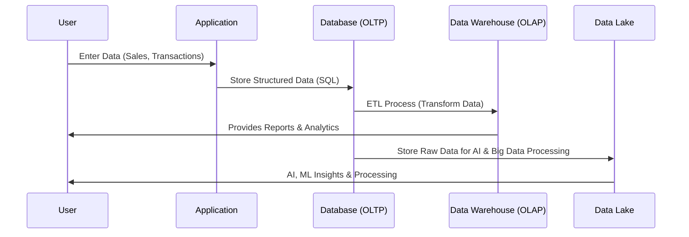

# **🏪 Database vs. Data Warehouse vs. Data Lake – How They Work, Tools & Learning Resources**

## **🔍 Introduction**

When dealing with **data storage and analytics**, you’ll come across three main types of storage solutions:

- 1️⃣ **Databases** → For storing and managing structured data for applications.
- 2️⃣ **Data Warehouses** → For analyzing historical structured data.
- 3️⃣ **Data Lakes** → For storing **raw, structured, and unstructured** data for advanced processing.

Each serves a different purpose, and choosing the right one depends on **how the data will be used**.

---

## **1️⃣ What is a Database? (OLTP) 📊**

### **📌 How It Works (Step-by-Step)**

- 1️⃣ **Application writes data** to a database (e.g., an online order).
- 2️⃣ The **database organizes the data** into structured tables.
- 3️⃣ Users or applications **query** the database using **SQL** to retrieve information.

### **✅ Key Characteristics**

- ✔ **Stores structured data** (tables with rows & columns).
- ✔ **Optimized for transactions** (OLTP - Online Transaction Processing).
- ✔ **Ensures consistency** using **ACID properties** (Atomicity, Consistency, Isolation, Durability).
- ✔ **Best for real-time applications** (e.g., Banking, E-commerce).

### **📊 Example: Database Table (Orders)**

| OrderID | Customer | Product | OrderDate  |
| ------- | -------- | ------- | ---------- |
| 101     | Ali      | Laptop  | 2023-05-10 |
| 102     | Sarah    | Phone   | 2023-06-15 |

📌 **Use Case:**  
If you buy a **phone from an e-commerce website**, the order details are stored in a **database**.

### **⚙️ Common Database Tools**

- ✔ **Relational Databases (SQL)** → MySQL, PostgreSQL, SQL Server, Oracle.
- ✔ **NoSQL Databases** → MongoDB, DynamoDB (for flexible data storage).
- ✔ **Cloud Databases** → Amazon RDS, Aurora, Google Cloud SQL.

### **📚 References to Learn Databases**

- 🔹 **PostgreSQL Docs** – [link](https://www.postgresql.org/docs/)
- 🔹 **MySQL Guide** – [link](https://dev.mysql.com/doc/)
- 🔹 **AWS RDS Documentation** – [link](https://docs.aws.amazon.com/AmazonRDS/latest/UserGuide/Welcome.html)

---

## **2️⃣ What is a Data Warehouse? (OLAP) 🏢**

### **📌 How It Works (Step-by-Step)**

- 1️⃣ **Data is extracted** from multiple databases.
- 2️⃣ **ETL (Extract, Transform, Load)** processes clean & transform data.
- 3️⃣ The data is stored in a **structured format** optimized for analysis.
- 4️⃣ **BI tools (Power BI, QuickSight, Tableau)** are used to generate reports.

### **✅ Key Characteristics**

- ✔ **Stores historical structured data** for analysis.
- ✔ **Optimized for analytical queries** (OLAP - Online Analytical Processing).
- ✔ Uses **columnar storage** (Parquet, ORC) for faster query performance.
- ✔ Best for **reporting, dashboards, and business intelligence (BI)**.

### **📊 Example: Data Warehouse Table (Sales Analytics)**

| Year | Product | Total Sales | Region |
| ---- | ------- | ----------- | ------ |
| 2022 | Laptop  | \$500,000   | USA    |
| 2023 | Phone   | \$750,000   | Europe |

📌 **Use Case:**  
A company wants to analyze **sales trends** for the last 5 years → The data is pulled from multiple databases and stored in a **data warehouse** for reporting.

### **⚙️ Common Data Warehouse Tools**

- ✔ **Cloud Data Warehouses** → Amazon Redshift, Google BigQuery, Snowflake.
- ✔ **ETL Tools** → AWS Glue, Apache NiFi, Talend, Airflow.
- ✔ **BI & Reporting Tools** → Power BI, Tableau, Amazon QuickSight.

### **📚 References to Learn Data Warehousing**

- 🔹 **Amazon Redshift Docs** – [link](https://docs.aws.amazon.com/redshift/latest/dg/welcome.html)
- 🔹 **Google BigQuery Guide** – [link](https://cloud.google.com/bigquery/docs/)
- 🔹 **Snowflake Data Warehouse Docs** – [link](https://docs.snowflake.com/en/)

---

## **3️⃣ What is a Data Lake? (Raw Data Storage) 🌊**

### **📌 How It Works (Step-by-Step)**

- 1️⃣ **Raw data (structured & unstructured) is ingested** from multiple sources.
- 2️⃣ The data is stored in a **scalable object storage system**.
- 3️⃣ **Big Data tools (Apache Spark, Presto, Athena)** are used to process it.
- 4️⃣ **AI & Machine Learning models** extract insights from the data.

### **✅ Key Characteristics**

- ✔ **Stores raw, structured & unstructured data** (videos, logs, IoT data).
- ✔ **Highly scalable and cost-effective** (petabytes of data).
- ✔ Uses **object storage (Amazon S3, Google Cloud Storage)**.
- ✔ **Works with AI, ML, and Big Data analytics**.

### **📊 Example: Data Lake Content**

| Data Type   | Source       | Format |
| ----------- | ------------ | ------ |
| Sales Data  | CRM          | CSV    |
| Sensor Data | IoT Devices  | JSON   |
| Images      | User Uploads | JPEG   |

📌 **Use Case:**  
A streaming platform stores **raw video files** and **user logs** in a **data lake** for AI-based recommendations.

### **⚙️ Common Data Lake Tools**

- ✔ **Cloud Data Lakes** → AWS S3 + Lake Formation, Azure Data Lake, Google Cloud Storage.
- ✔ **Big Data Processing** → Apache Spark, Presto, Trino, Hive.
- ✔ **Querying Tools** → AWS Athena, Databricks, Snowflake.

### **📚 References to Learn Data Lakes**

- 🔹 **AWS Lake Formation Docs** – [link](https://docs.aws.amazon.com/lake-formation/latest/dg/what-is-lake-formation.html)
- 🔹 **Databricks Data Lake Guide** – [link](https://databricks.com/product/data-lakehouse)
- 🔹 **Google Cloud Data Lake Docs** – [link](https://cloud.google.com/architecture/data-lakes)

---

## **4️⃣ Key Differences: Database vs. Data Warehouse vs. Data Lake**

| Feature            | Database (OLTP) 📊                  | Data Warehouse (OLAP) 🏢        | Data Lake 🌊                       |
| ------------------ | ----------------------------------- | ------------------------------- | ---------------------------------- |
| **Purpose**        | Store & manage transactional data   | Store & analyze historical data | Store raw, big data                |
| **Data Type**      | Structured                          | Structured                      | Structured + Unstructured          |
| **Query Language** | SQL                                 | SQL (Optimized for OLAP)        | SQL + Big Data Tools               |
| **Storage Type**   | Tables (Rows & Columns)             | Columnar Storage (Parquet, ORC) | Object Storage (JSON, Video, Logs) |
| **Processing**     | Fast for Transactions               | Fast for Queries                | Batch & Streaming Processing       |
| **Use Case**       | Apps, Websites, Business Operations | Business Intelligence & Reports | AI, Machine Learning, IoT          |

---

## **5️⃣ How Do They Work Together?**

Most companies **use all three** together in a **data pipeline**.

---

## **🎯 Summary**

- ✔ **Databases** store structured, transactional data (OLTP).
- ✔ **Data Warehouses** store cleaned, structured data for analytics (OLAP).
- ✔ **Data Lakes** store raw, structured & unstructured data for big data processing.
- ✔ **All three can be used together** in a data pipeline.

🚀 **Next Step:** Would you like to learn about **Lakehouse Architecture (combining Data Warehouse + Data Lake) or AWS services like Amazon S3, Redshift, and Athena?**
