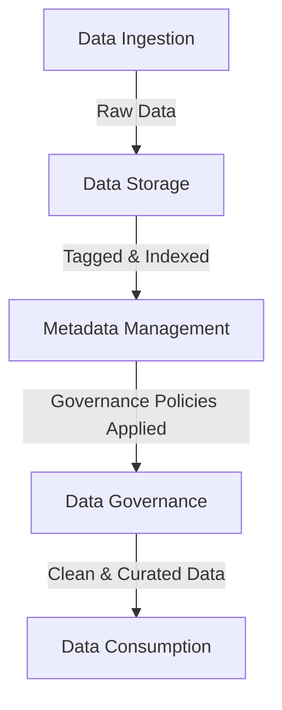
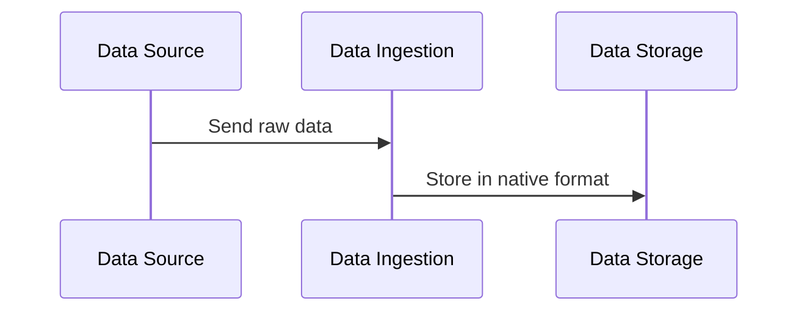
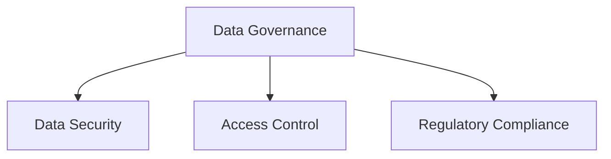

# 🚀 **Data Flow in a Data Lake: A Complete Guide**

A **Data Lake** isn’t just a place to dump data; it follows a structured **data flow** to ensure efficiency, governance, and accessibility. This guide will break down the **end-to-end flow** of data from **ingestion to consumption**, covering key zones, transformations, and best practices.

---

## 🌊 **Data Flow Overview**

A Data Lake follows **five major steps**:

### **Key Stages:**

- 1️⃣ **Data Ingestion** → Bringing in raw data from various sources.
- 2️⃣ **Data Storage** → Storing data in its **native raw format**.
- 3️⃣ **Metadata Management** → Organizing data for discovery.
- 4️⃣ **Data Governance** → Ensuring security, compliance, and quality.
- 5️⃣ **Data Consumption** → Using data for analytics, ML, and reporting.

---

<div style="text-align: center;">



</div>

---

## 📥 **1️⃣ Data Ingestion Layer**

### **What is Data Ingestion?**

Data ingestion is the **entry point** into the Data Lake. It imports raw data from various sources, **without modifying it**.

### **Data Sources** 🌍

A Data Lake ingests **diverse types of data** from multiple sources:

- 🔹 **IoT Devices** – Sensors, logs, machine-generated data.
- 🔹 **Online Platforms** – Web apps, social media.
- 🔹 **Relational Databases** – SQL & NoSQL (PostgreSQL, MongoDB).
- 🔹 **Mobile Apps** – User interactions, transactions.
- 🔹 **APIs & Streaming Data** – Kafka, AWS Kinesis, Azure Event Hub.

### **Accepted Data Types** 📄

| Type                | Examples              |
| ------------------- | --------------------- |
| **Structured**      | SQL tables, CSV files |
| **Semi-Structured** | JSON, XML, Avro       |
| **Unstructured**    | Images, videos, logs  |

### **Common Ingestion Tools**

| Tool               | Type      |
| ------------------ | --------- |
| Apache Kafka       | Streaming |
| AWS Kinesis        | Streaming |
| AWS Glue           | Batch     |
| Azure Data Factory | Batch     |

### **Example Data Ingestion Flow**



🔹 **Key Takeaway**: Data **enters the lake in its raw format** and is **not transformed at this stage**.

---

## 💾 **2️⃣ Data Storage Layer**

### **Where is the data stored?**

Once data enters the Data Lake, it’s stored in **its native format**. This is the **base layer** of the lake.

### **Storage Formats** 📂

| Format                   | Description             |
| ------------------------ | ----------------------- |
| **CSV, JSON, XML**       | Common raw data formats |
| **Avro, ORC, Parquet**   | Optimized for analytics |
| **Images, Videos, Logs** | Unstructured formats    |

### **Schema-on-Read vs. Schema-on-Write**

| Approach              | Description                                               |
| --------------------- | --------------------------------------------------------- |
| **Schema-on-Write**   | Data is structured **before** ingestion (Data Warehouse). |
| **Schema-on-Read** ✅ | Data is structured **when queried** (Data Lake).          |

### **Example Storage Structure**

```bash
/data-lake/raw/
     ├── transactions/
     ├── logs/
     ├── social_media/
/data-lake/curated/
     ├── transactions_parquet/
     ├── logs_cleaned/
```

✅ **Best Practice**: Store raw data **separately** from processed data for **flexibility**.

---

## 🔖 **3️⃣ Metadata Management Layer**

### **Why is Metadata Important?**

Without metadata, a Data Lake turns into a **Data Swamp**—unstructured, chaotic, and hard to search.

### **Metadata Captures** 🏷️

- **Content** – File type, size, encoding.
- **Source** – Where the data originated from.
- **Format** – JSON, CSV, Avro, Parquet.
- **Timestamps** – Creation and modification times.

### **Common Metadata Tools**

| Tool                         | Function                   |
| ---------------------------- | -------------------------- |
| **AWS Glue Data Catalog**    | Automates metadata tagging |
| **Apache Atlas**             | Metadata governance        |
| **Databricks Unity Catalog** | Data discovery             |

### **Metadata Improves**

- ✅ **Data Searchability** – Quickly find relevant data.
- ✅ **Data Lineage** – Track how data flows over time.
- ✅ **Data Organization** – Prevents a **Data Swamp**.

---

## 🔐 **4️⃣ Data Governance Layer**

### **Why is Governance Important?**

A Data Lake must be **secure, compliant, and high-quality**.

### **Key Components** 🛡️

- 🔹 **Data Privacy** – Prevent unauthorized access.
- 🔹 **Security** – Apply IAM roles and access policies.
- 🔹 **Regulatory Compliance** – GDPR, HIPAA compliance.
- 🔹 **Quality Control** – Validate and clean data.

### **Common Governance Tools**

| Tool              | Purpose         |
| ----------------- | --------------- |
| **AWS IAM**       | Access control  |
| **Azure Purview** | Data governance |
| **Google DLP**    | Data security   |

### **Example Governance Framework**

<div style="text-align: center;">



</div>

✅ **Best Practice**: **Apply access controls early** to prevent unauthorized data exposure.

---

## 📊 **5️⃣ Data Consumption Layer**

### **How is data used?**

This is where **end users** analyze, visualize, and derive insights.

### **Use Cases** 🎯

- 1️⃣ **Business Intelligence (BI)**

  - Tools: **Tableau, Power BI, Looker**
  - Example: **Sales performance dashboards**

- 2️⃣ **Machine Learning (ML)**

  - Tools: **AWS SageMaker, TensorFlow**
  - Example: **Customer churn prediction**

- 3️⃣ **Real-time Analytics**

  - Tools: **Apache Flink, Spark Streaming**
  - Example: **Fraud detection in transactions**

### **Common Query Tools**

| Tool              | Use Case                   |
| ----------------- | -------------------------- |
| **AWS Athena**    | Serverless SQL queries     |
| **Apache Presto** | Fast SQL on large datasets |
| **Databricks**    | Spark-based analytics      |

### **SQL Query Example**

```sql
SELECT SUM(sales) FROM transactions_parquet WHERE region = 'EU';
```

---

## 🏆 **Key Takeaways**

- ✅ **A Data Lake follows a structured flow**: **Ingestion → Storage → Metadata → Governance → Consumption**.
- ✅ **Raw data is stored without modification** and **schema is applied on read**.
- ✅ **Metadata and governance prevent a Data Swamp**.
- ✅ **BI, AI, and ML leverage the lake for insights**.

---

## 🚀 **Next Steps**

Want a **hands-on implementation** of this flow using **AWS or Azure**? Let me know! 🔥
