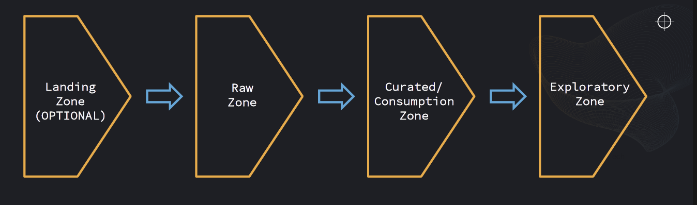
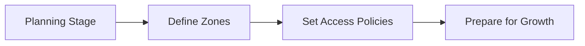
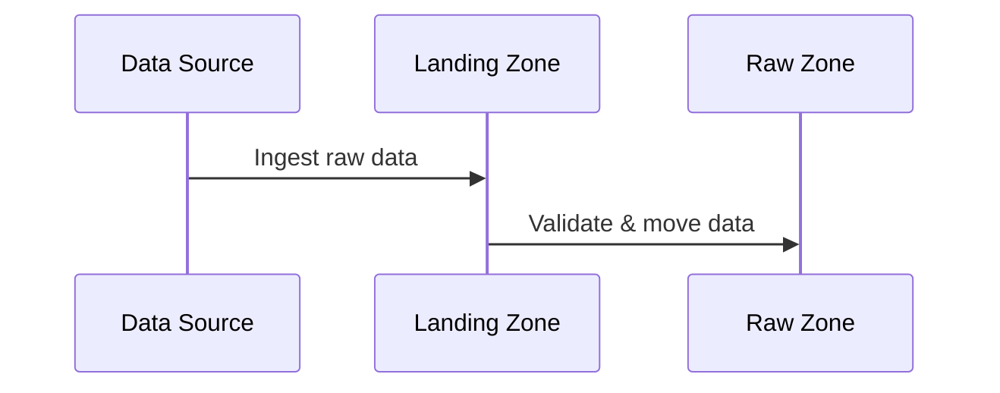
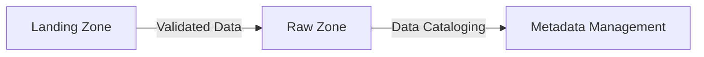
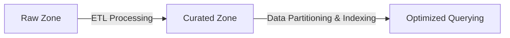
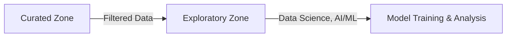

# 🏗️ **Data Zones in a Data Lake: A Structured Approach**

<div style="text-align: center;">
    
</div>

---

## 🌍 **Single Layer vs. Multi-Layer Data Lakes**

A **Data Lake** can be structured using either **a single-layer approach** or **a multi-layer approach**.

### **🚀 Why Multi-Layer Data Lakes Are Recommended?**

- ✅ **Structured Organization** – Data is neatly organized into different zones.
- ✅ **Quality Control** – Ensures data is validated and refined.
- ✅ **Enhanced Governance** – Enables access control, security, and compliance.

💡 A **single-layer approach** might seem simpler, but for **large-scale solutions**, **multi-layer Data Lakes** provide **better scalability and flexibility**.

---

## 🗺️ **Planning Stage: Laying the Foundation**

### **📌 Importance of Planning**

Before **ingesting data**, it’s **critical** to **plan the Data Lake structure** to avoid turning it into a **Data Swamp**.

- ✅ **Plan structure before data arrival** to ensure data is managed efficiently.
- ✅ **Flexibility** – The structure **is not set in stone** and can **evolve over time**.



---

## 🚢 **Data Zone Types in a Data Lake**

A **Data Zone** is like **a different section in a warehouse**, separating data based on **its processing state, sensitivity, and access levels**.

| **Zone**                    | **Purpose**                                               | **Data Characteristics**                     |
| --------------------------- | --------------------------------------------------------- | -------------------------------------------- |
| **Landing Zone (Optional)** | Temporary buffer zone for data before classification      | Raw, unstructured, unprocessed               |
| **Raw Zone**                | Stores unprocessed data in its original form              | All data formats, schema-on-read             |
| **Curated Zone**            | Processed, cleaned, and transformed data for analytics    | Structured, optimized formats (Parquet, ORC) |
| **Exploratory Zone**        | Sandbox for analysts and data scientists to test new data | Experimental, not production-ready           |

---

## 🏗️ **1️⃣ Landing Zone (Optional)**

### **🔹 What is the Landing Zone?**

💡 **“Acting as a transient layer”**

The **Landing Zone** acts as a **transient layer** where **incoming data first arrives** before moving to the **Raw Zone**.

### **📌 Key Characteristics**

- ✅ **Preserves data in its native format** without modification.
- ✅ **Adds metadata** for tracking (e.g., source, format, timestamps).
- ✅ **Basic validation** is applied before moving data forward.
- ✅ **Stored in an AWS S3 bucket with folders per source system**.

### **📡 Data Sources in the Landing Zone**

- **Streaming Data** → IoT devices, Kafka, AWS Kinesis.
- **Batch Data** → CSV, JSON, database exports.
- **Unstructured Data** → Images, logs, videos.

### **🚦 Landing Zone Workflow**

<div style="text-align: center;">



</div>

✅ **Best Practice**: If using a Landing Zone, set up **automated checks** for **validation and metadata tagging** before moving data.

---

## 📂 **2️⃣ Raw Zone: The Untouched Data Vault**

### **🔹 What is the Raw Zone?**

The **Raw Zone** is where data is stored **exactly as it was received** without **alteration or processing**.

### **📌 Key Characteristics**

- ✅ **Contains quality-checked data**.
- ✅ **No predefined structure** – Flexible for different formats.
- ✅ **Schema applied on reading (Schema-on-Read)** – Allows dynamic queries.
- ✅ **Available to users** for processing.
- ✅ **Maintains raw format** to ensure integrity.

### **🗂 Example Folder Structure**

```bash
/data-lake/raw/
     ├── transactions/
     ├── logs/
     ├── social_media/
     ├── customer_feedback/
```

### **🚀 Raw Zone Workflow**



✅ **Best Practice**: Implement **versioning** (e.g., AWS S3 versioning) to track changes over time.

---

## 📊 **3️⃣ Curated Zone: Data Becomes Usable**

### **🔹 What is the Curated Zone?**

💡 **“Main consumption area for analysts, data scientists, and BI tools.”**

The **Curated Zone** contains **clean, structured, and transformed data**, optimized for **analytics, business intelligence (BI), and machine learning (ML)**.

### **📌 Key Characteristics**

- ✅ **Data organized and optimized** for query performance.
- ✅ **Access control for different users** ensures security.
- ✅ **Data can be enriched** with additional features for analysis.
- ✅ Stored in **columnar formats** like **Parquet or ORC** for efficiency.

### **🚀 Transformation Steps**

1️⃣ **Extract** – Pull data from the Raw Zone.  
2️⃣ **Transform** – Clean, structure, and optimize.  
3️⃣ **Load (ELT)** – Store in the Curated Zone.



✅ **Best Practice**: Use **ETL tools** like Apache Spark, AWS Glue, or Azure Data Factory to automate transformations.

---

## 🧪 **4️⃣ Exploratory Zone: The Data Playground**

### **🔹 What is the Exploratory Zone?**

💡 **“Non-productive environment for experimentation.”**

The **Exploratory Zone** is a **sandbox environment** for **data scientists, analysts, and engineers** to experiment **without affecting production**.

### **📌 Key Characteristics**

- ✅ **Non-productive environment for experimentation**.
- ✅ **Supports AI/ML model training, feature engineering, and hypothesis testing**.
- ✅ **Different policies for storage and data quality** (more flexible).
- ✅ **Separate environment for development purposes** to avoid impacting live analytics.

### **🚀 Exploratory Zone Workflow**



✅ **Best Practice**: Set **data retention policies** so old experimental data doesn’t waste storage.

---

## 🔥 **Final Thoughts: Why Data Zones Matter**

A **Data Lake** without zones is like a **warehouse with no organization**—messy, inefficient, and prone to data loss.

### **📌 Key Takeaways**

- ✅ **Landing Zone (Optional)** → **Temporary holding area** before classification.
- ✅ **Raw Zone** → **Immutable, unprocessed data** (keeps everything as-is).
- ✅ **Curated Zone** → **Optimized, structured data** for BI & analytics.
- ✅ **Exploratory Zone** → **R&D and experimentation space** for AI & ML.

---

## 🏁 **Conclusion: Zones Are Flexible!**

- 📌 **Zones are not fixed** – Adapt them based on business needs.
- 📌 **Serves as general inspiration** – Customize as needed.
- 📌 **Single-layer approach is simpler** – But lacks control and governance.
- 📌 **Multi-layer approach is preferable for complex, large-scale solutions**.
