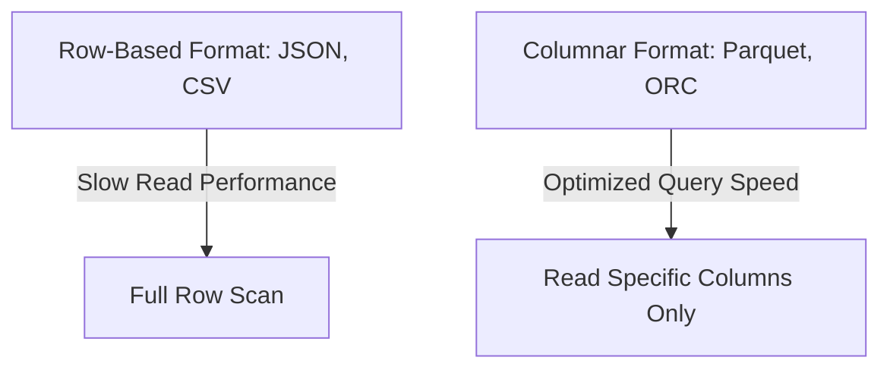
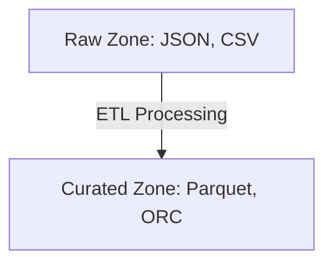

# 📂 **Data Formats in a Data Lake: Choosing the Right One**

Data in a **Data Lake** can come in **different formats**, and the way it is stored affects **performance, efficiency, and usability**. Choosing the right data format is crucial for **querying speed, storage efficiency, and analytics performance**.

This guide will break down **primary data format categories**, compare **row-based vs. columnar formats**, and explore **which formats work best in different Data Lake zones**.

---

## 🏷️ **Primary Data Format Categories**

Data formats in a **Data Lake** can be classified into two broad categories:

| **Format Type**         | **Description**                            | **Best For**                             |
| ----------------------- | ------------------------------------------ | ---------------------------------------- |
| **Row Formats** 📄      | Store data row by row                      | Faster ingestion & write-heavy workloads |
| **Columnar Formats** 📊 | Store data in columns for efficient access | Faster queries & read-heavy workloads    |

---

## 📜 **Row-Based Formats: Simple but Less Efficient**

💡 **Row-based formats store data as complete rows, similar to traditional relational databases.**

### **📌 Key Characteristics**

- ✅ **Store data row by row** – Each row contains a full record.
- ✅ **Simple for data generation and ingestion** – Easy to write and append.
- ❌ **Inefficient for analytical queries** – Reading large datasets requires scanning all rows.

### **🔹 Common Row-Based Formats**

| **Format**                            | **Description**                                    | **Best Used For**                   |
| ------------------------------------- | -------------------------------------------------- | ----------------------------------- |
| **CSV (Comma-Separated Values)**      | Plain text format, widely supported                | Simple storage, data exchange       |
| **JSON (JavaScript Object Notation)** | Hierarchical, human-readable                       | Semi-structured data, API responses |
| **AVRO**                              | Binary row-based format, supports schema evolution | Streaming & data serialization      |

### **🚀 Row Format Use Cases**

✅ **Transactional logs** – Preserving data exactly as generated.  
✅ **Landing/Raw Zones** – Storing data before processing.  
✅ **Data ingestion & transfer** – Easier data exchange between systems.

---

## 📊 **Columnar Formats: Optimized for Querying**

💡 **Columnar formats store data by columns rather than rows, optimizing it for analytical queries.**

### **📌 Key Characteristics**

- ✅ **Physically store data in columns** – Allows efficient access to specific attributes.
- ✅ **Efficient compression** – Reduces storage costs and speeds up queries.
- ✅ **Enables parallel processing** – Different nodes can process different columns simultaneously.

### **🔹 Common Columnar Formats**

| **Format**                       | **Description**                              | **Best Used For**                   |
| -------------------------------- | -------------------------------------------- | ----------------------------------- |
| **Parquet** 🏆                   | Open-source, highly compressed, schema-based | Big Data analytics, cloud storage   |
| **ORC (Optimized Row Columnar)** | Optimized for Hive, high compression         | Fast reads in distributed systems   |
| **Delta Lake**                   | ACID-compliant, supports versioning          | Data Lakes with structured querying |

### **🚀 Performance Advantage of Columnar Formats**

✅ **Columnar formats excel in read-intensive scenarios.**  
✅ **Greater storage efficiency** due to advanced compression techniques.  
✅ **Faster query execution** – Only relevant columns are scanned.



---

## 📌 **Comparison: Row Formats vs. Columnar Formats**

| Feature               | **Row Format** 📄            | **Columnar Format** 📊                             |
| --------------------- | ---------------------------- | -------------------------------------------------- |
| **Storage Layout**    | Stores data **row-by-row**   | Stores data **column-by-column**                   |
| **Write Performance** | 🚀 **Fast** – Easy to append | 🐌 **Slower** – Writes require column organization |
| **Read Performance**  | 🐌 **Slow** – Reads all rows | 🚀 **Fast** – Reads only needed columns            |
| **Compression**       | ❌ **Less efficient**        | ✅ **Highly compressed**                           |
| **Best Use Cases**    | Raw data, ingestion, logs    | BI, analytics, fast queries                        |

✅ **Best Practice:** Use **row formats for ingestion** and **columnar formats for analytics**.

---

## 🏗️ **Data Formats in Different Data Lake Zones**

A **Data Lake** is structured into **multiple zones**, and each zone benefits from different **data formats**.

### 🏠 **Landing Zone / Raw Data Zone**

💡 **Purpose**: Temporary storage of newly ingested data.

✅ **Best Formats:** **CSV, JSON, AVRO**  
✅ **Why?**

- Stores data **in its raw, original format**.
- Easy to **ingest from APIs, logs, and transactional systems**.
- **Schema-on-Read** allows flexibility when processing later.

```bash
/data-lake/raw/
     ├── transactions.json
     ├── logs.csv
     ├── api_responses.avro
```

---

### 📂 **Curated Zone: Optimized for Analytics**

💡 **Purpose**: Stores cleaned, structured, and optimized data for querying.

✅ **Best Formats:** **Parquet, ORC, Delta Lake**  
✅ **Why?**

- Data is **converted into columnar formats** for **faster queries**.
- **Compressed & partitioned** for efficiency.
- **Access control** ensures only authorized users query the data.

```bash
/data-lake/curated/
     ├── transactions.parquet
     ├── customer_data.orc
```



---

### 🧪 **Exploratory Zone: Flexible & Versatile**

💡 **Purpose**: Used for **data science, machine learning, and experimentation**.

✅ **Best Formats:** **Mixed (Row & Columnar)**  
✅ **Why?**

- **Supports various data formats** depending on the experiment.
- **Flexibility** to store both row-based and columnar data.
- **Quick prototyping** with different storage options.

```bash
/data-lake/exploratory/
     ├── test_data.csv
     ├── ML_features.parquet
     ├── log_analysis.json
```

✅ **Best Practice:** Allow **both formats** to **support different exploratory tasks**.

---

## 🔥 **Final Thoughts: Choosing the Right Data Format**

Each **Data Format** serves a different purpose in a Data Lake.

### **📌 Summary of Best Practices**

- ✅ **Row-based formats (CSV, JSON, AVRO) are great for raw storage & ingestion.**
- ✅ **Columnar formats (Parquet, ORC, Delta Lake) are ideal for analytics & querying.**
- ✅ **Choose the right format based on the Data Lake Zone.**

| **Data Lake Zone**   | **Recommended Formats**        |
| -------------------- | ------------------------------ |
| **Landing/Raw Zone** | CSV, JSON, AVRO                |
| **Curated Zone**     | Parquet, ORC, Delta Lake       |
| **Exploratory Zone** | Mixed formats (Row & Columnar) |

---

## 🏁 **Conclusion**

📌 **Formats in a Data Lake are not fixed** – They evolve based on needs.  
📌 **Row vs. Columnar formats** – Choose based on **ingestion vs. querying needs**.  
📌 **Single format isn’t enough** – Use **multiple formats across different zones**.
