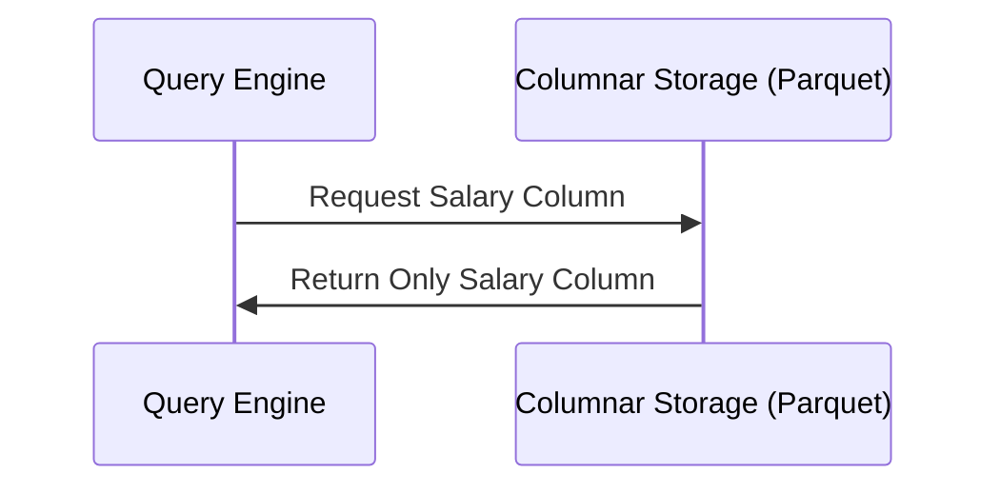
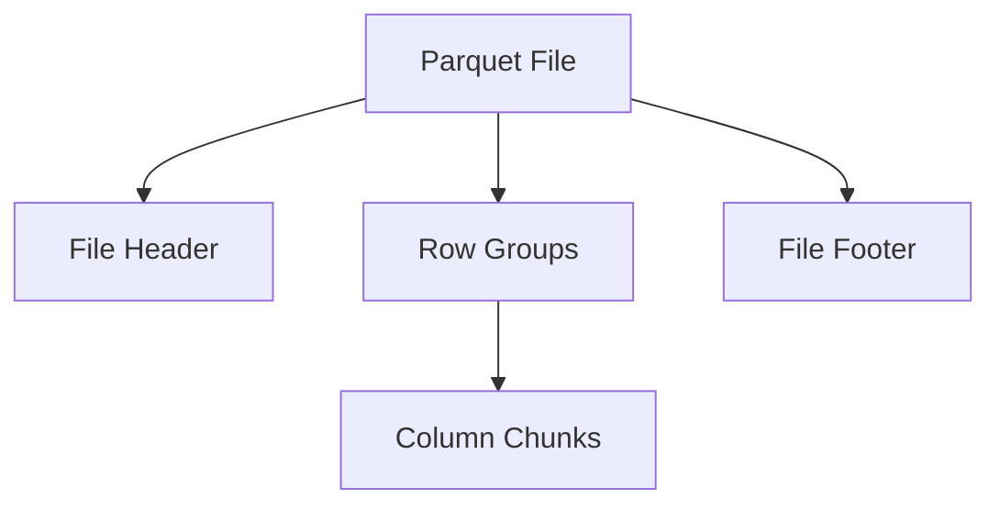
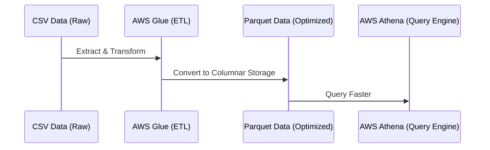

# **📦 Apache Parquet – The Optimized Columnar Storage Format**

## **1️⃣ What is Apache Parquet?**

Apache Parquet is an **open-source columnar storage format** designed for **big data analytics**. It is optimized for use with **distributed processing frameworks like Apache Spark, Hive, Presto, and AWS Athena**.

### **✅ Why Use Apache Parquet?**

- ✔ **Columnar storage for high-performance querying**.
- ✔ **Highly compressed format, reducing storage costs**.
- ✔ **Efficient for big data processing in Hadoop & cloud**.
- ✔ **Schema evolution support** – allows changes to table structure.
- ✔ **Works well with modern data warehouses (Snowflake, BigQuery, Redshift).**

---

## **2️⃣ Row-Based vs. Columnar Storage – How Parquet Works**

### **📌 Traditional Row-Based Storage**

- Data is stored **row by row**, making it efficient for transactional workloads but **slow for analytical queries**.
- **Example:** Relational databases like MySQL and PostgreSQL.

#### **Row-Based Storage Example**

| ID  | Name  | Age | Salary |
| --- | ----- | --- | ------ |
| 1   | John  | 30  | 50000  |
| 2   | Alice | 28  | 55000  |
| 3   | Bob   | 35  | 60000  |

🔹 **If we want to calculate the average salary, we must read every row.**

### **📌 Columnar Storage (Parquet’s Approach)**

- Data is stored **column-wise**, meaning only relevant columns are read during queries.
- **Ideal for analytical workloads where we query specific attributes frequently.**

#### **Columnar Storage Example (Parquet)**

| Column Name | Data                |
| ----------- | ------------------- |
| ID          | 1, 2, 3             |
| Name        | John, Alice, Bob    |
| Age         | 30, 28, 35          |
| Salary      | 50000, 55000, 60000 |

🔹 **Now, if we want the average salary, we only read the ‘Salary’ column, making it much faster.**

---

## **3️⃣ Key Features of Apache Parquet**

### **📌 1. Compression & Encoding**

- **Uses advanced compression techniques** like Snappy, Gzip, and ZSTD.
- **Column-level compression** reduces storage costs while maintaining performance.
- Common **encoding methods:**
  - **Dictionary Encoding** – Stores unique values separately, reducing redundancy.
  - **Run-Length Encoding (RLE)** – Compresses repeating values efficiently.
  - **Bit Packing** – Stores integer values in a compact format.

### **📌 2. Schema Evolution**

- **Allows schema changes over time** without breaking existing data.
- **Supports adding new columns dynamically**.

### **📌 3. Metadata Optimization**

- Stores rich metadata like data types, statistics, and row groups.
- Enables **predicate pushdown filtering** to **skip unnecessary data scans**.

---

## **4️⃣ Apache Parquet File Structure**

A Parquet file consists of multiple parts:

- 1️⃣ **File Header** – Contains metadata about the file.
- 2️⃣ **Row Groups** – The actual data stored in **columnar format**.
- 3️⃣ **Column Chunks** – Each column stored separately within row groups.
- 4️⃣ **File Footer** – Stores schema & statistics for fast access.

---

## **5️⃣ Apache Parquet vs. Other Storage Formats**

| **Feature**           | **Apache Parquet**         | **CSV**                     | **JSON**        | **Avro**           |
| --------------------- | -------------------------- | --------------------------- | --------------- | ------------------ |
| **Storage Type**      | Columnar                   | Row-Based                   | Semi-Structured | Row-Based          |
| **Compression**       | High                       | None                        | Limited         | Moderate           |
| **Query Performance** | High                       | Slow                        | Moderate        | Fast for Streaming |
| **Schema Evolution**  | Yes                        | No                          | No              | Yes                |
| **Best For**          | Big Data, Cloud Warehouses | Simple Logs, Small Datasets | Web APIs, NoSQL | Streaming Data     |

🔹 **Parquet is the best choice for analytics, BI, and big data.**

---

## **6️⃣ Real-World Use Case: Using Parquet for Big Data Analytics**

### **📊 Scenario: E-Commerce Sales Data**

A retail company collects **millions of daily transactions**. They need fast **querying and reduced storage costs**.

### **📌 Old Approach (CSV Storage)**

- **Data stored in CSV files, requiring full-table scans.**
- **Queries were slow & expensive.**
- **Storage costs were high due to redundant data.**

### **📌 New Approach (Apache Parquet Storage in AWS S3 + Athena)**

- 1️⃣ **Convert CSV data into Parquet format.**
- 2️⃣ **Store Parquet files in Amazon S3.**
- 3️⃣ **Run queries using AWS Athena for real-time insights.**

🔹 **Results:**

- ✔ **Query execution improved from minutes to seconds.**
- ✔ **Storage costs reduced by 70% due to compression.**
- ✔ **BI dashboards now update in real-time.**

---

## **🚀 Summary – Key Takeaways**

- ✔ **Apache Parquet stores data in columnar format, enabling high-performance analytics.**
- ✔ **Optimized compression techniques reduce storage costs.**
- ✔ **Metadata indexing allows faster queries by skipping unnecessary data.**
- ✔ **Best suited for cloud data lakes (AWS S3, Google BigQuery, Azure Data Lake).**
- ✔ **Ideal for modern data pipelines using Spark, Hive, Presto, and Athena.**
