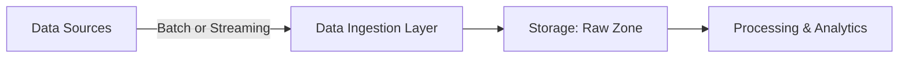
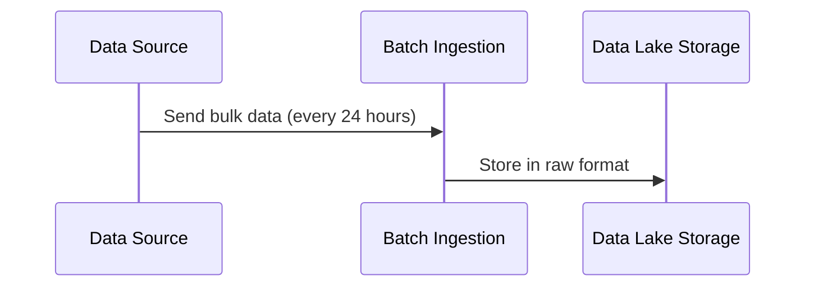
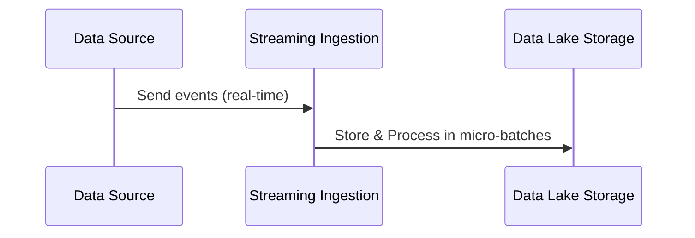
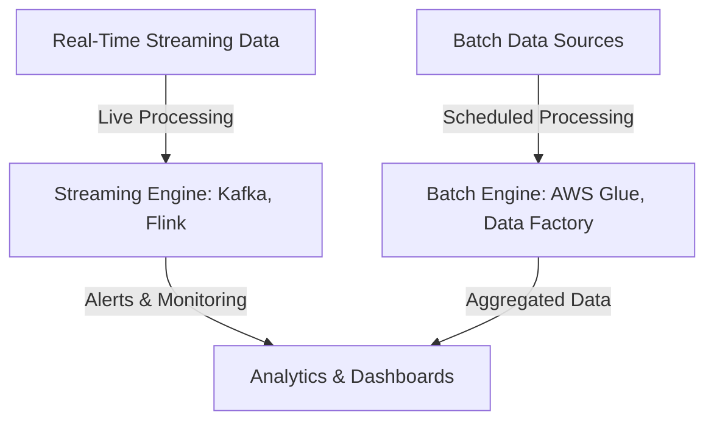

# 🚀 **Batch Ingestion vs. Streaming Ingestion in a Data Lake**

A **Data Lake** ingests data from multiple sources, and the ingestion method significantly impacts **latency, processing speed, and system design**. The two primary ingestion methods are:

- **Batch Ingestion** ⏳ → Loads data in chunks at scheduled intervals.
- **Streaming Ingestion** ⚡ → Ingests data in real-time as it is generated.

Choosing the right ingestion method depends on **data freshness requirements, system scalability, and use case complexity**.

---

## 🌊 **What is Data Ingestion?**

**Data ingestion** is the process of **collecting, importing, and storing data** into a **Data Lake** for further processing and analysis.

✅ **Why is ingestion important?**

- Enables **data-driven decision-making**.
- Supports **historical & real-time analytics**.
- Ensures **scalability** for large datasets.

Data ingestion can be **batch-based, streaming-based, or hybrid** (a combination of both). Let's explore each in detail.

---

---

## ⏳ **Batch Ingestion: Bulk Data Transfer**

### **🔹 What is Batch Ingestion?**

Batch ingestion **collects and loads data at scheduled intervals** rather than in real-time. This method is useful when **data freshness is not critical** and large amounts of data need to be processed efficiently.

### **📌 Key Characteristics**

- ✅ **Loads data in bulk** at predefined intervals (e.g., hourly, daily).
- ✅ **Optimized for large-scale data processing** (ETL workflows).
- ✅ **Efficient for historical analysis & BI**.
- ❌ **Not suitable for real-time analytics**.

### **🔹 Common Use Cases**

- ✅ **Business Reports** – Daily or weekly sales reports.
- ✅ **Data Warehouses** – Aggregating data for analytics.
- ✅ **Backups & Historical Data Processing** – Storing logs & transactional records.

### **🛠 Common Batch Ingestion Tools**

| **Tool**               | **Type**            | **Best For**                     |
| ---------------------- | ------------------- | -------------------------------- |
| **Apache Sqoop**       | Batch ETL           | Relational database to Hadoop/S3 |
| **AWS Glue**           | Serverless ETL      | Cloud-based batch processing     |
| **Azure Data Factory** | Orchestrator        | Data integration pipelines       |
| **Apache Nifi**        | Workflow Automation | Complex batch pipelines          |

### **⚙️ Example Batch Ingestion Workflow**

✅ **Best Practice**: Schedule batch jobs **during non-peak hours** to reduce system load.

---

## ⚡ **Streaming Ingestion: Real-Time Data Flow**

### **🔹 What is Streaming Ingestion?**

Streaming ingestion **processes and ingests data in real-time** as it is generated. This method is ideal for **low-latency applications** where fresh data is critical.

### **📌 Key Characteristics**

- ✅ **Data is ingested continuously** without delays.
- ✅ **Optimized for real-time analytics** and event-driven processing.
- ✅ **Requires scalable infrastructure** for handling high-throughput data.
- ❌ **More complex implementation & resource-intensive**.

### **🔹 Common Use Cases**

- ✅ **Fraud Detection** – Monitor banking transactions in real-time.
- ✅ **IoT Data Streams** – Process sensor readings immediately.
- ✅ **Clickstream Analysis** – Track user activity on a website as it happens.
- ✅ **Stock Market Trading** – Analyze stock price fluctuations in milliseconds.

### **🛠 Common Streaming Ingestion Tools**

| **Tool**             | **Type**          | **Best For**                       |
| -------------------- | ----------------- | ---------------------------------- |
| **Apache Kafka**     | Message Broker    | High-volume event streaming        |
| **AWS Kinesis**      | Cloud Streaming   | Real-time data pipelines           |
| **Azure Event Hubs** | Streaming Service | IoT & log ingestion                |
| **Apache Flink**     | Stream Processing | Stateful event-driven applications |
| **Google Pub/Sub**   | Messaging Queue   | Real-time event delivery           |

### **⚙️ Example Streaming Ingestion Workflow**

✅ **Best Practice**: Implement **windowing techniques** to process large streaming data efficiently.

---

## 🔄 **Batch vs. Streaming Ingestion: Key Differences**

| Feature                | **Batch Ingestion** ⏳                       | **Streaming Ingestion** ⚡                    |
| ---------------------- | -------------------------------------------- | --------------------------------------------- |
| **Data Arrival**       | At scheduled intervals (e.g., hourly, daily) | Continuous, real-time                         |
| **Processing Latency** | High (delayed updates)                       | Low (real-time updates)                       |
| **Best For**           | Historical data, reporting, ETL pipelines    | Real-time analytics, event processing         |
| **Storage Efficiency** | Efficient for large volumes                  | Requires optimized real-time storage          |
| **Complexity**         | Easier to implement                          | More complex due to event-driven architecture |
| **Common Tools**       | AWS Glue, Apache Sqoop, Azure Data Factory   | Kafka, Kinesis, Flink, Pub/Sub                |

✅ **Best Practice**: Use **batch ingestion for historical analytics** and **streaming ingestion for real-time insights**.

---

## 🔀 **Hybrid Approach: Combining Batch & Streaming**

In many **real-world scenarios**, **both batch and streaming ingestion** are used together.

### **🚀 Example Hybrid Use Cases**

- ✅ **E-Commerce Analytics** – Use streaming for real-time inventory updates & batch for revenue reports.
- ✅ **IoT Systems** – Ingest sensor data in real-time but store logs in batch.
- ✅ **Financial Transactions** – Detect fraud instantly while processing monthly reports in batch.

✅ **Best Practice**: Choose **batch vs. streaming** based on **business requirements** and **system capabilities**.

---

## 🏁 **Conclusion: When to Use What?**

- 📌 **Batch ingestion** is **best for bulk data transfers & historical analysis**.
- 📌 **Streaming ingestion** is **best for real-time analytics & event-driven applications**.
- 📌 **Hybrid approaches** combine **batch + streaming** to handle **both real-time & historical data needs**.

| **Use Case**           | **Recommended Ingestion** |
| ---------------------- | ------------------------- |
| Daily sales reports    | ⏳ Batch Ingestion        |
| Fraud detection        | ⚡ Streaming Ingestion    |
| IoT device monitoring  | ⚡ Streaming Ingestion    |
| Data warehouse updates | ⏳ Batch Ingestion        |
| Stock price tracking   | ⚡ Streaming Ingestion    |
| E-commerce inventory   | 🔀 Hybrid Approach        |

---

## 🚀 **What’s Next?**

Would you like a **hands-on tutorial** for setting up **Kafka-based streaming ingestion**? Or do you want to explore **ETL pipelines for batch ingestion**? Let me know! 🔥
