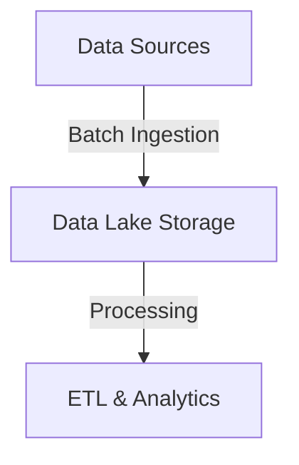
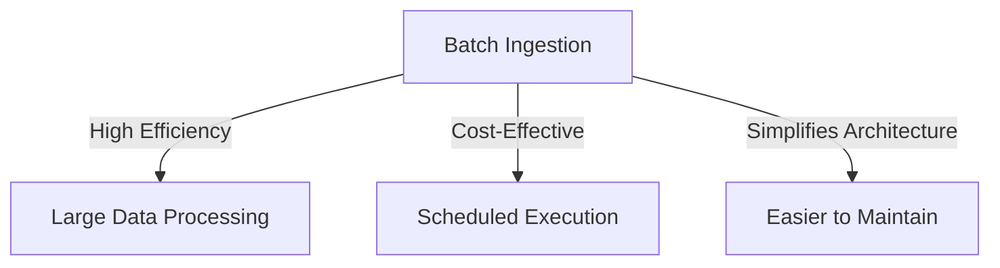
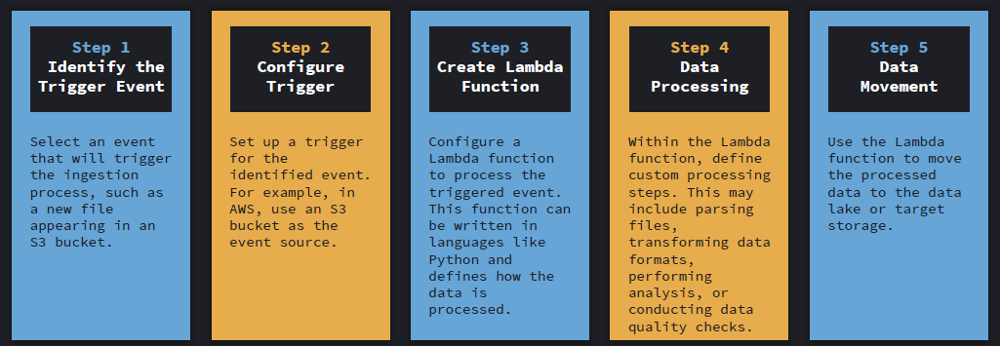
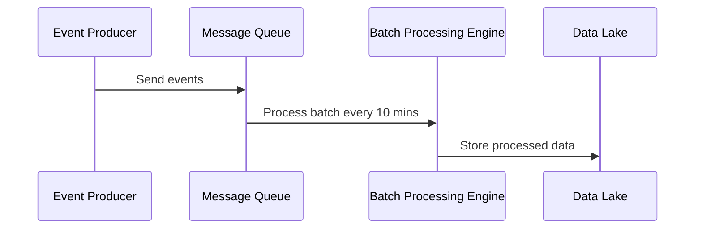
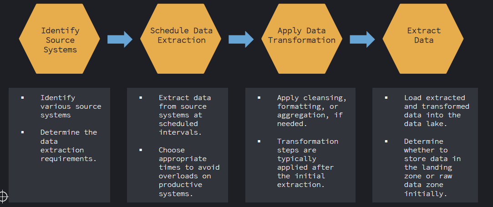
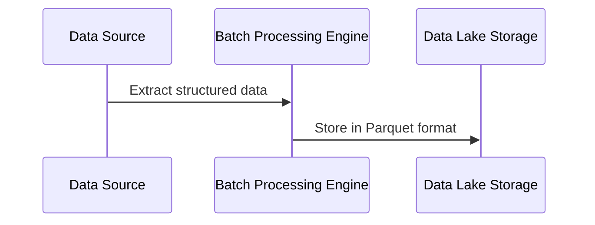
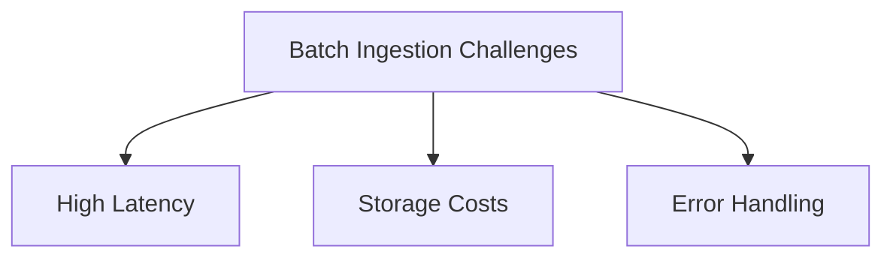
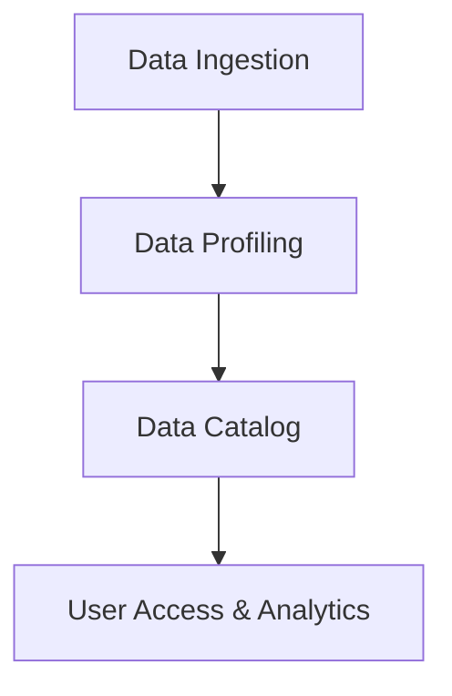

# ⏳ **Batch Ingestion in a Data Lake: A Detailed Guide**

Batch ingestion is a **fundamental method** for loading data into a **Data Lake**. It is widely used for **large-scale data processing**, where data freshness is **not critical** but **efficiency and structured processing** are important.

This guide explores **use cases, benefits, ingestion patterns, the batch ingestion process, tools, data cataloging, profiling, and key considerations** to help you design a robust batch ingestion pipeline.

---

## 🌊 **What is Batch Ingestion?**

**Batch ingestion** is the process of **collecting, processing, and loading data into a Data Lake at scheduled intervals** (e.g., hourly, daily, weekly).

💡 **Unlike real-time ingestion, batch ingestion focuses on structured and bulk data movement**, making it ideal for historical analysis, business reporting, and data warehousing.

---

---

## 🎯 **Use Cases of Batch Ingestion**

Batch ingestion is widely used across industries. Some common use cases include:

### 📊 **Business Intelligence & Reporting**

- ✅ **Daily Sales Reports** → Aggregate and store sales data every 24 hours.
- ✅ **Monthly Revenue Reports** → Process large transactional datasets periodically.

### 🏦 **Financial & Banking Systems**

- ✅ **End-of-day transaction reconciliation** → Collect and store all transactions at the end of the business day.
- ✅ **Risk and compliance auditing** → Batch process financial logs for regulatory compliance.

### 🏗️ **Enterprise Data Warehousing**

- ✅ **ETL Pipelines** → Extracting, transforming, and loading structured data from multiple sources.
- ✅ **Data Lake Population** → Ingesting data into raw zones before further processing.

### 🌍 **IoT & Log Processing**

- ✅ **Aggregating sensor data** → Batch loading sensor data for analysis every few hours.
- ✅ **Log collection & analysis** → Periodically processing application logs for debugging.

### 🔄 **Backup & Archival**

- ✅ **Database backups** → Scheduled extraction and storage of backups.
- ✅ **Cold storage management** → Moving old data to low-cost storage.

---

## ✅ **Benefits of Batch Ingestion**

Batch ingestion offers **several advantages**, making it the **preferred method for structured and large-scale data processing**.

### **📌 Key Benefits**

- ✅ **Efficient Processing** → Optimized for handling large data volumes.
- ✅ **Simplified System Design** → Less complex than real-time ingestion.
- ✅ **Cost-Effective** → Reduces storage and compute costs by processing data at fixed intervals.
- ✅ **Better Data Consistency** → Ensures clean, structured data for analytics.
- ✅ **Supports Large Files** → Handles massive datasets without requiring streaming infrastructure.

---

💡 **Best Practice**: Use batch ingestion when **data freshness is not a priority** but **efficiency and structured storage** are crucial.

---

## 🔀 **Batch Ingestion Patterns**

### 📌 **Change Data Capture (CDC)**

**Captures incremental changes** in a database instead of transferring full tables.

✅ **Why use it?**

- **Reduces data transfer volume**.
- **Efficiently updates Data Lake**.

✅ **Common Tools**

| **Tool**     | **Best For**                 |
| ------------ | ---------------------------- |
| **Debezium** | Streaming CDC to Data Lakes  |
| **AWS DMS**  | Migrating databases with CDC |

---

### 📌 **Log Ingestion**

Batch collection of **system logs, server logs, and application logs** for analysis.

✅ **Why use it?**

- Helps in **debugging, security audits, and compliance tracking**.

✅ **Common Tools**

| **Tool**                   | **Best For**                   |
| -------------------------- | ------------------------------ |
| **Fluentd**                | Log collection and forwarding  |
| **Logstash**               | Parsing and ingesting logs     |
| **Amazon CloudWatch Logs** | Storing and analyzing AWS logs |

---

### 📌 **Event-Driven Batch Ingestion**

Batch processing of **events from messaging systems** like Kafka or SQS.

✅ **Why use it?**

- Handles **event bursts** by storing them and processing in scheduled batches.

✅ **Common Tools**

| **Tool**         | **Best For**                    |
| ---------------- | ------------------------------- |
| **Apache Kafka** | Streaming & event-driven batch  |
| **AWS SQS**      | Event-driven message processing |

---

  

---

💡 **Best Practice**: Use event-driven ingestion when **you need near real-time batch processing**.

---

## 🔄 **Batch Ingestion Process: Step-by-Step Workflow**

A **batch ingestion pipeline** follows a structured workflow, ensuring **data integrity and efficiency**.

  

---

### **🛠 1️⃣ Identify Source Systems**

The **first step** in batch ingestion is identifying where the data originates.

✅ **Common data sources**:

- Relational databases (MySQL, PostgreSQL, SQL Server)
- APIs (REST, GraphQL)
- Log files & system events
- Cloud storage (AWS S3, Azure Blob Storage)

✅ **Questions to consider**:

- What **data formats** are used (CSV, JSON, Parquet)?
- What is the **data volume** and how often does it change?

---

### **⏳ 2️⃣ Schedule Data Extraction**

Once data sources are identified, **a schedule is set for extraction**.

✅ **Scheduling intervals** depend on the business need:

- **Daily** – Sales & transaction reports
- **Hourly** – Log processing & system monitoring
- **Weekly** – Customer engagement analytics

✅ **Common scheduling tools**:

| Tool                   | Purpose                |
| ---------------------- | ---------------------- |
| **Apache Airflow**     | Workflow automation    |
| **AWS Step Functions** | Cloud-based scheduling |
| **Crontab (Linux)**    | Basic job scheduling   |

💡 **Best Practice**: Extract data **during off-peak hours** to reduce system load.

---

### **🔄 3️⃣ Apply Data Transformation (ETL Process)**

After extraction, the data is **cleaned and transformed** before loading into the Data Lake.

✅ **Common transformation tasks**:

- Remove **duplicates & corrupted records**.
- Convert **data formats (CSV → Parquet)** for optimization.
- Apply **aggregations & enrichments**.

✅ **ETL Tools for Transformation**:

| Tool                   | Function                        |
| ---------------------- | ------------------------------- |
| **Apache Spark**       | Large-scale data transformation |
| **AWS Glue**           | Serverless ETL                  |
| **Azure Data Factory** | Cloud-based ETL pipelines       |

---

### **📂 4️⃣ Extract & Load Data into the Data Lake**

Finally, the cleaned data is **stored in the Data Lake** for further processing.

✅ **Storage zones for batch ingestion**:

| Data Lake Zone       | Data Format   |
| -------------------- | ------------- |
| **Raw Zone**         | CSV, JSON     |
| **Curated Zone**     | Parquet, ORC  |
| **Exploratory Zone** | Mixed formats |

✅ **Loading Mechanisms**:

- **Bulk file transfers** (SFTP, HDFS, S3).
- **Database dumps** (using Apache Sqoop).

💡 **Best Practice**: Store **optimized columnar formats** in the **curated zone** for fast analytics.

---

## 🔧 **Tools for Batch Ingestion**

Many tools support batch ingestion, depending on the **infrastructure** and **use case**.

### **🚀 Popular Batch Ingestion Tools**

| **Tool**               | **Category**     | **Use Case**                  |
| ---------------------- | ---------------- | ----------------------------- |
| **Apache Sqoop**       | Data Transfer    | RDBMS to Hadoop               |
| **Apache Spark**       | Batch Processing | Large-scale ETL               |
| **AWS Glue**           | Cloud ETL        | Serverless batch processing   |
| **Google Dataflow**    | ETL              | Batch & stream processing     |
| **Azure Data Factory** | Orchestrator     | Cloud-based batch pipelines   |
| **HDFS DistCp**        | File Transfer    | Copying large files in Hadoop |

💡 **Best Practice**: Use **cloud-based tools** like AWS Glue or Azure Data Factory for **scalability**.

---

## ⚠️ **Considerations for Batch Ingestion**

Batch ingestion is **efficient**, but there are some key considerations:

### **📌 Key Factors to Keep in Mind**

- **Latency** – Not suitable for real-time applications.
- **Data Volume** – Large batches can strain storage and compute resources.
- **Failure Handling** – Ensure retry mechanisms for failed jobs.
- **Schema Evolution** – Plan for changing data structures over time.
- **Storage Optimization** – Use **Parquet/ORC** instead of raw CSV for analytics.

---

💡 **Best Practice**: Monitor batch jobs using **logging & alerting systems** (AWS CloudWatch, Prometheus).

---

## 📚 **Data Catalog & Profiling**

### **🔹 Data Catalog: Organizing Metadata**

- 🔹 **Stores dataset information** like schema, ownership, and data location.
- 🔹 **Helps in data discovery & governance**.

📌 **Common Tools**:

| Tool                      | Best For          |
| ------------------------- | ----------------- |
| **AWS Glue Data Catalog** | Metadata indexing |
| **Apache Atlas**          | Data governance   |

---

### **🔍 Data Profiling: Ensuring Data Quality**

- 🔹 **Detects missing values, duplicates, and inconsistencies**.
- 🔹 **Ensures schema adherence and format consistency**.

📌 **Common Tools**:

| Tool                    | Best For                   |
| ----------------------- | -------------------------- |
| **Great Expectations**  | Data quality checks        |
| **Talend Data Quality** | Enterprise data validation |

---

💡 **Best Practice**: Automate **profiling & cataloging during ingestion** to catch quality issues early.

---

## 🏁 **Final Thoughts**

- 📌 **Batch ingestion is best for structured, large-scale, scheduled data transfers**.
- 📌 **Different ingestion patterns like CDC, Log Ingestion, and Event-Driven Batch help optimize the process**.
- 📌 **Integrating Data Catalog & Profiling ensures governance & data quality**.
