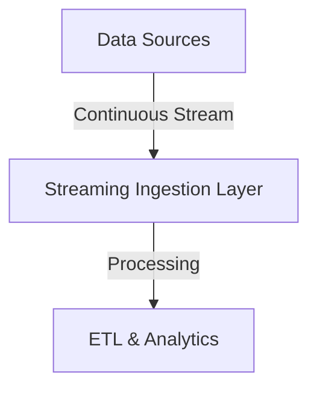
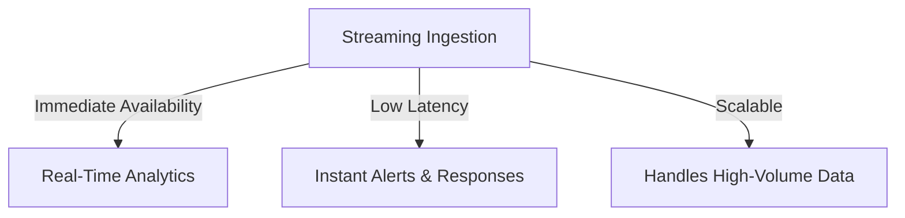
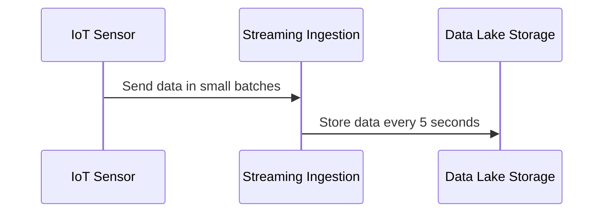
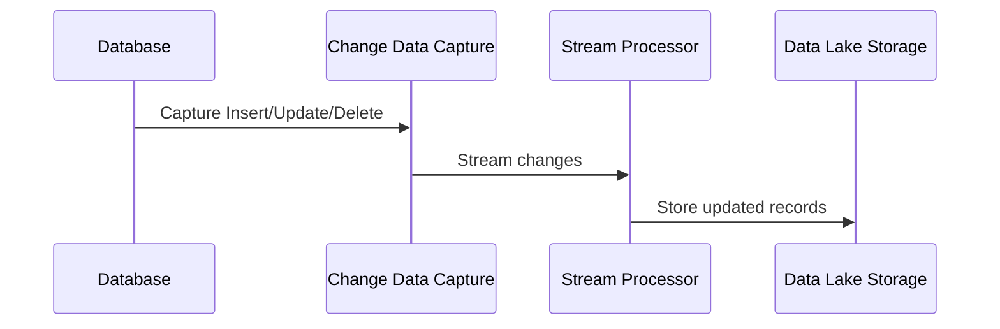
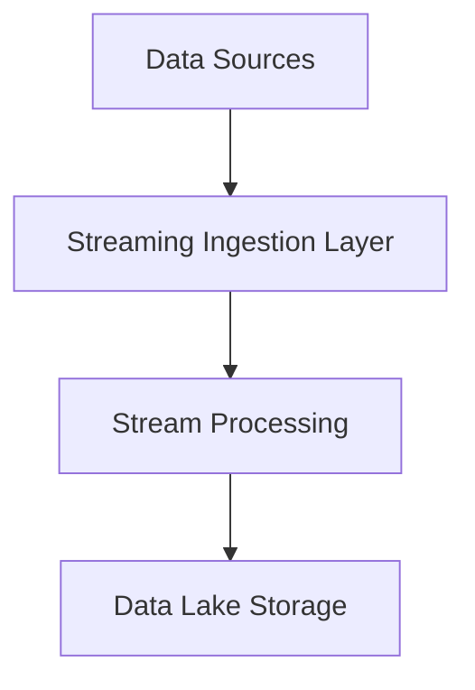

# ⚡ **Streaming Ingestion in a Data Lake: A Deep Dive**

Data is being **generated continuously** from various sources—**IoT devices, social media, financial transactions, and system logs**. **Streaming ingestion** is the process of **ingesting data in real-time or near real-time** into a **Data Lake**, making it available for **immediate processing and analysis**.

This guide will explore **what streaming ingestion is, its use cases, benefits, ingestion patterns, processing techniques, tools, and best practices**.

---

## 🌊 **What is Streaming Ingestion?**

💡 **Streaming ingestion** refers to the **continuous, real-time ingestion of data** into a Data Lake, as opposed to batch ingestion, which processes data at fixed intervals.

✅ **Why Use Streaming Ingestion?**

- **Real-time insights** – Detect fraud, monitor system health, or track user activity as it happens.
- **Lower latency** – Data is available **instantly** rather than waiting for scheduled batch processing.
- **Event-driven architecture** – Enables immediate actions based on ingested data.

---

---

## 🎯 **Use Cases of Streaming Ingestion**

### 🏦 **Financial & Banking Systems**

- ✅ **Real-time fraud detection** – Monitor transactions and detect anomalies.
- ✅ **Stock market analysis** – Track stock prices and execute algorithmic trading.

### 🌍 **IoT & Sensor Data Processing**

- ✅ **Smart cities** – Process data from **traffic sensors and surveillance cameras**.
- ✅ **Industrial monitoring** – Ingest IoT data from **manufacturing equipment** to predict failures.

### 🏗️ **Log & Event Processing**

- ✅ **System monitoring** – Detect anomalies, errors, and security threats in real time.
- ✅ **User behavior tracking** – Monitor clicks, sessions, and interactions for **personalized recommendations**.

### 🎥 **Media & Content Streaming**

- ✅ **Video analytics** – Track viewer engagement in **real-time streaming platforms**.
- ✅ **Ad placement optimization** – Deliver targeted ads based on user behavior.

---

## ✅ **Benefits of Streaming Ingestion**

Streaming ingestion provides **several advantages** over batch ingestion.

### **📌 Key Benefits**

- ✅ **Low Latency** → Data is **immediately available** for processing.
- ✅ **Real-Time Decision Making** → Enables **instant alerts, recommendations, and responses**.
- ✅ **Scalable & Fault-Tolerant** → Modern stream processing systems **handle massive data volumes** with built-in fault tolerance.
- ✅ **Better User Experience** → Powers **live dashboards, personalized recommendations, and real-time monitoring**.

---

💡 **Best Practice**: Use streaming ingestion when **real-time processing and immediate insights** are needed.

---

## 🔀 **Streaming Ingestion Patterns**

### **📌 1️⃣ Event-Driven Streaming**

**Ingests and processes individual events** in real time, making it ideal for **low-latency applications**.

✅ **Common Use Cases**

- **Fraud detection** – Immediate flagging of suspicious transactions.
- **User engagement tracking** – Real-time personalization in e-commerce.

✅ **Common Tools**

| **Tool**         | **Best For**              |
| ---------------- | ------------------------- |
| **Apache Kafka** | Event-driven streaming    |
| **AWS Kinesis**  | Real-time event ingestion |

---

### **📌 2️⃣ Micro-Batching (Stream-in-Batch)**

**Processes streaming data in small intervals** (e.g., every few seconds).

✅ **Common Use Cases**

- **Log aggregation** – Collect logs and process in small time windows.
- **IoT data** – Batch sensor data every few seconds.

✅ **Common Tools**

| **Tool**                              | **Best For**                    |
| ------------------------------------- | ------------------------------- |
| **Apache Spark Structured Streaming** | Micro-batch processing          |
| **Google Dataflow**                   | Cloud-based stream-batch hybrid |

---

💡 **Best Practice**: Use **micro-batching** when **slight delays (seconds) are acceptable**.

---

### **📌 3️⃣ Change Data Capture (CDC) Streaming**

**Detects and streams only modified records** instead of full table copies.

✅ **Common Use Cases**

- **Database replication** – Sync live changes between databases and Data Lake.
- **Streaming ETL** – Process only new or updated records.

✅ **Common Tools**

| **Tool**     | **Best For**                |
| ------------ | --------------------------- |
| **Debezium** | Streaming CDC               |
| **AWS DMS**  | Change tracking & migration |

---

💡 **Best Practice**: Use **CDC for database streaming ingestion** to avoid **reloading entire tables**.

---

## 🔄 **Streaming Ingestion Process: Step-by-Step Workflow**

---

### **🛠 1️⃣ Collect Data from Streaming Sources**

✅ **Common data sources**:

- **IoT sensors** – Real-time telemetry data.
- **Clickstream logs** – Website user interactions.
- **Financial transactions** – Credit card swipes, online payments.

✅ **Data Formats**

| Format      | Best For            |
| ----------- | ------------------- |
| **JSON**    | API & log data      |
| **Avro**    | Schema evolution    |
| **Parquet** | Optimized analytics |

---

### **⚡ 2️⃣ Stream Processing & Transformation**

Streaming data often requires **real-time transformations** before being stored.

✅ **Common transformations**

- **Filtering** – Remove unwanted records.
- **Aggregation** – Compute rolling averages, trends.
- **Enrichment** – Join with external datasets.

✅ **Processing Tools**

| **Tool**         | **Best For**                    |
| ---------------- | ------------------------------- |
| **Apache Flink** | Stateful stream processing      |
| **AWS Lambda**   | Serverless real-time processing |

---

### **📂 3️⃣ Store Processed Data in a Data Lake**

Once processed, data is **stored in the Data Lake** for future use.

✅ **Data Storage Zones**

| Data Lake Zone   | Data Format  |
| ---------------- | ------------ |
| **Raw Zone**     | JSON, Avro   |
| **Curated Zone** | Parquet, ORC |

💡 **Best Practice**: Use **compressed columnar formats (Parquet, ORC)** in the **Curated Zone** for analytics.

---

## 🔧 **Tools for Streaming Ingestion**

| **Tool**                       | **Category**      | **Best For**                        |
| ------------------------------ | ----------------- | ----------------------------------- |
| **Apache Kafka**               | Event Streaming   | High-throughput real-time ingestion |
| **AWS Kinesis**                | Cloud Streaming   | Serverless real-time pipelines      |
| **Google Pub/Sub**             | Messaging Queue   | Event-driven data delivery          |
| **Apache Flink**               | Stream Processing | Stateful event processing           |
| **Spark Structured Streaming** | Micro-batching    | Hybrid batch-stream processing      |

💡 **Best Practice**: Choose **event streaming for low-latency cases** and **micro-batching for moderate real-time needs**.

---

## 🏁 **Final Thoughts: When to Use Streaming Ingestion?**

📌 **Streaming ingestion is ideal for real-time analytics, event-driven systems, and low-latency applications**.  
📌 **Different patterns (Event-Driven, Micro-Batching, CDC) suit different business needs**.  
📌 **Use streaming with Data Lakes for real-time dashboards, AI, and operational intelligence**.
