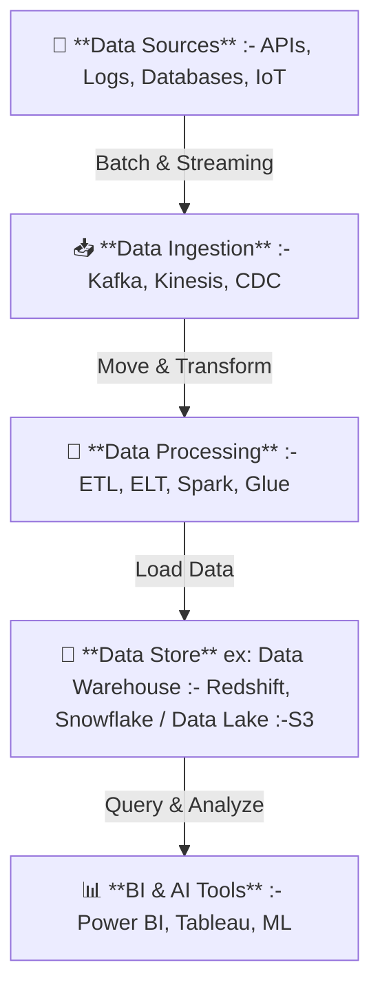

# 🔄 Data Flow & Data Pipelines: A Complete Guide

## **👁 Introduction**

A **Data Pipeline** is a system that automates the movement, transformation, and storage of data. It ensures that **data flows efficiently, reliably, and in the correct format** for analytics, AI, and reporting.

### **💡 Why Do We Need Data Pipelines?**

Modern businesses generate **huge volumes of data** from different sources (**APIs, IoT, logs, databases, social media**). A **data pipeline** automates how this data is **collected, processed, stored, and analyzed**, ensuring:

- ✅ **Fast Decision-Making**: Up-to-date insights for real-time applications.
- ✅ **Scalability**: Handles growing amounts of data efficiently.
- ✅ **Automation**: Eliminates manual work in collecting and transforming data.
- ✅ **Data Integrity**: Ensures clean, high-quality data for analytics & AI.

---

## **✅ 1. Data Pipeline Overview – Stages & Workflow**

A **Data Pipeline** consists of **four core stages**:

| **Stage**                               | **Purpose**                             | **Examples**                        |
| --------------------------------------- | --------------------------------------- | ----------------------------------- |
| **📥 Data Ingestion**                   | Collects raw data from sources          | Databases, APIs, IoT, Logs          |
| **🔄 Data Processing & Transformation** | Cleans, structures, and transforms data | ETL, ELT, Streaming                 |
| **🏢 Data Storage**                     | Stores processed data                   | Data Warehouses, Data Lakes         |
| **📊 Data Analysis & Consumption**      | Uses data for insights                  | BI Dashboards, AI, Machine Learning |

### **👉 High-Level View of a Data Pipeline**

---

## **📥 2. Stage 1: Data Ingestion – Collecting Data**

### **👉 What is Data Ingestion?**

Data ingestion is the **process of collecting data** from different sources and **feeding it into a storage system** (Data Lake, Data Warehouse).

### **💡 Types of Data Ingestion**

| **Type**                   | **Definition**                                            | **Example Use Case**                                   |
| -------------------------- | --------------------------------------------------------- | ------------------------------------------------------ |
| **Batch Ingestion ⏳**     | Collects data in scheduled intervals (e.g., every 1 hour) | A bank loads daily transactions into Redshift          |
| **Real-Time Streaming ⚡** | Ingests data as soon as it is generated                   | A fraud detection system tracks transactions instantly |

### **📝 Data Ingestion Tools**

| **Function**                   | **Batch Tools** ⏳           | **Streaming Tools** ⚡         |
| ------------------------------ | ---------------------------- | ------------------------------ |
| **Extract Data from APIs**     | Apache NiFi, Airbyte         | Apache Kafka, AWS Kinesis      |
| **Database Replication (CDC)** | AWS DMS, Debezium            | Debezium, Google Datastream    |
| **File-Based Ingestion**       | AWS S3, Google Cloud Storage | AWS Firehose, Google Pub/Sub   |
| **IoT & Sensor Data**          | Apache NiFi, Talend          | AWS IoT Core, Azure Event Hubs |

---

## **🔄 3. Stage 2: Data Processing & Transformation (ETL vs ELT)**

### **👉 What is Data Processing?**

After ingestion, **raw data is often messy**. It needs **cleaning, validation, and transformation** before it’s useful.

### **💡 ETL vs. ELT: What’s the Difference?**

| **Processing Type**                | **Definition**                              | **Best Use Case**                  |
| ---------------------------------- | ------------------------------------------- | ---------------------------------- |
| **ETL (Extract, Transform, Load)** | Transforms data **before storing**          | Used in structured data warehouses |
| **ELT (Extract, Load, Transform)** | Loads raw data first, then transforms later | Used in big data & cloud storage   |

### **📝 Data Processing Tools**

| **Function**                   | **Batch Processing Tools** ⏳   | **Streaming Processing Tools** ⚡                |
| ------------------------------ | ------------------------------- | ------------------------------------------------ |
| **ETL**                        | AWS Glue, Apache Spark, Talend  | Apache Kafka Streams, AWS Kinesis Data Analytics |
| **ELT**                        | dbt, Apache Airflow, Fivetran   | Google Dataflow, Flink                           |
| **Data Validation & Cleaning** | Great Expectations, Apache Beam | Spark Streaming, Flink                           |

---

## **🏢 4. Stage 3: Data Storage – Where Data is Stored**

### **💡 Data Storage Options**

| **Storage Type**                           | **Common Tools**                              |
| ------------------------------------------ | --------------------------------------------- |
| **Data Lakes (Raw Storage)**               | AWS S3, Google Cloud Storage, Azure Data Lake |
| **Data Warehouses (Structured Analytics)** | Amazon Redshift, Snowflake, Google BigQuery   |
| **NoSQL Databases (Flexible Data Models)** | MongoDB, DynamoDB, Elasticsearch              |

---

## **📊 5. Stage 4: Data Analysis & Consumption**

### **👉 Data Analysis Tools**

| **Function**                   | **Batch Analysis Tools** ⏳ | **Real-Time Analysis Tools** ⚡ |
| ------------------------------ | --------------------------- | ------------------------------- |
| **Business Intelligence (BI)** | Power BI, Tableau, Looker   | Amazon QuickSight, Superset     |
| **Data Querying**              | Apache Presto, AWS Athena   | Rockset, Elasticsearch          |
| **AI & Machine Learning**      | TensorFlow, PyTorch         | SageMaker, Azure ML             |

---

## **🚀 Summary**

- **A Data Pipeline automates data movement, transformation, and storage.**
- **4 Stages of Data Flow:**
  - 📥 **Ingestion (Kafka, Kinesis, CDC)**
  - 🔄 **Processing (ETL, ELT, Spark, Glue)**
  - 🏢 **Storage (Redshift, Snowflake, S3)**
  - 📊 **Analysis (Power BI, Tableau, AI/ML)**
- **Modern pipelines combine batch & streaming for full-scale analytics & AI.**
