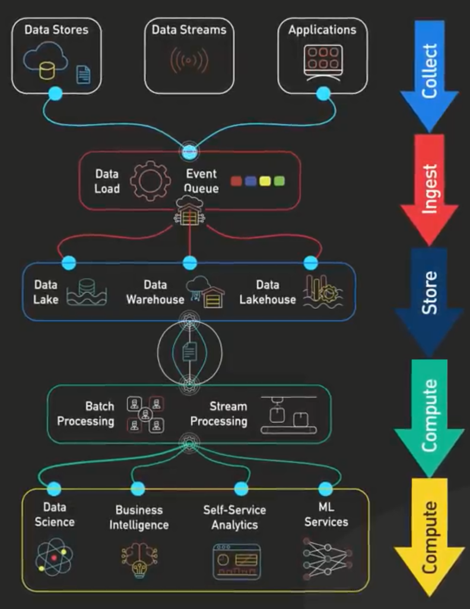
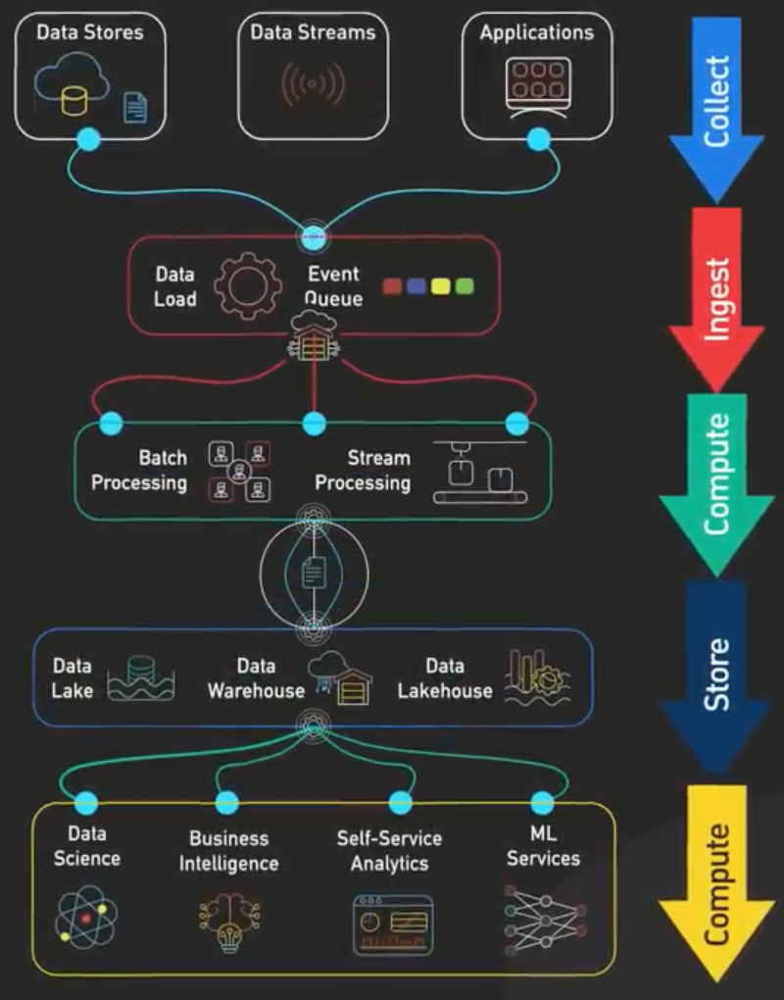

# **🚀 Understanding the Two Approaches to Data Pipeline Workflow**

## **📌 Approach 1: Store → Compute (Processing Happens After Storage)**

    

### **🔍 How It Works**

1️⃣ **Collect**: Data is ingested from sources (APIs, databases, applications, IoT, logs).  
2️⃣ **Ingest**: Data is loaded into an event queue or directly into storage.  
3️⃣ **Store**: Raw data is stored **first** in a **Data Lake, Data Warehouse, or Data Lakehouse**.  
4️⃣ **Compute**: Processing (batch or stream) happens **after storage**, transforming raw data into structured insights.  
5️⃣ **Consume**: Processed data is used for **BI, ML, Analytics**.

### **📌 Example Scenario**

**📊 A Large E-commerce Company (Amazon, eBay):**

- **Data Collected**: Customer purchases, clicks, browsing history.
- **Storage First**:
  - All raw data (structured & unstructured) is **first dumped into a Data Lake (AWS S3, Google Cloud Storage)**.
  - Data is then **moved to a Data Warehouse (Snowflake, Redshift)** for analysis.
- **Processing Later**:
  - **Batch Processing** (daily ETL jobs using Apache Spark) cleans and aggregates data for reports.
  - **Streaming Processing** (Flink, Kinesis) detects fraud or personalized recommendations in real-time.

### **📌 When to Use This Approach?**

✔ **Best for batch-heavy workloads** that require long-term storage before transformation.  
✔ **When raw data is valuable** and can be used for different future analytics.  
✔ **When processing requirements evolve**, and different departments need raw data for multiple use cases.

---

## **📌 Approach 2: Compute → Store (Processing Happens Before Storage)**

    

### **🔍 How It Works**

1️⃣ **Collect**: Data is ingested from sources (APIs, databases, applications, IoT, logs).  
2️⃣ **Ingest**: Data enters an event queue (Kafka, Kinesis).  
3️⃣ **Compute**: Processing happens **before storage** using **real-time or batch processing**.  
4️⃣ **Store**: Only **processed and structured data** is stored in a **Data Warehouse, Data Lakehouse, or NoSQL Database**.  
5️⃣ **Consume**: Business Intelligence (BI), analytics, and ML consume structured data.

### **📌 Example Scenario**

**🚗 A Ride-Sharing App (Uber, Lyft):**

- **Data Collected**: GPS coordinates, ride requests, payments.
- **Processing First**:
  - **Streaming Processing** (Kafka, Flink) **processes incoming GPS data in real-time**.
  - **Batch Processing** (AWS Glue, dbt) cleans and aggregates ride data every few minutes.
- **Storage Later**:
  - Only **processed data** is stored in **Elasticsearch (for real-time analytics)** and **BigQuery (for long-term analytics)**.

### **📌 When to Use This Approach?**

✔ **When real-time processing is needed** (fraud detection, recommendations, IoT monitoring).  
✔ **When storing raw data is inefficient** and you only need transformed data.  
✔ **For cost efficiency**, as less raw data is stored, reducing storage costs.

---

## **🔍 Comparison: Which Approach is Better?**

| Feature             | Store → Compute (Processing After Storage) | Compute → Store (Processing Before Storage) |
| ------------------- | ------------------------------------------ | ------------------------------------------- |
| **Processing Time** | High latency (data is stored first)        | Low latency (real-time insights)            |
| **Storage Cost**    | High (raw data is stored)                  | Lower (only processed data is stored)       |
| **Flexibility**     | High (can reprocess data anytime)          | Low (only stores transformed data)          |
| **Best for**        | **Batch workloads, historical analysis**   | **Real-time analytics, event-driven apps**  |

---

## **🚀 Conclusion**

✔ **If you need historical analysis and flexibility → Store first, process later**.  
✔ **If you need real-time analytics and efficiency → Process first, store later**.  
✔ **Many modern pipelines use a hybrid approach**, storing raw data for long-term analytics while processing real-time data for quick insights.

Would you like a **detailed example of a hybrid pipeline combining both approaches?** 🚀
