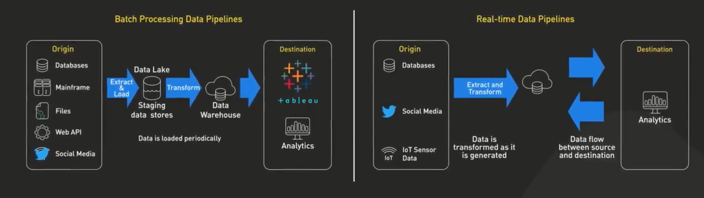
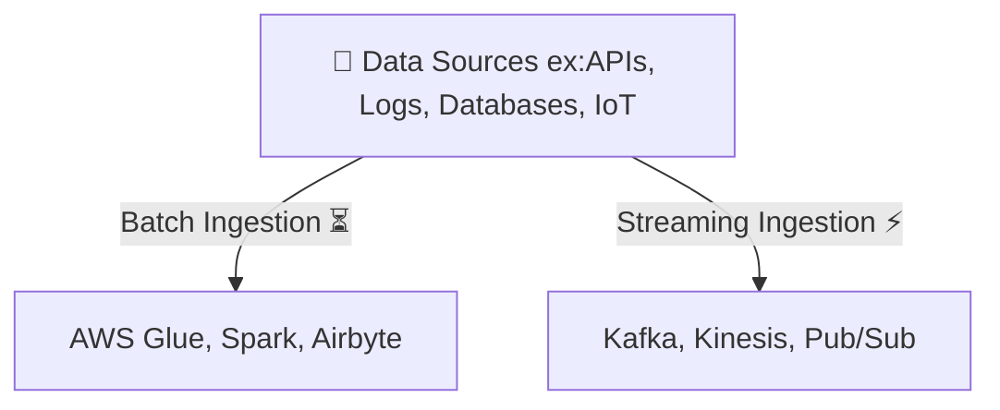
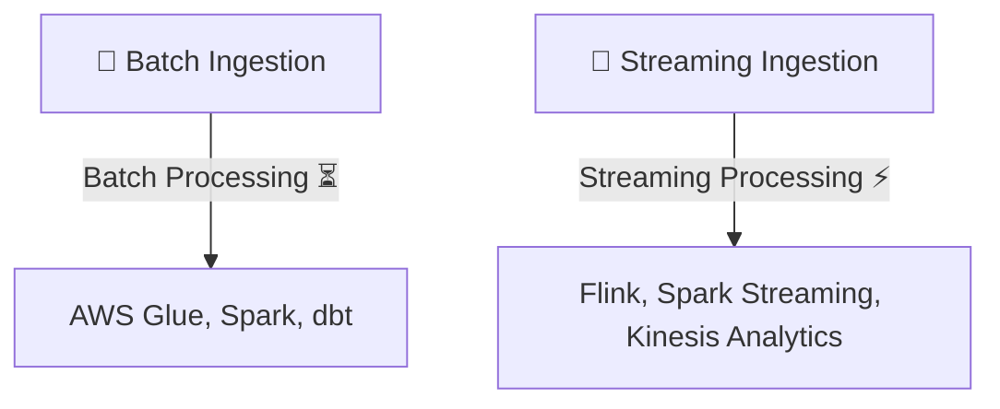
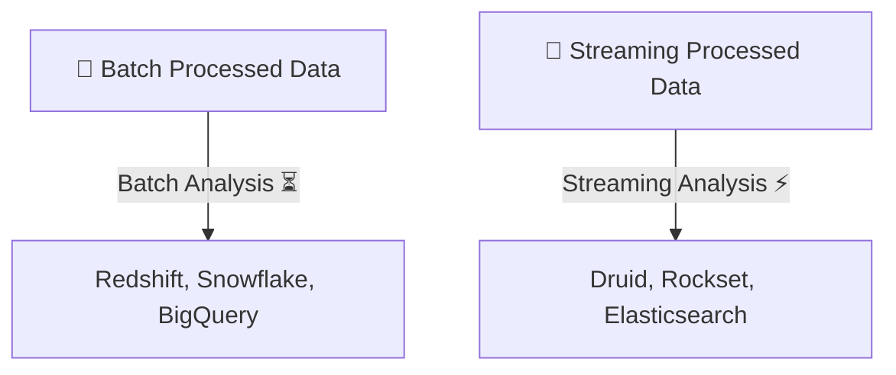
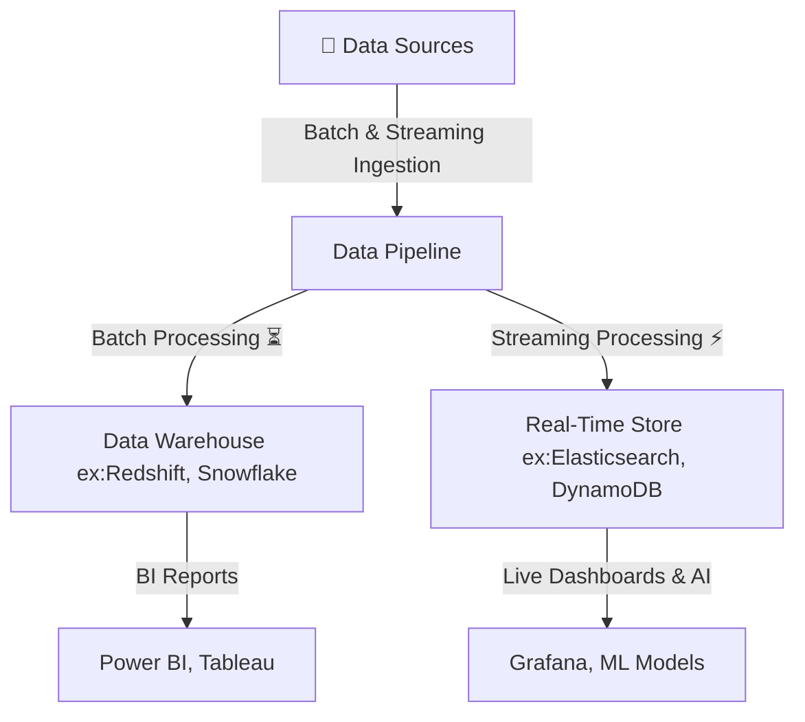

# **🚀 Understanding Batch & Streaming in the Data Pipeline**

To **properly understand batch vs. streaming**, we need to see how they fit into the **three major stages** of a data pipeline:

1️⃣ **Data Ingestion** (Collecting raw data from sources)
2️⃣ **Data Processing & Transformation** (Converting raw data into meaningful insights)
3️⃣ **Data Analysis & Consumption** (Using the processed data for reporting, AI, or applications)

---

    

---

## **1️⃣ Data Ingestion – Getting Data from Sources**

### **📌 What is Data Ingestion?**

Data ingestion is the process of **collecting raw data** from multiple sources and delivering it into a data storage system (Data Warehouse, Data Lake, or Streaming Platform).

### **⏳ Batch vs. ⚡ Streaming in Data Ingestion**

| **Type**                   | **Definition**                                                      | **Examples**                                                                     | **Common Tools**                                            |
| -------------------------- | ------------------------------------------------------------------- | -------------------------------------------------------------------------------- | ----------------------------------------------------------- |
| **Batch Ingestion** ⏳     | Data is collected in bulk at scheduled times (e.g., hourly, daily). | A retail company loads customer orders **every midnight** into a data warehouse. | Apache Nifi, AWS Glue, Google Dataflow, Airbyte             |
| **Streaming Ingestion** ⚡ | Data is continuously ingested as it arrives (real-time).            | A stock trading app **processes live market data** every second.                 | Apache Kafka, AWS Kinesis, Google Pub/Sub, Azure Event Hubs |

### **📌 Data Flow for Batch & Streaming Ingestion**

---

## **2️⃣ Data Processing & Transformation (ETL vs. ELT)**

### **📌 What is Data Processing?**

After ingestion, data must be **transformed, cleaned, and structured** before it can be stored or analyzed.

### **⏳ Batch vs. ⚡ Streaming in Data Processing**

| **Type**                    | **Definition**                               | **Examples**                                                                  | **Common Tools**                                                      |
| --------------------------- | -------------------------------------------- | ----------------------------------------------------------------------------- | --------------------------------------------------------------------- |
| **Batch Processing** ⏳     | Cleans & transforms data at scheduled times. | A financial institution processes all transactions **at the end of the day**. | Apache Spark, AWS Glue, dbt, Talend                                   |
| **Streaming Processing** ⚡ | Processes & analyzes data as it arrives.     | A fraud detection system **monitors transactions in real-time**.              | Apache Flink, Spark Streaming, AWS Kinesis Analytics, Google Dataflow |

### **📌 Data Flow for Batch & Streaming Processing**

---

## **3️⃣ Data Analysis & Consumption (BI, AI, Reports)**

### **📌 What is Data Analysis & Consumption?**

After processing, data is stored and used for **business intelligence (BI), dashboards, or AI models**.

### **⏳ Batch vs. ⚡ Streaming in Data Analysis**

| **Type**                  | **Definition**                                 | **Examples**                                         | **Common Tools**                                         |
| ------------------------- | ---------------------------------------------- | ---------------------------------------------------- | -------------------------------------------------------- |
| **Batch Analysis** ⏳     | Runs queries & reports on **historical data**. | A company generates **quarterly sales reports**.     | Amazon Redshift, Snowflake, Google BigQuery, Apache Hive |
| **Streaming Analysis** ⚡ | Runs analytics on **real-time data streams**.  | A ride-sharing app **tracks driver locations live**. | Apache Druid, Rockset, Elasticsearch, Amazon DynamoDB    |

### **📌 Data Flow for Batch & Streaming Analysis**

---

## **📌 Hybrid Approach: When to Use Both?**

Many companies **combine batch & streaming** to achieve both **historical insights and real-time decision-making**.

**Example Hybrid Pipeline:**
✅ **Real-time Fraud Detection (Streaming)** 🔄 **Daily Revenue Reports (Batch)** 🔄 **Live Dashboards (Streaming)**

---

## **🚀 Summary**

✔ **Batch & Streaming exist in** **Ingestion, Processing, and Analysis**.  
✔ **Batch Processing** is best for **historical reports**, while **Streaming Processing** is best for **real-time analytics**.  
✔ **Most modern pipelines use both** depending on business needs.
