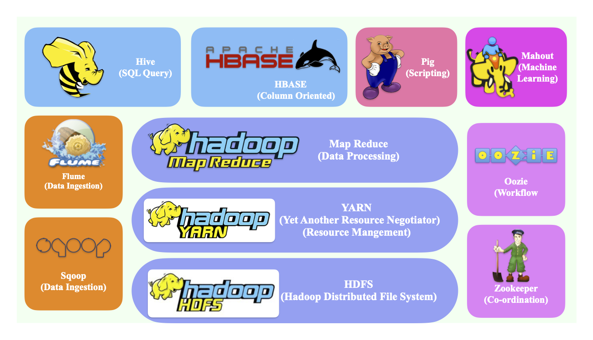
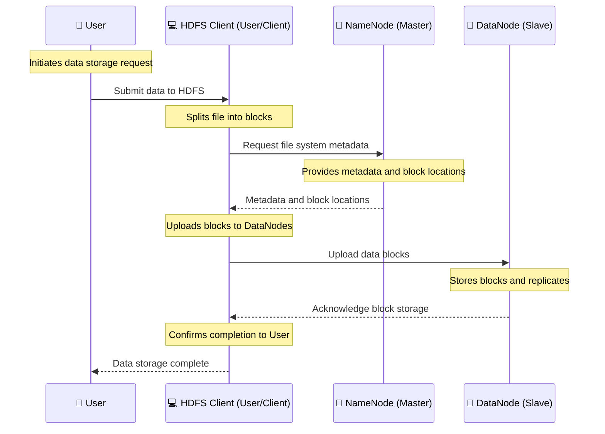
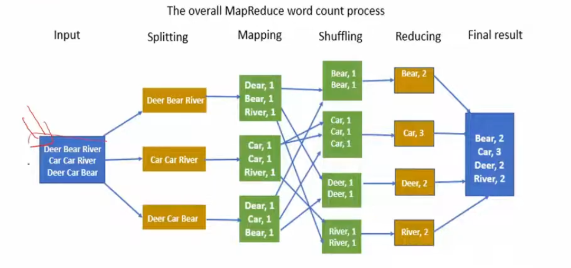
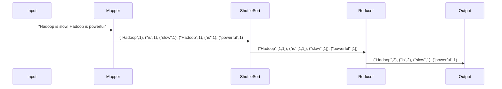

# 🧸 **Hadoop - The Grandfather of Big Data Processing**

Before diving deep into **Apache Spark**, it's essential to understand **Hadoop**. Why? Because **Spark was created to overcome Hadoop's limitations**, and many Spark jobs still interact with Hadoop systems (like HDFS).

Let's **unravel the mystery of Hadoop** in a way that actually makes sense! 😎

---

    

---

## 🔥 **1. What is Hadoop, and Why Was It Created?**

### 📌 **The Simple Definition**

Hadoop is an **open-source framework** that allows storing and processing **huge amounts of data** across many computers in a **fault-tolerant and parallel** manner.

### 🧠 **The Problem Before Hadoop**

In the early 2000s, organizations faced a data explosion:

- **Millions of website visits daily** 📊
- **Massive log files from web applications** 📝
- **Huge datasets from e-commerce, banking, and IoT** 🌍

🚨 **Challenges:**

- ❌ **Traditional Databases (SQL, MySQL, Oracle) struggled** with large datasets.
- ❌ **Single servers couldn't store and process petabytes of data efficiently.**
- ❌ **Data processing took hours or even days.**

💡 Hadoop **solved all these problems** by introducing **distributed storage** and **parallel processing**. 💡

### 🔑 **Hadoop Key Features**

Hadoop became the **foundation of modern Big Data** because it:

- ✅ **Stores data across multiple machines** (scalability).
- ✅ **Processes data in parallel** (efficiency).
- ✅ **Handles machine failures automatically** (fault tolerance).

---

## 🏛 **2. Hadoop Architecture - The Core Components**

Hadoop is **not just one tool**; it consists of **multiple components** working together.

### 🏗 **The Three Pillars of Hadoop**

| 🏛 **Component**                              | 🚀 **Purpose**                                    |
| -------------------------------------------- | ------------------------------------------------- |
| **HDFS (Hadoop Distributed File System)** 📂 | Stores large-scale data across multiple machines. |
| **MapReduce** 🏭                             | Processes data in parallel (but slow).            |
| **YARN (Yet Another Resource Negotiator)** 🎛 | Manages cluster resources efficiently.            |

Each component plays a crucial role in **handling petabytes of data** in a distributed environment.

---

## 📂 **3. HDFS (Hadoop Distributed File System) - Storage Layer**

HDFS is **Hadoop’s storage system**. Instead of storing one massive file on a single machine, it **splits data into blocks and distributes them** across multiple machines.

### 🔹 **Key Features of HDFS**

✔ **Distributed Storage** – Splits large files into chunks.  
✔ **Fault Tolerance** – Replicates data across nodes to prevent loss.  
✔ **Scalability** – Handles petabytes of data efficiently.

### 🛠 **Key HDFS Components**

| Component                 | Role                                     |
| ------------------------- | ---------------------------------------- |
| **NameNode** 🧠           | Manages metadata and file locations.     |
| **DataNode** 💾           | Stores actual data blocks.               |
| **Secondary NameNode** 📜 | Keeps metadata snapshots (not a backup). |

### 🏗 **How HDFS Works**

- 1️⃣ A **file is split into blocks** (default size: 128MB or 256MB).
- 2️⃣ Each **block is stored on different nodes** in the cluster.
- 3️⃣ **HDFS replicates blocks** (default: 3 copies) to prevent data loss.
- 4️⃣ If a machine fails, **another copy of the block is used** for recovery.

---

1. **User (👤)**: Initiates the request to store data in HDFS.
2. **HDFS Client (User/Client) (💻)**: Splits the file into blocks and communicates with the NameNode to get metadata and block locations.
3. **NameNode (Master) (🧠)**: Provides the metadata and block locations to the HDFS Client.
4. **HDFS Client (User/Client) (💻)**: Uploads the data blocks to DataNodes.
5. **DataNode (Slave) (💾)**: Stores the data blocks and replicates them as necessary.
6. **HDFS Client (User/Client) (💻)**: Acknowledges the completion of data storage to the User.

🚨 **Why HDFS Matters:** It ensures **data availability, redundancy, and reliability** even if machines fail.

---

## 🏭 **4. MapReduce - Processing Layer**

MapReduce is **Hadoop’s original processing engine**, designed to run computations in parallel across a cluster. However, it has **performance issues** (which we’ll discuss shortly).

### 📝 **How MapReduce Works (Step-by-Step)**

1️⃣ **Map Phase** – Breaks data into key-value pairs.  
2️⃣ **Shuffle Phase** – Groups similar keys together.  
3️⃣ **Reduce Phase** – Aggregates and processes the final result.

### 📊 **Example: Word Count Program**

    

### ⚠ **Why is MapReduce Slow?**

- ❌ **Disk-Based Processing** – Every stage reads/writes to disk, causing delays.
- ❌ **Batch-Only Processing** – No support for real-time analytics.
- ❌ **Java-Based** – Requires **a lot of boilerplate code**.

💡 **SOLUTION:** Apache Spark **keeps everything in memory** for much faster performance! ⚡

---

## 🎛 **5. YARN - Resource Management Layer**

YARN (Yet Another Resource Negotiator) **allocates computing resources** across different Hadoop jobs.

### 🏗 **Key YARN Components**

| Component                 | Role                                           |
| ------------------------- | ---------------------------------------------- |
| **Resource Manager** 🎯   | Allocates CPU and memory for tasks.            |
| **Node Manager** 💻       | Runs on each machine to monitor jobs.          |
| **Application Master** 🏆 | Manages a **single job** from start to finish. |

### 💡 **Why YARN Matters**

If you're using **pure Java**, you write MapReduce jobs directly.  
If you're using **Hive (SQL on Hadoop)**, YARN **converts SQL into Java MapReduce functions** automatically.

❌ **So, if you don’t want to write Java for everything, you need tools like Hive!**

---

## ⚠ **6. Limitations of Hadoop (Why It’s Not Enough!)**

### ❌ **1. Slow Performance** 🐢

- MapReduce **relies on disk storage** instead of in-memory processing.
- Disk I/O causes **significant performance bottlenecks**.

### ❌ **2. No Real-Time Processing** ⏳

- Hadoop is **batch-based**—not designed for real-time applications.
- Example: **Fraud detection in banking requires instant decisions**.

### ❌ **3. Java-Centric Complexity** 📜

- Writing **MapReduce jobs requires Java** and is not user-friendly.
- Even Hive and Pig still generate **Java-based execution plans**.

### ❌ **4. Expensive Cluster Management** 💰

- Requires **more hardware** to maintain performance.
- Spark does more with **fewer resources**.

---

## 🚀 **7. How Apache Spark Fixes Hadoop’s Problems**

Spark was **designed to improve upon Hadoop** while remaining compatible with HDFS.

| Feature              | Hadoop (MapReduce)      | Apache Spark                     |
| -------------------- | ----------------------- | -------------------------------- |
| **Speed**            | Slow (disk-based)       | 100x faster (in-memory)          |
| **Processing**       | Batch only              | Batch + Real-time                |
| **Ease of Use**      | Java-based              | Simple APIs (Python, Scala, SQL) |
| **Fault Tolerance**  | High (data replication) | High (RDDs & lineage)            |
| **Machine Learning** | None                    | Built-in MLlib library           |

---

## 🏁 **8. Summary**

- ✅ **Hadoop introduced scalable Big Data storage and processing.**
- ✅ **HDFS provides fault-tolerant storage.**
- ✅ **MapReduce enables distributed processing but is slow.**
- ✅ **YARN manages cluster resources but executes Java functions.**
- ✅ **Hadoop lacks real-time capabilities and requires extensive Java code.**
- ✅ **Apache Spark was built to address these issues.**
