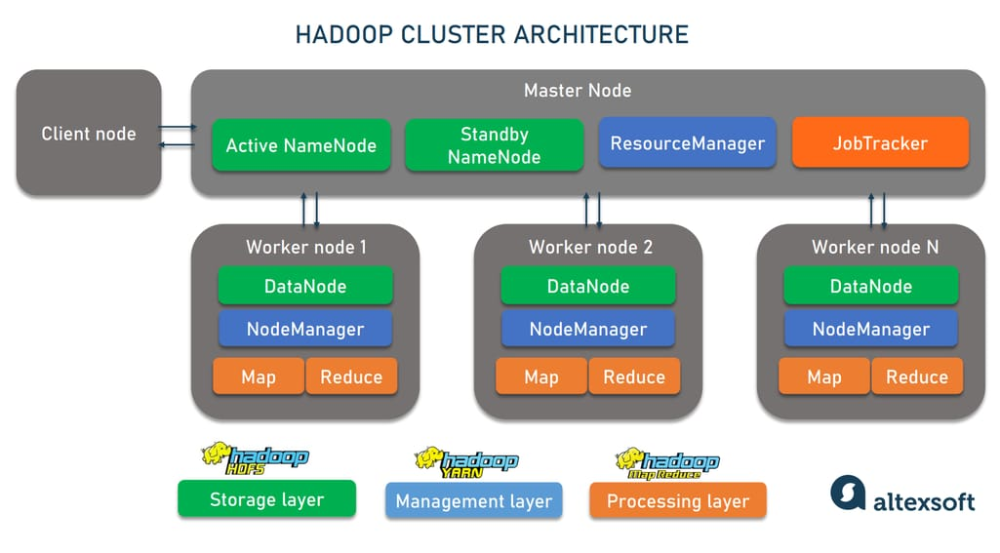
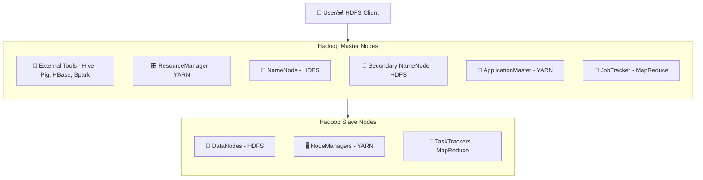
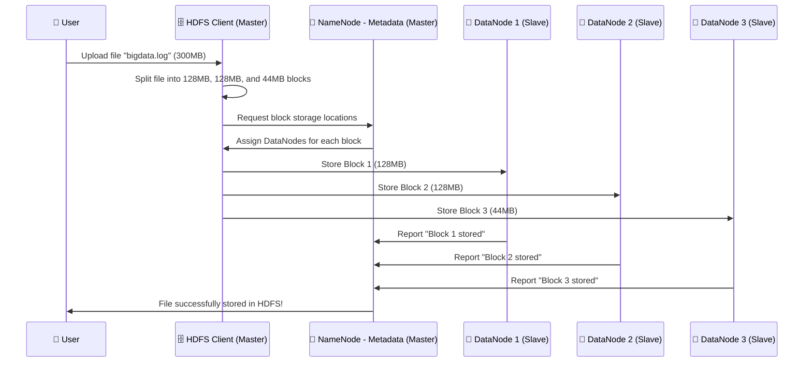
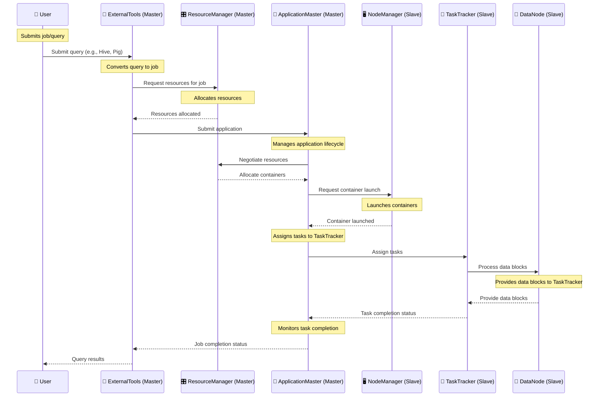

# 🏗 **Hadoop Architecture - Core Components & Execution Workflow**

Understanding **Hadoop’s execution workflow** is essential to see **how data flows through the system**. Hadoop follows a **Master-Slave architecture**, where the **Master nodes** manage the system, and the **Slave nodes** execute tasks.

Hadoop processing can be divided into **two main scenarios**:

- 1️⃣ **Storage Workflow** (When a file is stored in HDFS)
- 2️⃣ **Batch Processing Workflow** (When a user runs a query or submits a job)

---

    

---

## 🔥 **Hadoop Architecture - The Big Picture**

### **📌 Detailed Explanation:**

1. **Master Nodes**:

   - **NameNode (🧠)**: Manages metadata about the file system and locations of data blocks.
   - **Secondary NameNode (📜)**: Takes periodic snapshots of the NameNode's metadata but does not serve as a backup.
   - **ResourceManager (🎛)**: Central YARN component that allocates resources and manages the execution of distributed applications.
   - **ApplicationMaster (📝)**: Manages the lifecycle of applications, negotiates resources, and oversees task execution.
   - **External Tools (🐝)**: Tools like Hive (for SQL processing), Pig (for scripting), and HBase (for NoSQL database) interact with the Hadoop ecosystem to provide additional functionality.

2. **Slave Nodes**:
   - **DataNodes (💾)**: Store the actual data blocks. Handle read and write requests from clients and perform block replication.
   - **NodeManagers (🖥️)**: Run tasks on worker nodes and report resource usage to the ResourceManager.
   - **TaskTrackers (🔄)**: Execute individual tasks assigned by the MapReduce JobTracker.

### **📌 Key Components:**

#### **HDFS Components**

- **NameNode (🧠)**: Manages metadata and file locations in HDFS.
- **DataNode (💾)**: Stores actual data blocks in HDFS.
- **Secondary NameNode (📜)**: Takes periodic snapshots of the NameNode's metadata.

#### **MapReduce Components**

- **JobTracker**: Manages job scheduling and task assignment (not shown in the diagram).
- **TaskTracker (🔄)**: Executes tasks assigned by the JobTracker.

#### **YARN Components**

- **ResourceManager (🎛)**: Allocates resources and manages the execution of distributed applications.
- **NodeManager (🖥️)**: Manages resources and application containers on each node.
- **ApplicationMaster (📝)**: Manages the lifecycle of applications, including resource negotiation and task execution.

## 📂 **Storage Workflow in HDFS (Step-by-Step)**

📌 **Explanation:**

- 1️⃣ The **HDFS Client** splits large files into blocks.
- 2️⃣ The **NameNode (Master)** assigns DataNodes for storage.
- 3️⃣ **DataNodes (Slaves)** store the actual data blocks.
- 4️⃣ The **NameNode tracks the metadata** (which block is stored where).

💡 **HDFS ensures data redundancy by replicating blocks across multiple nodes.**

---

## 🏗 **Batch Processing Workflow in Hadoop (Step-by-Step)**

### **Processing Workflow (Master/Slave)**

1. **User (👤)**: Submits a job or query through external tools like Hive or Pig.
2. **External Tools (Master) (🐝)**: Convert the query into a job and request resources from the ResourceManager.
3. **ResourceManager (Master) (🎛)**: Allocates resources and informs the External Tools.
4. **External Tools (Master) (🐝)**: Submit the application to the ApplicationMaster.
5. **ApplicationMaster (Master) (📝)**: Manages the application's lifecycle, negotiates resources, and requests container launch from NodeManagers.
6. **NodeManager (Slave) (🖥️)**: Launches the containers and informs the ApplicationMaster.
7. **ApplicationMaster (Master) (📝)**: Assigns tasks to TaskTrackers.
8. **TaskTracker (Slave) (🔄)**: Processes data blocks by interacting with DataNodes and provides the task completion status to the ApplicationMaster.
9. **ApplicationMaster (Master) (📝)**: Provides the job completion status to the External Tools.
10. **External Tools (Master) (🐝)**: Return the query results to the User.
