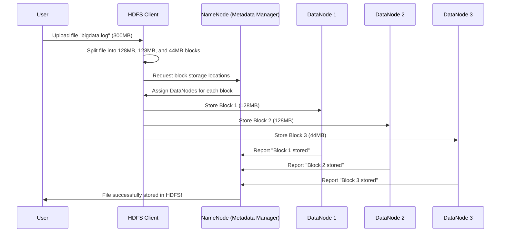

# 📂 **How HDFS Splits Large Files into Chunks for Storage** 🔍

Before diving deeper into **Apache Spark**, let’s first understand how **HDFS (Hadoop Distributed File System)** **splits large files into chunks** and distributes them across multiple nodes.

This process is **fundamental** to how **Big Data is stored efficiently in a distributed system**.

---

## 🏗 **1. Why Does HDFS Split Files into Chunks?**

A **single machine cannot store petabytes of data**, so HDFS **breaks files into blocks** and stores them **across multiple machines** in a cluster.

### 🔹 **Key Reasons for Splitting Files into Blocks:**

- ✔ **Scalability** – Large files can be stored across multiple machines.
- ✔ **Fault Tolerance** – If one node fails, the same block exists on other nodes.
- ✔ **Parallel Processing** – Different parts of the file can be processed simultaneously.

> 📌 **By default, HDFS splits files into** **128MB (or 256MB) blocks** and stores them across multiple nodes.

---

## 🔍 **2. Who Splits the File?**

When a file is **uploaded to HDFS**, the **HDFS Client** performs the following tasks:

- 1️⃣ **Breaks the file into fixed-size blocks (default: 128MB).**
- 2️⃣ **Sends each block to different DataNodes** for storage.
- 3️⃣ **Stores metadata (block location) in the NameNode.**

### 🏗 **Key Players in the File Splitting Process**

| Component       | Role                                           |
| --------------- | ---------------------------------------------- |
| **HDFS Client** | Splits the file into chunks before storing it. |
| **NameNode**    | Stores metadata (file-to-block mapping).       |
| **DataNodes**   | Store the actual data blocks.                  |

---

## 🔄 **3. Step-by-Step Process of File Splitting in HDFS**

Let’s say we have a **300MB file** named `bigdata.log` that we want to store in HDFS.

📂 **Step 1: HDFS Client Splits the File**

- The **HDFS Client** checks the file size (`300MB`).
- Since the default **HDFS block size** is `128MB`, the file is divided into:
  - **Block 1** → `128MB`
  - **Block 2** → `128MB`
  - **Block 3** → `44MB` (remaining data)

📂 **Step 2: Blocks Are Sent to Different DataNodes**

- HDFS **randomly assigns each block** to different DataNodes in the cluster.
- Each block is **replicated** (default: 3 copies) for **fault tolerance**.

📂 **Step 3: Metadata is Stored in NameNode**

- The **NameNode** keeps track of **which DataNode stores which block**.
- No actual file data is stored in the NameNode—**only metadata** (file-to-block mapping).

---

## 📊 **4. File Splitting and Storage in HDFS (Sequence Diagram)**

---

## 🔄 **5. Replication for Fault Tolerance**

HDFS does **not store a block on just one machine**—it **replicates each block** across the cluster.

| Block           | Primary DataNode | Replica 1  | Replica 2  |
| --------------- | ---------------- | ---------- | ---------- |
| Block 1 (128MB) | DataNode 1       | DataNode 2 | DataNode 3 |
| Block 2 (128MB) | DataNode 2       | DataNode 3 | DataNode 4 |
| Block 3 (44MB)  | DataNode 3       | DataNode 4 | DataNode 1 |

💡 **This ensures that if a DataNode fails, HDFS can still retrieve the data from another copy!**

---

## 🏁 **6. Summary of the Process**

- ✔ **The HDFS Client splits large files into 128MB (or 256MB) blocks.**
- ✔ **Each block is stored on different DataNodes in the cluster.**
- ✔ **The NameNode keeps track of block locations.**
- ✔ **Blocks are replicated across multiple DataNodes for fault tolerance.**
