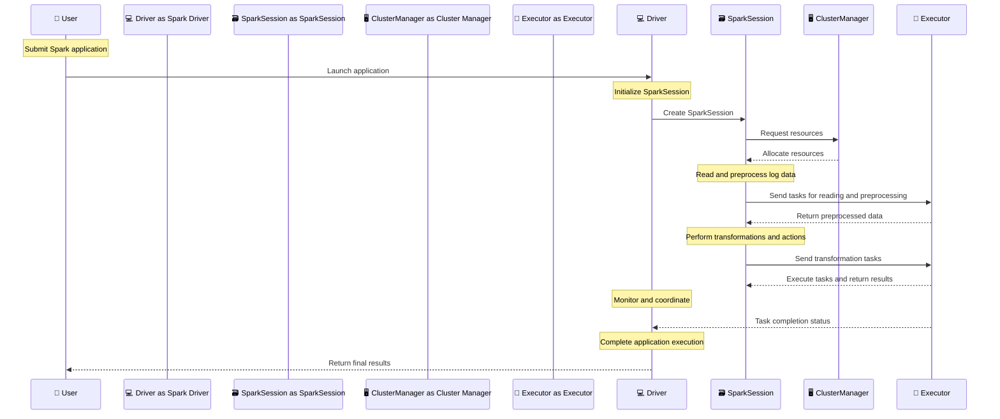

# 🚀 **Apache Spark - How Your Spark Application Works!** 🔥

So, you’ve heard about **SparkSession, SparkContext, and Spark Executors**, but how does your **Spark application actually work?** 🤯 Let’s break it down step by step!

---

## 🎯 **1. Real-World Example: Analyzing Web Server Logs**

Imagine you’re analyzing **web server logs** to extract:

- **The number of hits per URL** 📊
- **Top accessed URLs** 🔝
- **Unique visitors** 👥

To process this massive dataset, we’ll submit a **Spark application** that runs on a cluster. Let’s see what happens behind the scenes! 🕵️‍♂️

---

## **Components of a Spark Application**

1. **👤 User**: The individual or system submitting the Spark application.
2. **💻 Spark Driver**: The central coordination unit that supervises the entire Spark application.
3. **🗃️ SparkSession**: The entry point to programming Spark with the Dataset and DataFrame API.
4. **🖥️ Cluster Manager**: Manages resources for the cluster (e.g., YARN, Mesos, or Standalone).
5. **🔄 Executor**: Distributed agent responsible for executing tasks.

## **Sequence Diagram for Spark Application**



## **Workflow Steps Explained**

1. **Submit Spark Application**:

   - **👤 User** submits a Spark application to analyze web server logs, which is launched by the **💻 Spark Driver**.

2. **Initialize SparkSession**:

   - The **💻 Spark Driver** initializes the **🗃️ SparkSession**.
   - **🗃️ SparkSession** is the unified entry point for Spark functionalities introduced in Spark 2.0, combining the functionality of SQLContext, HiveContext, and SparkContext.

3. **Request Resources from Cluster Manager**:

   - The **🗃️ SparkSession** requests resources from the **🖥️ Cluster Manager**.
   - The **🖥️ Cluster Manager** allocates resources and assigns them to the **🗃️ SparkSession**.

4. **Read and Preprocess Log Data**:

   - The **🗃️ SparkSession** reads the web server log data from the specified source (e.g., HDFS).
   - Preprocessing tasks are sent to the **🔄 Executors** for execution.
   - **🔄 Executors** execute the preprocessing tasks and return the preprocessed data to the **🗃️ SparkSession**.
   - Example Code:

     ```python
     from pyspark.sql import SparkSession

     spark = SparkSession.builder \
         .appName("Web Server Logs Analysis") \
         .getOrCreate()

     logs_df = spark.read.text("hdfs:///path/to/logs")
     logs_df = logs_df.selectExpr("split(value, ' ')[0] as host",
                                  "split(value, ' ')[3] as timestamp",
                                  "split(value, ' ')[6] as url",
                                  "split(value, ' ')[8] as status",
                                  "split(value, ' ')[9] as content_size")
     ```

5. **Perform Transformations and Actions**:

   - The **🗃️ SparkSession** performs transformations (e.g., filtering, grouping) and actions (e.g., count, show) on the preprocessed data.
   - Transformation tasks are sent to the **🔄 Executors**.
   - **🔄 Executors** execute the transformation tasks and return the results to the **🗃️ SparkSession**.
   - Example Code:

     ```python
     url_counts_df = logs_df.groupBy("url").count().orderBy("count", ascending=False)
     ```

6. **Monitor and Coordinate**:

   - The **💻 Spark Driver** monitors and coordinates the execution of tasks.
   - **🔄 Executors** report task completion status to the **💻 Spark Driver**.

7. **Complete Application Execution**:

   - The **💻 Spark Driver** completes the application execution and returns the final results to the **👤 User**.
   - Example Code:

     ```python
     url_counts_df.show()
     ```
