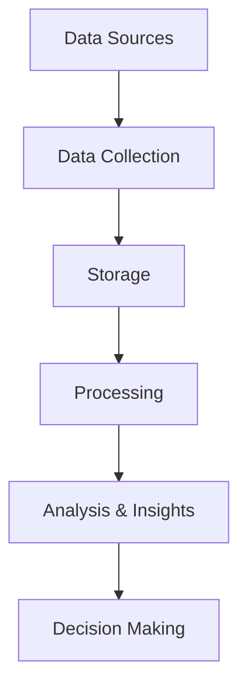
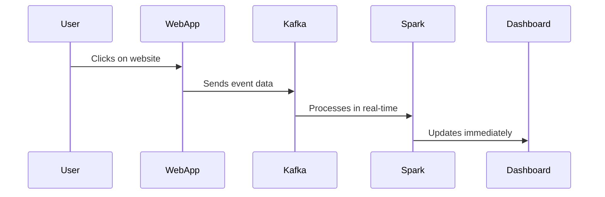

# 🤯 **Big Data - The Full Story You Wish You Knew!** 🚀

Welcome to the **world of Big Data**, where everything is **massive, messy, and moving at light speed**! If you’ve ever wondered **why your phone magically recommends ads for that weird thing you whispered about**—you’re already living in a **Big Data reality**.

Let’s break it all down **like a smart (and slightly sarcastic) human would**. 😎

---

## 🔥 **1. Big Data: What’s the Big Deal?**

### 📌 **What is Big Data, Really?**

Big Data isn’t just about having a lot of data. It’s about data that is **so ridiculously large and fast-moving** that traditional computers look at it and say, _"Nope, I’m out!"_

We're talking about **petabytes, exabytes, and zettabytes** of data. (Yeah, those are real words.)

### 🧠 **Big Data in a Sentence:**

> _"Too much data, coming too fast, from too many sources, and we need to make sense of it before it becomes an expensive pile of junk."_

---

## 🎭 **2. The 5 V’s of Big Data (Because 3 Weren’t Enough!)**

| 🏆 **V**     | 💡 **What It Means**                  | 📌 **Example**                                                      |
| ------------ | ------------------------------------- | ------------------------------------------------------------------- |
| **Volume**   | HUGE amounts of data                  | Facebook generates **4 petabytes** of data every day!               |
| **Velocity** | Data is coming in FAST                | Stock trading systems processing **millions of trades per second**. |
| **Variety**  | Different types of data               | Text, images, videos, social media posts, logs, IoT sensor data.    |
| **Veracity** | How accurate/trustworthy is the data? | Fake news, spam, inconsistent formats in datasets.                  |
| **Value**    | Is the data useful?                   | If we can predict a customer’s next purchase = \$\$\$.              |

Think of **Big Data like a messy closet**.

- Volume: It's overflowing.
- Velocity: You keep adding stuff every second.
- Variety: There are shoes, books, old receipts, and that weird hat from college.
- Veracity: Some stuff in there is garbage.
- Value: You need to find the **one** thing you actually need.

---

## 🏛 **3. How Does Big Data Work? (The “Smart” Way)**

Big Data isn’t just about **collecting** ridiculous amounts of data—it’s about **storing, processing, and making sense of it**.

### 🔄 **The Big Data Lifecycle**

- 1️⃣ **Collect It** – Data comes from sensors, websites, social media, machines, logs.
- 2️⃣ **Store It** – Dump it into HDFS, AWS S3, Google BigQuery.
- 3️⃣ **Process It** – Use Apache Spark, Flink, MapReduce to clean & transform it.
- 4️⃣ **Analyze It** – Query it using SQL, AI, or Python.
- 5️⃣ **Use It** – Make decisions, predictions, and profits. 💰

---

## ⚔ **4. Big Data vs. Traditional Data: The Ultimate Showdown**

| ⚡ **Feature**       | 📜 **Traditional Databases (SQL, RDBMS)** | 🚀 **Big Data Systems (NoSQL, Hadoop, Spark)**                |
| -------------------- | ----------------------------------------- | ------------------------------------------------------------- |
| **Data Size**        | Handles GB to TB                          | Handles PB to ZB                                              |
| **Processing Speed** | Slower, batch-based                       | Real-time, parallel processing                                |
| **Data Type**        | Mostly structured (tables, columns)       | Structured, semi-structured, unstructured (logs, videos, IoT) |
| **Scalability**      | Vertical (buy bigger servers)             | Horizontal (add more machines)                                |
| **Cost**             | Expensive (enterprise databases)          | Cheaper (cloud, open-source tools)                            |

Big Data is **NOT just a bigger database**. It’s **a whole new way of thinking about data**.

---

## ⚡ **5. Batch vs. Real-Time Processing (When Speed Matters)**

There are **two main ways to process data**:

🐢 **Batch Processing:**

- Think of it like cooking a big meal all at once.
- Example: Running a report **once a day** (Hadoop, SQL).
- Use case: Payroll processing, sales reporting.

⚡ **Real-Time Streaming:**

- Think of it like **serving food as soon as it’s ready**.
- Example: Detecting **fraudulent credit card transactions instantly**.
- Use case: Stock market, self-driving cars, chat apps.

> 💡 If you need **immediate insights**, you go with **streaming**.  
> 💡 If you can **wait a few hours**, you go with **batch**.

---

## 🏗 **6. The Big Data Ecosystem (A Giant Tech Playground)**

Big Data isn’t one tool—it’s a whole **zoo** of technologies. Let’s break them down:

| 🚀 **Category**            | 🛠 **Popular Technologies**                 |
| -------------------------- | ------------------------------------------ |
| **Storage** 🗄              | HDFS, Amazon S3, Google BigQuery           |
| **Processing** 🔥          | Apache Spark, Flink, MapReduce             |
| **Streaming** ⏳           | Apache Kafka, Apache Flume, Amazon Kinesis |
| **Databases** 🏪           | HBase, Cassandra, MongoDB                  |
| **Workflow Management** 📋 | Apache Airflow, Oozie                      |
| **Querying** 🔎            | Hive, Presto, Trino                        |
| **Visualization** 📊       | Tableau, Power BI, Kibana                  |

Each of these tools has its own **special powers**, and we use them **together** to make sense of data.

---

## 🎯 **7. Real-World Use Cases of Big Data**

Let’s make this **real**—Big Data isn’t just for geeks, it’s **running the world**.

🔹 **Healthcare** 🏥 – Predicting diseases, tracking pandemics, personalized treatments.  
🔹 **Finance** 💰 – Fraud detection, stock market predictions.  
🔹 **E-commerce** 🛍 – Recommendation engines (Amazon, Netflix).  
🔹 **Social Media** 📱 – Sentiment analysis, targeted ads.  
🔹 **Cybersecurity** 🔐 – Threat detection, anomaly detection.

---

## 🏁 **8. Key Takeaways**

- ✅ Big Data is **not just a lot of data**—it’s about making **fast, smart decisions**.
- ✅ The **5 Vs** define what makes data "Big".
- ✅ **Batch vs. Streaming** depends on **how fast you need results**.
- ✅ The **Big Data ecosystem** is huge, with tools for **storage, processing, querying, and visualization**.
- ✅ Every industry is using Big Data to **gain an advantage**.

### 💡 **What’s Next?**

You **now understand Big Data** at a high level. Next, we’re diving into **Apache Spark**—the ultimate tool for Big Data processing. 🚀

🔹 Want to learn **Spark Architecture** first?  
🔹 Or do you want to start **coding with RDDs, DataFrames, and Spark SQL**?
