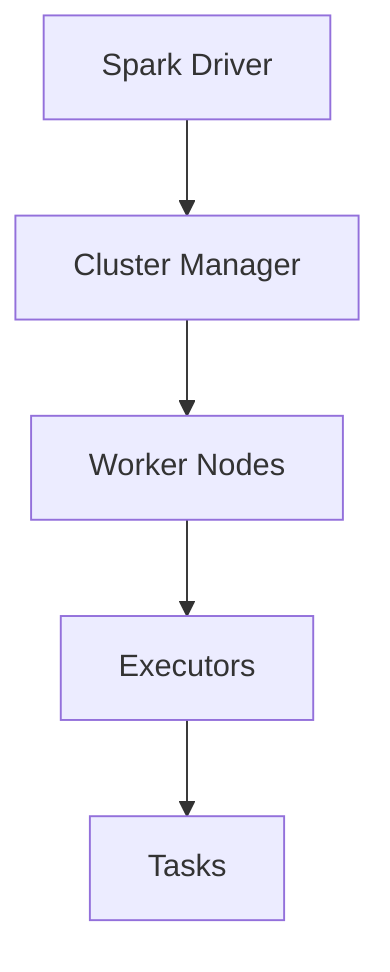

# 🚀 **Apache Spark - The Big Data Revolution! 🔥**

Now that we've covered **Hadoop**, let's dive into **Apache Spark**—the framework that made Big Data processing **faster, easier, and more powerful**.

This guide will break down:  
✔ **What Apache Spark is**  
✔ **How its architecture works**  
✔ **How it compares to Hadoop**  
✔ **Which parts of Hadoop it replaces (and which it doesn’t)**

Let’s get started! 🚀

---

## 🔥 **1. What is Apache Spark?**

Apache Spark is an **open-source, distributed computing system** designed for **fast, scalable** data processing. It’s known for its **in-memory computation**, which makes it **100x faster than Hadoop MapReduce**.

### 🔹 **Why Spark?**

✅ **Lightning-fast** – Performs computations **in-memory** instead of writing to disk like Hadoop.  
✅ **Real-time + Batch processing** – Can handle **both streaming and batch workloads**.  
✅ **Simple APIs** – Supports **Python (PySpark), Scala, Java, and SQL**.  
✅ **Multi-Purpose** – Used for **ETL, Machine Learning, Graph Processing, and Real-time Analytics**.

### 📌 **Spark vs. Hadoop: What’s the Difference?**

| Feature              | Hadoop (MapReduce)  | Apache Spark                     |
| -------------------- | ------------------- | -------------------------------- |
| **Speed**            | Slow (disk-based)   | 100x faster (in-memory)          |
| **Processing**       | Batch only          | Batch + Streaming                |
| **Ease of Use**      | Java-based, complex | Simple APIs (Python, Scala, SQL) |
| **Fault Tolerance**  | Data replication    | RDD lineage (automatic recovery) |
| **Machine Learning** | None                | Built-in MLlib library           |

💡 **Bottom Line:** If Hadoop is like **an old-school hard drive**, then Spark is **an ultra-fast SSD**. 🚀

---

## 🏗 **2. Apache Spark Architecture**

Unlike Hadoop, which relies on **MapReduce**, Spark follows a **Resilient Distributed Dataset (RDD)** model that enables **in-memory computing** for much faster performance.

### 🏛 **Key Components of Spark Architecture**



| Component              | Description                                                |
| ---------------------- | ---------------------------------------------------------- |
| **Spark Driver** 🎯    | The brain of the job, responsible for task coordination.   |
| **Cluster Manager** ⚡ | Manages resources (YARN, Kubernetes, Standalone, Mesos).   |
| **Worker Nodes** 🖥     | Machines that execute tasks.                               |
| **Executors** 🏗        | Processes running on worker nodes that execute Spark jobs. |
| **Tasks** 🛠            | Smallest unit of work in Spark.                            |

💡 **How Spark Works:**  
1️⃣ **Spark Driver** receives a job and divides it into **tasks**.  
2️⃣ **Cluster Manager** allocates resources across **worker nodes**.  
3️⃣ **Executors** on worker nodes **run the tasks in parallel**.  
4️⃣ Data is processed **in-memory**, avoiding slow disk writes.

🚀 **Result?** 10x - 100x faster than Hadoop MapReduce!

---

## 🏗 **3. Apache Spark vs. Hadoop: Does Spark Replace Hadoop?**

### 🔥 **Does Spark Replace Hadoop Completely?**

**No!** Spark is designed to **complement Hadoop, not replace it entirely**.

**Spark Replaces:**
✔ **MapReduce** (Spark’s in-memory engine is much faster).

**Spark Works With:**
✔ **HDFS** (Spark can read/write data stored in Hadoop).  
✔ **YARN** (Spark can use Hadoop’s resource manager).

### 🔹 **How Spark Works with Hadoop**

| Component                  | Does Spark Replace It? | Explanation                                            |
| -------------------------- | ---------------------- | ------------------------------------------------------ |
| **HDFS (Storage)**         | ❌ No                  | Spark can read/write from HDFS but doesn’t replace it. |
| **MapReduce (Processing)** | ✅ Yes                 | Spark replaces MapReduce for faster processing.        |
| **YARN (Cluster Manager)** | ❌ No                  | Spark can use YARN for resource allocation.            |

💡 **So, if you have an existing Hadoop cluster, you can use Spark as a faster processing engine instead of MapReduce!**

---

## ⚡ **4. Apache Spark Ecosystem - The Complete Picture**

Spark is not just a processing engine—it has a **whole ecosystem** of libraries that extend its capabilities.

```mermaid
graph TD
  A[Spark Core] --> B[Spark SQL]
  A --> C[Spark Streaming]
  A --> D[MLlib (Machine Learning)]
  A --> E[GraphX (Graph Processing)]
```

| Component           | Purpose                                |
| ------------------- | -------------------------------------- |
| **Spark Core**      | Core engine for distributed computing. |
| **Spark SQL**       | Query structured data using SQL.       |
| **Spark Streaming** | Real-time data processing.             |
| **MLlib**           | Machine Learning library.              |
| **GraphX**          | Graph processing library.              |

💡 **Example Use Cases:**

- **Spark SQL** – Run SQL queries on large datasets.
- **Spark Streaming** – Detect fraud in real-time banking transactions.
- **MLlib** – Predict customer churn using machine learning.
- **GraphX** – Analyze social network relationships.

---

## 🔥 **5. RDDs - The Heart of Spark**

**Resilient Distributed Datasets (RDDs)** are the **building blocks of Spark**.

### 🔹 **Why RDDs?**

✔ **Distributed** – Spread across multiple nodes.  
✔ **Fault-Tolerant** – Can recover lost data automatically.  
✔ **In-Memory Processing** – Faster than disk-based computation.

### 🛠 **How RDDs Work**

```mermaid
graph TD
  A[RDD Creation] --> B[Transformation (map, filter)]
  B --> C[Action (reduce, collect)]
```

💡 **Example:** Counting words using RDDs

```python
rdd = spark.textFile("data.txt")
word_counts = rdd.flatMap(lambda line: line.split(" ")).map(lambda word: (word, 1)).reduceByKey(lambda a, b: a + b)
word_counts.collect()
```

✅ **No disk writes between steps** → Faster performance!

---

## 🏁 **6. Summary: Spark vs. Hadoop**

| Feature              | Hadoop (MapReduce) | Apache Spark       |
| -------------------- | ------------------ | ------------------ |
| **Processing Speed** | Slow (disk-based)  | Fast (in-memory)   |
| **Processing Type**  | Batch Only         | Batch + Streaming  |
| **Ease of Use**      | Java-based         | Python, Scala, SQL |
| **Machine Learning** | None               | Built-in MLlib     |
| **Fault Tolerance**  | Data Replication   | RDD Lineage        |

### 🔹 **Key Takeaways**

✔ **Spark replaces Hadoop MapReduce but works with HDFS and YARN.**  
✔ **Spark is 100x faster than Hadoop due to in-memory processing.**  
✔ **RDDs, DataFrames, and Spark SQL make Spark easy to use.**  
✔ **Spark is widely used for real-time and machine learning workloads.**

---

## 🚀 **What’s Next?**

Now that you understand **Spark’s architecture and how it compares to Hadoop**, do you want to:

🔹 **Deep dive into RDDs and Spark’s Execution Model?**  
🔹 **Explore Spark Streaming for real-time data processing?**  
🔹 **Learn Spark SQL and DataFrames for working with structured data?**

Tell me what interests you the most! 🚀
