# 🐢 **Why Hadoop MapReduce is Slow?**

Hadoop MapReduce is known for its **batch-processing power**, but it suffers from **performance bottlenecks** due to **high disk I/O operations**. Let’s break down how it processes data and compare it to Spark.

---

## 📂 **Example: Word Count Job in Hadoop MapReduce**

```mermaid
sequenceDiagram
    participant 📄 Input
    participant 🗺️ Mapper
    participant 🔄 ShuffleSort
    participant 🔧 Reducer
    participant 📊 Output

    📄 Input->>🗺️ Mapper: "Hadoop is slow, Hadoop is powerful"
    note over 🗺️ Mapper: In-Memory
    🗺️ Mapper->>🔄 ShuffleSort: ("Hadoop",1), ("is",1), ("slow",1), ("Hadoop",1), ("is",1), ("powerful",1)

    note over 🔄 ShuffleSort: Disk I/O Write
    🔄 ShuffleSort-->🔧 Reducer: ("Hadoop",[1,1]), ("is",[1,1]), ("slow",[1]), ("powerful",[1])

    note over 🔧 Reducer: Disk I/O Read
    🔧 Reducer->>📊 Output: ("Hadoop",2), ("is",2), ("slow",1), ("powerful",1)
    note over 📊 Output: Disk I/O Write
```

**Explanation Steps**:

1. **Input**: The input text "Hadoop is slow, Hadoop is powerful" is split into lines and fed to the Mapper.
2. **Map Phase**: The Mapper processes each line and splits it into words. For each word, it emits a key-value pair (word, 1). Example: ("Hadoop", 1), ("is", 1), ("slow", 1), ("Hadoop", 1), ("is", 1), ("powerful", 1).
3. **Shuffle and Sort Phase**: The intermediate key-value pairs are shuffled and sorted by key. All values for the same key are grouped together. Example: ("Hadoop", [1, 1]), ("is", [1, 1]), ("slow", [1]), ("powerful", [1]).
4. **Reduce Phase**: The Reducer processes each group of key-value pairs and aggregates the values for each key to produce the final count. Example: ("Hadoop", 2), ("is", 2), ("slow", 1), ("powerful", 1).
5. **Output**: The final output is written to storage. Example: "Hadoop: 2, is: 2, slow: 1, powerful: 1".

---

## 🏗 **1. Hadoop MapReduce Execution Workflow**

```mermaid
sequenceDiagram
    participant 👤 User as User
    participant 💻 HDFSClient as HDFS Client
    participant 🧠 NameNode as NameNode (Metadata Manager)
    participant 💾 DataNode as DataNode (Storage)
    participant 🎛 ResourceManager as ResourceManager (YARN)
    participant 📝 ApplicationMaster as ApplicationMaster (YARN)
    participant 🔄 TaskTracker as TaskTracker (MapReduce)

    note over 👤 User: Submits word count job
    👤 User->>💻 HDFSClient: Submit job
    💻 HDFSClient->>🧠 NameNode: Request metadata for dataset
    🧠 NameNode-->>💻 HDFSClient: Metadata and block locations
    💻 HDFSClient->>💾 DataNode: Read data blocks
    note over 💾 DataNode: Disk I/O Read

    💾 DataNode-->>🔄 TaskTracker: Map task input
    note over 🔄 TaskTracker: In-Memory
    🔄 TaskTracker->>💾 DataNode: Write intermediate word counts
    note over 💾 DataNode: Disk I/O Write

    note over 🎛 ResourceManager: Allocate resources for Reduce tasks
    🎛 ResourceManager-->>📝 ApplicationMaster: Resources allocated
    📝 ApplicationMaster->>🔄 TaskTracker: Assign Reduce tasks
    🔄 TaskTracker-->💾 DataNode: Read intermediate word counts
    note over 💾 DataNode: Disk I/O Read
    note over 🔄 TaskTracker: In-Memory
    🔄 TaskTracker->>💾 DataNode: Write final word counts
    note over 💾 DataNode: Disk I/O Write
    💾 DataNode-->>💻 HDFSClient: Acknowledge task completion
    💻 HDFSClient-->>👤 User: Word count job complete
```

**Explanation Steps**:

1. **Job Submission**: The user submits a word count job through the HDFS Client, which contacts the NameNode for metadata and block locations.
2. **Map Phase**:
   - **Disk I/O Read**: DataNodes read the data blocks.
   - **In-Memory**: TaskTrackers process the input data blocks, split lines into words, and count occurrences.
   - **Disk I/O Write**: Intermediate word counts are written to DataNodes.
3. **Shuffle and Sort**: Intermediate data is shuffled and sorted by key (Disk I/O Write).
4. **Reduce Phase**:
   - **Disk I/O Read**: TaskTrackers read the intermediate word counts from DataNodes.
   - **In-Memory**: TaskTrackers aggregate the word counts.
   - **Disk I/O Write**: Final word counts are written to DataNodes.
5. **Final Data Storage**: HDFS Client receives acknowledgment of task completion and informs the user that the job is complete.

💡 **Disk I/O happens multiple times, slowing down execution.**

---

## ⚡ **2. Word Count Job in Apache Spark**

```mermaid
sequenceDiagram
    participant 👤 User as User
    participant 💻 SparkClient as Spark Client
    participant 🧠 NameNode as NameNode (Metadata Manager)
    participant 💾 DataNode as DataNode (Storage)
    participant 🎛 ResourceManager as ResourceManager (YARN)
    participant 📝 ApplicationMaster as ApplicationMaster (YARN)
    participant 🖥️ Executor as Executor (Spark)

    note over 👤 User: Submits word count job
    👤 User->>💻 SparkClient: Submit job
    💻 SparkClient->>🧠 NameNode: Request metadata for dataset
    🧠 NameNode-->>💻 SparkClient: Metadata and block locations
    💻 SparkClient->>💾 DataNode: Read data blocks
    note over 💾 DataNode: Disk I/O Read

    💾 DataNode-->>🖥️ Executor: Task input
    note over 🖥️ Executor: In-Memory
    🎛 ResourceManager-->>📝 ApplicationMaster: Resources allocated
    📝 ApplicationMaster->>🖥️ Executor: Assign tasks

    note over 🖥️ Executor: In-Memory
    🖥️ Executor-->💻 SparkClient: Intermediate data in memory
    note over 🖥️ Executor: In-Memory
    🖥️ Executor-->>💾 DataNode: Write final word counts
    note over 💾 DataNode: Disk I/O Write
    💾 DataNode-->>💻 SparkClient: Acknowledge task completion
    💻 SparkClient-->>👤 User: Word count job complete
```

**Explanation Steps**:

1. **Job Submission**: The user submits a word count job through the Spark Client, which contacts the NameNode for metadata and block locations.
2. **Map Phase (Transformation)**:
   - **Disk I/O Read**: DataNodes read the data blocks.
   - **In-Memory**: Executors process the input data, split lines into words, and count occurrences in memory.
3. **Shuffle and Sort**: Intermediate data is kept in memory and grouped by key (In-Memory).
4. **Reduce Phase (Action)**:
   - **In-Memory**: Executors aggregate the word counts in memory.
   - **Disk I/O Write**: Final word counts are written to DataNodes.
5. **Final Data Storage**: Spark Client receives acknowledgment of task completion and informs the user that the job is complete.

### 🔹 **Why is Spark Faster?**

- **In-Memory Execution** – Reduces disk writes and reads.
- **Lazy Evaluation** – Optimizes task execution before running.
- **Parallel Processing** – Tasks execute simultaneously, reducing bottlenecks.

---

## 🔥 **3. Hadoop MapReduce vs. Apache Spark**

| Feature              | Hadoop (MapReduce)                 | Apache Spark              |
| -------------------- | ---------------------------------- | ------------------------- |
| **Processing Speed** | Slow (disk-based)                  | 100x faster (in-memory)   |
| **Processing Type**  | Batch Only                         | Batch + Streaming         |
| **Ease of Use**      | Java-based                         | Python, Scala, SQL        |
| **Fault Tolerance**  | Data Replication                   | RDD Lineage               |
| **Disk I/O**         | High (reads/writes between phases) | Low (in-memory execution) |
| **Machine Learning** | None                               | Built-in MLlib            |

💡 **Apache Spark eliminates disk bottlenecks, making it significantly faster.**

---

## 🏁 **4. Key Takeaways**

- ✅ **Hadoop MapReduce is slow due to excessive disk I/O.**
- ✅ **Apache Spark processes data in-memory, making it much faster.**
- ✅ **Spark supports real-time processing, while MapReduce is batch-only.**
- ✅ **MapReduce is good for batch processing, but Spark is better for analytics & ML.**

---

## 🚀 **What’s Next?**

Now that you understand **why MapReduce is slow**, do you want to:
🔹 **Explore Spark RDDs and DataFrames?**
🔹 **Learn about Spark Streaming for real-time data processing?**

Let me know, and we’ll continue! 🚀
