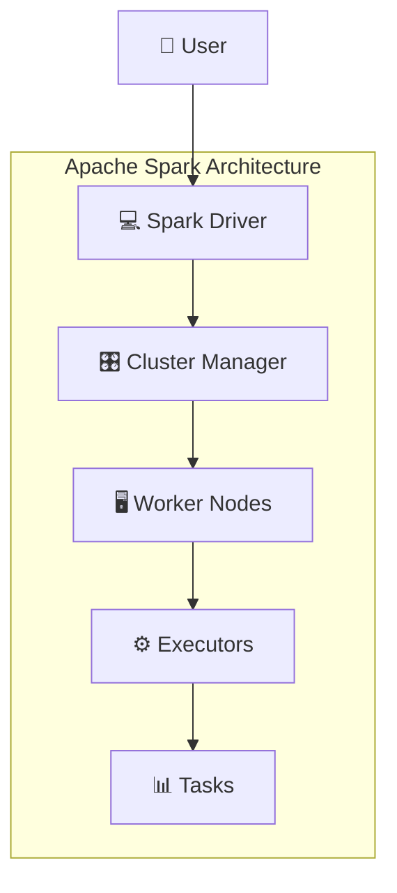
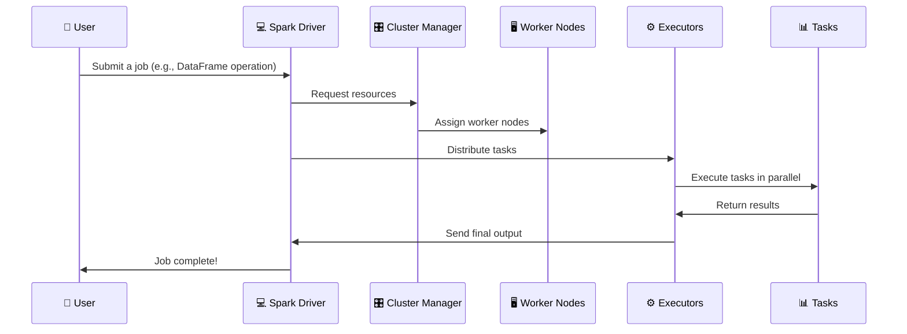

# 🚀 **Apache Spark - The Supercharged MapReduce Killer (But Not a Hadoop Replacement!)** 🔥

So, you’ve heard that **Apache Spark is the future** and that it’s **way faster than Hadoop**. But wait... does that mean **Spark replaces Hadoop?** Nope! 😵‍💫

Let’s break this down so it makes sense **without the buzzwords** and **with some humor** to keep you awake. 😆

---

## 🔥 **1. Spark is NOT a Replacement for Hadoop!**

### ❌ **What Spark Doesn’t Replace:**

- **HDFS (Storage)** → Spark doesn’t store data, it processes it.
- **YARN (Resource Manager)** → Spark can use YARN to allocate resources.
- **The Entire Hadoop Ecosystem** → Spark is **not** a data warehouse, a database, or a NoSQL engine.

### ✅ **What Spark Does Replace:**

- **MapReduce (Processing Engine)** → Spark takes over and **obliterates** MapReduce’s slow, disk-based execution.

💡 **Think of it like this:** If Hadoop is a restaurant, **HDFS is the kitchen**, **YARN is the manager**, and **MapReduce is the slow, outdated chef**. Spark is **the new, lightning-fast chef who cooks orders in memory instead of waiting for disk reads.** 🍽️⚡

---

## 🔗 **2. Spark is a Unified Analytics Engine** 🔄

While Hadoop’s MapReduce is **only good for batch processing**, Spark is like a **Swiss Army knife** for data analytics. It can handle:

- ✔ **Batch Processing** (Like MapReduce, but much faster)
- ✔ **Streaming Data** (Real-time processing with Spark Streaming)
- ✔ **SQL Queries** (With Spark SQL, just like Hive)
- ✔ **Machine Learning** (MLlib lets you train models at scale)
- ✔ **Graph Processing** (GraphX for analyzing relationships)

📌 **In simple terms:** Spark **does everything MapReduce can do and a whole lot more!** 💪

---

## 🏗 **3. Apache Spark Architecture - How the Magic Happens** 🎩✨

If you’ve ever been confused by **how Spark actually works**, let’s break it down **step by step**.

### **Key Components of Spark** 🔥

| **Component**         | **Description**                                                            |
| --------------------- | -------------------------------------------------------------------------- |
| **Spark Driver** 💻   | The **mastermind** that converts code into executable tasks.               |
| **Cluster Manager** 🎛 | Allocates resources (can be YARN, Kubernetes, or Spark’s own manager).     |
| **Worker Nodes** 🖥️   | Machines where Spark tasks run.                                            |
| **Executors** ⚙       | Run computations on worker nodes (think of them as tiny processing units). |
| **Tasks** 📊          | The smallest unit of execution in Spark.                                   |

### 🔄 **How Spark Processes a Job (Step-by-Step)**

📌 **Key Takeaways:**

- 1️⃣ **The Spark Driver** breaks the job into tasks and sends them to executors.
- 2️⃣ **Executors run on worker nodes** and process data in parallel.
- 3️⃣ **Final results are sent back to the Spark Driver.**

💡 **This entire process is in-memory, making Spark 100x faster than MapReduce!** ⚡

---

## 🔥 **4. Why Spark is Faster than MapReduce**

| Feature              | Hadoop MapReduce                   | Apache Spark              |
| -------------------- | ---------------------------------- | ------------------------- |
| **Processing Speed** | Slow (disk-based)                  | 100x faster (in-memory)   |
| **Processing Type**  | Batch Only                         | Batch + Streaming         |
| **Ease of Use**      | Java-based                         | Python, Scala, SQL        |
| **Fault Tolerance**  | Data Replication                   | RDD Lineage               |
| **Disk I/O**         | High (reads/writes between phases) | Low (in-memory execution) |
| **Machine Learning** | None                               | Built-in MLlib            |

💡 **Apache Spark eliminates disk bottlenecks, making it significantly faster.**

---

## 🏁 **5. Key Takeaways**

- ✅ **Spark replaces MapReduce, NOT Hadoop.**
- ✅ **It’s a unified analytics engine handling batch, streaming, SQL, ML, and graphs.**
- ✅ **Spark’s architecture is designed for in-memory execution, making it 100x faster.**
- ✅ **If Hadoop is a restaurant, Spark is the new, fast chef!** 🍽️🔥

---

## 🚀 **What’s Next?**

Now that you understand **why Spark is so powerful**, do you want to:
🔹 **Dive into RDDs and DataFrames?**
🔹 **Learn about Spark Streaming for real-time data processing?**

Let me know, and we’ll continue! 🚀
