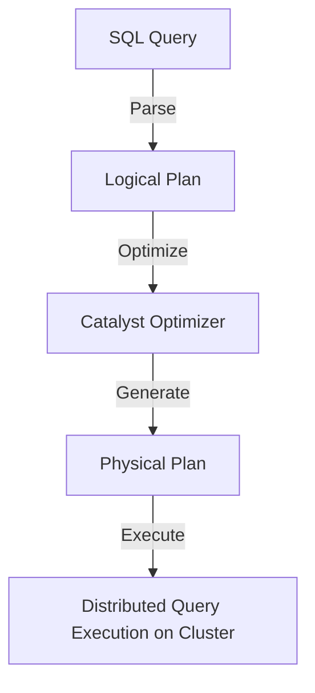

# 📊 **Deep Dive into Spark SQL** 🚀

**Spark SQL** is the module in **Apache Spark** that allows you to process **structured data** using SQL queries. It integrates with **DataFrames** and supports **querying large datasets efficiently**.

💡 If you know **SQL**, you can use **Spark SQL** to run **distributed queries** on **big data** without learning complex APIs!

---

## 🔥 **1. What is Spark SQL?**

**Spark SQL** provides:

- **SQL Query Support** 📝 → Run SQL queries on structured data.
- **Integration with DataFrames** 🔄 → Combines SQL with the power of Spark DataFrames.
- **Optimized Query Execution** 🚀 → Uses **Catalyst Optimizer** for faster performance.
- **Seamless Connection to Databases** 🔗 → Works with **Hive, MySQL, PostgreSQL, and more**.
- **Supports Multiple Languages** 🏗 → Use SQL queries in **Scala, Python, Java, and R**.

---

## 🏗 **2. How to Use Spark SQL?**

### **🔹 Creating a SparkSession (Entry Point for Spark SQL)**

```python
from pyspark.sql import SparkSession

# Initialize Spark Session
spark = SparkSession.builder.appName("Spark SQL Example").getOrCreate()
```

### **🔹 Creating a DataFrame (Structured Data for SQL Queries)**

```python
data = [("Alice", 25), ("Bob", 30), ("Charlie", 35)]
df = spark.createDataFrame(data, ["name", "age"])
df.show()
```

**🔹 Output:**

```ini
+-------+---+
|   name|age|
+-------+---+
|  Alice| 25|
|    Bob| 30|
|Charlie| 35|
+-------+---+
```

### **🔹 Running SQL Queries on DataFrame**

```python
df.createOrReplaceTempView("people")
result = spark.sql("SELECT * FROM people WHERE age > 25")
result.show()
```

**🔹 Output:**

```ini
+-------+---+
|   name|age|
+-------+---+
|    Bob| 30|
|Charlie| 35|
+-------+---+
```

💡 **SQL Queries in Spark SQL work just like standard SQL!**

---

## ⚙ **3. How Spark SQL Works Internally?**



### **🔹 Execution Steps:**

- 1️⃣ **SQL Query Parsing**: Converts SQL into a **Logical Plan**.
- 2️⃣ **Catalyst Optimizer**: Optimizes query execution for efficiency.
- 3️⃣ **Physical Plan Generation**: Defines how to execute the query.
- 4️⃣ **Execution on Cluster**: The query is executed **in parallel across multiple nodes**.

💡 **This process ensures high-performance query execution in Spark SQL!**

---

## 🔄 **4. Spark SQL vs. Traditional Databases**

| Feature             | Spark SQL                                    | Traditional SQL Databases |
| ------------------- | -------------------------------------------- | ------------------------- |
| **Processing Type** | Distributed (Parallel)                       | Single Machine            |
| **Scalability**     | Scales Across Clusters                       | Limited by Hardware       |
| **Performance**     | Optimized with Catalyst                      | Index-Based Optimization  |
| **Data Type**       | Works with Structured & Semi-Structured Data | Structured Only           |
| **Storage**         | HDFS, S3, Hive, etc.                         | Disk-Based Tables         |

💡 **Use Spark SQL when handling massive datasets that require distributed processing!**

---

## 🚀 **5. Advanced Features of Spark SQL**

### **🔹 Working with External Databases (JDBC Connection)**

```python
db_url = "jdbc:mysql://your_database_server/db_name"
properties = {"user": "your_user", "password": "your_password"}
df = spark.read.jdbc(url=db_url, table="users", properties=properties)
df.show()
```

### **🔹 Saving DataFrame as a Table**

```python
df.write.mode("overwrite").saveAsTable("users_table")
```

### **🔹 Using SQL Functions for Aggregation**

```python
from pyspark.sql.functions import avg

df.select(avg("age")).show()
```

---

## 🏁 **6. Key Takeaways**

- ✅ **Spark SQL lets you run SQL queries on big data at scale.**
- ✅ **It integrates seamlessly with DataFrames, Databases, and external storage.**
- ✅ **Catalyst Optimizer makes Spark SQL queries fast and efficient.**
- ✅ **Use Spark SQL when you need structured data processing with SQL queries!**

---
