# **🔄 What is ETL (Extract, Transform, Load) vs. ELT (Extract, Load, Transform)?**

## **🔍 Introduction**

ETL and ELT are two common **data integration processes** used to move data from different sources into **data warehouses or data lakes**.

| **Process**                        | **Best for**                    | **Key Difference**                                         |
| ---------------------------------- | ------------------------------- | ---------------------------------------------------------- |
| **ETL (Extract, Transform, Load)** | Traditional **Data Warehouses** | Data is **transformed before loading** into storage.       |
| **ELT (Extract, Load, Transform)** | **Data Lakes & Lakehouses**     | Data is **loaded first, then transformed** inside storage. |

Choosing **ETL or ELT** depends on **data size, processing power, and the target storage system**.

---

## **1️⃣ What is ETL (Extract, Transform, Load)?**

ETL **extracts** data, **transforms** it into a structured format, and then **loads** it into a data warehouse.

### **📌 How ETL Works (Step-by-Step)**

- 1️⃣ **Extract** → Data is pulled from multiple sources (databases, APIs, logs).
- 2️⃣ **Transform** → Data is **cleaned, structured, and enriched** before storing.
- 3️⃣ **Load** → The transformed data is stored in a **data warehouse (Amazon Redshift, Snowflake, BigQuery)**.

```mermaid
sequenceDiagram
    participant Source as 📡 Source Data (Databases, APIs, Logs)
    participant ETLTool as 🔄 ETL Processing (AWS Glue, Talend, Apache NiFi)
    participant Warehouse as 🏢 Data Warehouse (Amazon Redshift, Snowflake, BigQuery)
    participant User as 👩‍💻 Analyst

    Source->>ETLTool: Extract Raw Data
    ETLTool->>ETLTool: 🛠️ Transform (Clean, Filter, Aggregate)
    ETLTool->>Warehouse: 📥 Load Transformed Data
    Warehouse->>User: 📊 Provide Structured Data for Queries
```



### **✅ Pros & Cons of ETL**

| Feature          | ✅ Pros                                       | ❌ Cons                                                |
| ---------------- | --------------------------------------------- | ------------------------------------------------------ |
| **Best for**     | Structured, relational data warehouses        | Not scalable for big data                              |
| **Processing**   | Ensures clean & validated data before loading | Transformation happens before storing, slowing process |
| **Performance**  | Optimized for **reporting & BI**              | High processing load on ETL tool                       |
| **Common Tools** | AWS Glue, Talend, Apache NiFi, Informatica    | Requires dedicated ETL infrastructure                  |

📌 **Example Use Case:**  
A **banking system** processes daily transactions and **loads clean financial data** into **Amazon Redshift** for **reporting & compliance**.

### **📚 References to Learn More**

- 🔹 **AWS Glue ETL Overview** – [link](https://docs.aws.amazon.com/glue/latest/dg/what-is-glue.html)
- 🔹 **Talend ETL Documentation** – [link](https://help.talend.com/)

---

## **2️⃣ What is ELT (Extract, Load, Transform)?**

ELT **extracts** data, **loads** it into a data lake first, and **transforms it inside the storage system**.

### **📌 How ELT Works (Step-by-Step)**

- 1️⃣ **Extract** → Data is pulled from multiple sources.
- 2️⃣ **Load** → The raw data is **stored in a data lake (Amazon S3, Google Cloud Storage)**.
- 3️⃣ **Transform** → Data is processed **on demand** when queries or analytics require it.

```mermaid
sequenceDiagram
    participant Source as 📡 Source Data (Databases, APIs, Logs)
    participant DataLake as 🌊 Data Lake (Amazon S3, Google Cloud Storage)
    participant QueryEngine as 🚀 Query Engine (Athena, BigQuery, Snowflake)
    participant User as 👩‍💻 Analyst

    Source->>DataLake: 📥 Load Raw Data
    User->>QueryEngine: 🔍 Run Query (Transform Data On-Demand)
    QueryEngine->>DataLake: 🛠️ Process & Transform Data in Storage
    QueryEngine->>User: 📊 Return Processed Data
```



### **✅ Pros & Cons of ELT**

| Feature          | ✅ Pros                                        | ❌ Cons                                         |
| ---------------- | ---------------------------------------------- | ----------------------------------------------- |
| **Best for**     | Big Data & Cloud Data Lakes                    | Requires powerful storage                       |
| **Processing**   | More scalable than ETL                         | Raw data remains unstructured until transformed |
| **Performance**  | Fast for massive datasets                      | Can be slow for real-time queries               |
| **Common Tools** | Amazon Athena, Snowflake, BigQuery, Databricks | Queries require computation resources           |

📌 **Example Use Case:**  
A **social media company** collects millions of user interactions **in Amazon S3**, then **transforms the data on-demand** using **AWS Athena** for machine learning insights.

### **📚 References to Learn More**

- 🔹 **AWS Athena for ELT** – [link](https://docs.aws.amazon.com/athena/latest/ug/what-is.html)
- 🔹 **Google BigQuery ELT Guide** – [link](https://cloud.google.com/solutions/bigquery-data-warehouse)

---

## **3️⃣ Key Differences: ETL vs. ELT**

| Feature                          | ETL (Extract, Transform, Load)                       | ELT (Extract, Load, Transform)                              |
| -------------------------------- | ---------------------------------------------------- | ----------------------------------------------------------- |
| **Where Transformation Happens** | Before storing in the data warehouse                 | Inside the data lake or query engine                        |
| **Best for**                     | Relational **Data Warehouses (Redshift, Snowflake)** | **Big Data & Data Lakes (Amazon S3, BigQuery, Databricks)** |
| **Processing Speed**             | Slower (requires pre-processing)                     | Faster for massive data                                     |
| **Flexibility**                  | Structured & cleaned before storing                  | Raw data is kept for flexible transformation                |
| **Cost**                         | Higher (dedicated ETL infrastructure)                | Lower (data stored first, processed later)                  |

---

## **4️⃣ When to Use ETL vs. ELT?**

| **Scenario**                                             | **Best Approach** |
| -------------------------------------------------------- | ----------------- |
| Need **structured data for BI reports**                  | ✅ ETL            |
| Working with **petabytes of unstructured data**          | ✅ ELT            |
| Compliance requires **pre-cleaned data**                 | ✅ ETL            |
| Running **machine learning on raw data**                 | ✅ ELT            |
| Want to minimize **data processing time upfront**        | ✅ ELT            |
| **Traditional data warehouse** (Redshift, Snowflake)     | ✅ ETL            |
| **Cloud-based analytics** (Athena, BigQuery, Databricks) | ✅ ELT            |

---

## **5️⃣ How Do ETL & ELT Work Together?**

Some companies use **both ETL & ELT** in their data pipelines:

- **ETL cleans structured data** for BI reports.
- **ELT handles large unstructured datasets** for analytics.

```mermaid
graph TD;
    A[Source Data (APIs, Databases)] -->|Extract| B[ETL Process (AWS Glue, Talend)];
    B -->|Load Clean Data| C[Data Warehouse (Amazon Redshift)];
    A -->|Extract & Load| D[Data Lake (Amazon S3)];
    D -->|On-Demand Processing| E[ELT Query Engine (Athena, BigQuery)];
    C -->|Reports & Dashboards| F[Business Users];
    E -->|AI & Machine Learning| G[Data Scientists];
```

📌 **How this works:**

- 1️⃣ **ETL moves structured data** → from sources to **Amazon Redshift for BI reports**.
- 2️⃣ **ELT loads raw data** → into **Amazon S3 for flexible transformations & ML**.
- 3️⃣ **Business users** → get reports from structured ETL data.
- 4️⃣ **Data scientists** → analyze raw ELT data for AI/ML models.

---

## **🎯 Summary**

- ✔ **ETL (Extract, Transform, Load)** → Cleans data **before storing**, best for structured **data warehouses**.
- ✔ **ELT (Extract, Load, Transform)** → Loads raw data first, then **transforms on demand**, best for **data lakes & big data**.
- ✔ **Use ETL for structured BI reporting**, and **ELT for scalable big data analytics**.
- ✔ **Cloud services like AWS Glue (ETL) and Athena (ELT) help automate data processing**.

🚀 **Next Step:** Would you like to explore **AWS Glue (ETL) vs. AWS Athena (ELT) in detail** or move to **Real-Time Data Processing (Streaming Data with Kinesis & Kafka)?**
