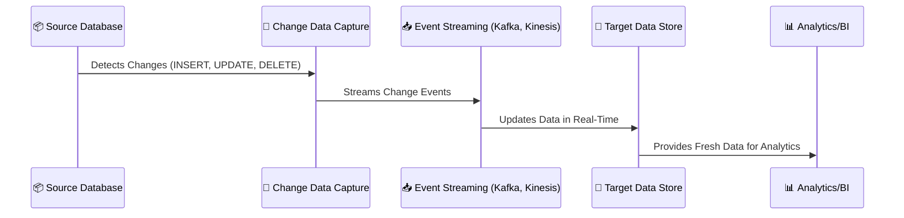
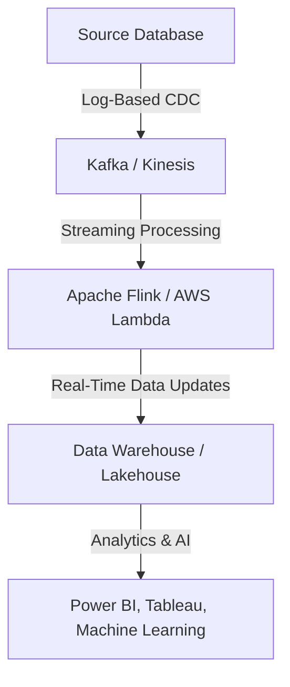

# **🔄 Change Data Capture (CDC) – Real-Time Updates in Data Pipelines**

## **📌 Introduction to Change Data Capture (CDC)**

Change Data Capture (CDC) is a technique used to **track changes** in a database and capture them in real-time or near real-time. It ensures **incremental updates** instead of full database replication, reducing processing time and improving efficiency.

### **✅ Why Use CDC?**

- **Real-time data synchronization** across systems
- **Optimized ETL processing**, reducing resource consumption
- **Enables streaming architectures** for event-driven applications
- **Minimizes data transfer costs** by only processing changes

---

## **1️⃣ How Does CDC Work?**

CDC works by **capturing inserts, updates, and deletes** from a database and forwarding them to downstream systems like data warehouses, lakes, or streaming platforms.

### **📌 CDC Workflow**

---

## **2️⃣ Types of CDC Methods**

CDC can be implemented using different methods depending on the database capabilities.

| **CDC Method**          | **Description**                                   | **Best For**                          | **Common Tools**                                    |
| ----------------------- | ------------------------------------------------- | ------------------------------------- | --------------------------------------------------- |
| **Log-Based CDC**       | Reads transaction logs to detect changes          | High-performance, minimal impact      | Debezium, AWS DMS, Kafka Connect                    |
| **Trigger-Based CDC**   | Uses database triggers to track row changes       | Fine-grained control, older databases | Custom SQL Triggers, PostgreSQL Logical Replication |
| **Timestamp-Based CDC** | Identifies changes based on `last_updated` column | Simple, easy to implement             | ETL Jobs with SQL Queries                           |
| **Batch Query CDC**     | Periodically queries for new or modified records  | Low-cost, but high latency            | Apache Nifi, Airflow, AWS Glue                      |

---

## **3️⃣ CDC in Modern Data Pipelines**

CDC is a key component of **real-time data pipelines**, enabling **fast data updates** across different systems.

### **📌 CDC in a Data Pipeline**

---

## **4️⃣ Common Use Cases for CDC**

✅ **Data Replication** → Keep data synchronized between OLTP & OLAP systems.  
✅ **Real-Time Analytics** → Update dashboards instantly when new data arrives.  
✅ **Event-Driven Applications** → Trigger actions based on database changes.  
✅ **Streaming ETL Pipelines** → Move only changed data instead of full loads.

---

## **5️⃣ CDC Tools & Technologies**

### **📌 CDC in AWS**

- **AWS DMS (Database Migration Service)** – Log-based CDC for AWS RDS, Aurora, DynamoDB.
- **AWS Kinesis Data Streams** – Streams CDC data for analytics.
- **AWS Lambda** – Processes and transforms CDC data.

### **📌 CDC in Apache Ecosystem**

- **Debezium** – Log-based CDC for MySQL, PostgreSQL, SQL Server.
- **Apache Kafka Connect** – Captures changes and streams them to consumers.
- **Apache Flink** – Processes CDC events in real time.

### **📌 CDC in Azure**

- **Azure Change Feed (CosmosDB)** – Built-in CDC for NoSQL databases.
- **Azure Event Hubs** – Streams CDC data in real-time.
- **Azure Stream Analytics** – Real-time processing of CDC events.

---

## **🚀 Summary**

✔ **CDC enables real-time data synchronization and analytics.**  
✔ **Log-based CDC is the most efficient approach for large databases.**  
✔ **CDC integrates with streaming platforms (Kafka, Kinesis) for event-driven architectures.**  
✔ **Common tools include AWS DMS, Debezium, Apache Kafka, and Azure Event Hubs.**

Would you like a **step-by-step guide on setting up CDC with a specific tool**? 😊
