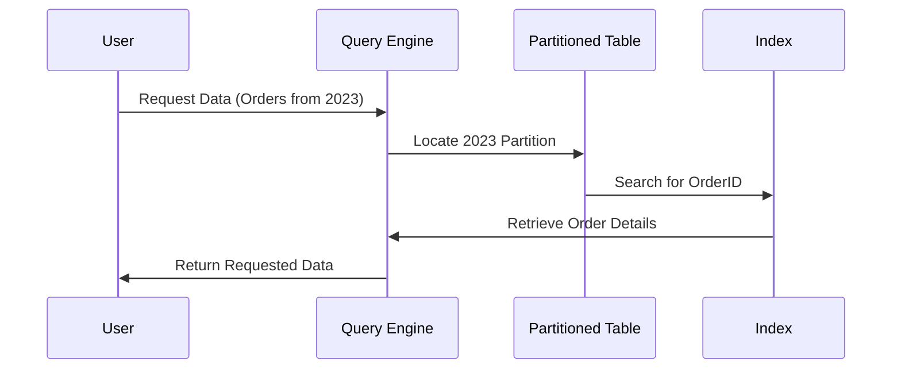

# **📂 What is Data Partitioning & Indexing?**

## **🔍 Introduction**

When working with **large datasets**, **Partitioning & Indexing** are essential for optimizing:  
✅ **Query performance** (faster searches).  
✅ **Data retrieval** (avoiding full table scans).  
✅ **Storage efficiency** (better organization of data).

Think of it this way:

- **Partitioning** = Dividing a phonebook by cities for **faster lookups**.
- **Indexing** = Using an alphabetically ordered **table of contents** to find names quickly.

These techniques are used in **databases, data warehouses, and big data systems**.

---

## **1️⃣ What is Data Partitioning? 🗂️**

### **📌 How It Works (Step-by-Step)**

1️⃣ **Choose a partition key** (e.g., Date, Region, ID).  
2️⃣ **Divide the data** into multiple partitions based on the key.  
3️⃣ **Query the relevant partition** instead of scanning the entire dataset.

### **📊 Example: Range Partitioning (By Year)**

| OrderID | Customer | OrderDate  | Partition |
| ------- | -------- | ---------- | --------- |
| 101     | Ali      | 2022-05-10 | 2022      |
| 102     | Sarah    | 2023-03-15 | 2023      |
| 103     | Omar     | 2024-07-21 | 2024      |

📌 **How it works:**

- When searching for **2023 orders**, the database **only scans the 2023 partition**, making retrieval much faster.

### **⚙️ Common Tools for Partitioning**

✔ **SQL Databases** → PostgreSQL, MySQL, SQL Server, Oracle.  
✔ **Big Data Systems** → Apache Hive, Apache Spark, Hadoop.  
✔ **Cloud Services** → Amazon Redshift, BigQuery, Snowflake.

### **📚 References to Learn Partitioning**

🔹 **PostgreSQL Partitioning Docs** – [link](https://www.postgresql.org/docs/current/ddl-partitioning.html)  
🔹 **AWS Redshift Partitioning Guide** – [link](https://docs.aws.amazon.com/redshift/latest/dg/c_designing-tables-best-practices.html)  
🔹 **BigQuery Partitioning Guide** – [link](https://cloud.google.com/bigquery/docs/partitioned-tables)

---

## **2️⃣ What is Data Indexing? 🔍**

### **📌 How It Works (Step-by-Step)**

1️⃣ **Create an index** on a column (e.g., Customer Name).  
2️⃣ **The database stores a sorted lookup table** for fast retrieval.  
3️⃣ **When searching, the query engine uses the index** instead of scanning the whole table.

### **📊 Example: Index on Customer Name**

| CustomerID | Name  | City   |
| ---------- | ----- | ------ |
| 101        | Ahmed | Cairo  |
| 102        | Sarah | Dubai  |
| 103        | Omar  | Riyadh |

📌 **How it works:**

- If we search for "Sarah", the database **uses the index** instead of checking each row one by one.

### **⚙️ Common Tools for Indexing**

✔ **SQL Databases** → PostgreSQL, MySQL, SQL Server.  
✔ **Big Data Indexing** → Apache Lucene, Elasticsearch.  
✔ **Cloud Services** → Amazon Aurora, Snowflake.

### **📚 References to Learn Indexing**

🔹 **PostgreSQL Indexing Guide** – [link](https://www.postgresql.org/docs/current/indexes.html)  
🔹 **Elasticsearch Indexing Basics** – [link](https://www.elastic.co/guide/en/elasticsearch/reference/current/getting-started-index.html)  
🔹 **MySQL Index Optimization** – [link](https://dev.mysql.com/doc/refman/8.0/en/optimization-indexes.html)

---

## **3️⃣ How Partitioning & Indexing Work Together?**

📌 **How it works:**  
1️⃣ The query **first filters the relevant partition** (e.g., orders from 2023).  
2️⃣ Then, it **uses an index** to quickly find specific rows.  
3️⃣ **Result:** **Much faster** query execution compared to scanning all data.

---

## **4️⃣ When to Use Partitioning & Indexing?**

| **Scenario**                      | **Use Partitioning?**           | **Use Indexing?**                |
| --------------------------------- | ------------------------------- | -------------------------------- |
| Querying large datasets 📊        | ✅ Yes (to reduce search space) | ✅ Yes (to speed up lookup)      |
| Searching for a specific value 🔍 | ❌ No                           | ✅ Yes (Index speeds up search)  |
| Analyzing historical data 📅      | ✅ Yes (Partition by date)      | ❌ No (Partitioning is enough)   |
| Updating data frequently ✏️       | ❌ No (Can be complex)          | ✅ Yes (Indexing speeds updates) |

---

## **🎯 Summary**

✔ **Partitioning splits data** into smaller chunks to **reduce search space**.  
✔ **Indexing creates a lookup table** for **fast searching**.  
✔ **Together, they improve performance** for **databases, data warehouses, and big data systems**.  
✔ **Use both wisely** depending on **query patterns and dataset size**.

🚀 **Next Step:** Would you like to explore **Lakehouse Architecture (Data Lake + Warehouse)** or move to **AWS services like Amazon S3, Redshift, and Athena**?
