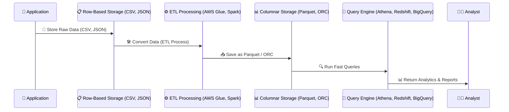

# **📂 Understanding Columnar Storage (Parquet, ORC) vs. Row-Based Storage (CSV, JSON)**

## **🔍 Introduction**

Data is stored in different formats depending on **how it's accessed and queried**. Two major storage formats are:

- **Row-Based Storage (CSV, JSON)** → Stores data **row by row** (best for transactional operations).
- **Columnar Storage (Parquet, ORC)** → Stores data **column by column** (best for analytics & queries).

Understanding **when to use row vs. columnar storage** can **greatly impact query speed, storage efficiency, and processing performance**.

---

## **1️⃣ What is Row-Based Storage? (CSV, JSON) 📋**

### **📌 How It Works (Step-by-Step)**

- 1️⃣ **Each row is stored sequentially** in a file or database.
- 2️⃣ **All column values of a row are stored together** (efficient for inserting/updating rows).
- 3️⃣ **Queries scan the entire file** even if they need just one column.

### **📊 Example: Row-Based Storage (CSV Format)**

```ini
ID, Name, Age, Salary
1, Ali, 30, 5000
2, Sarah, 28, 7000
3, Omar, 35, 8000
```

- **Each row is stored together** in a **comma-separated format**.
- If we **query only "Salary"**, the database **still has to read all columns** (slow).

### **✅ Pros & Cons**

| Feature               | ✅ Pros                           | ❌ Cons                                      |
| --------------------- | --------------------------------- | -------------------------------------------- |
| **Best for**          | Fast inserts & updates            | Slow analytical queries                      |
| **Query Performance** | Good for retrieving **full rows** | Inefficient for large datasets               |
| **Storage Size**      | Large (duplicates column names)   | Uses more space compared to columnar storage |
| **Common Formats**    | CSV, JSON                         | Not optimized for big data                   |

### **⚙️ Common Tools That Use Row-Based Storage**

- ✔ **Databases** → MySQL, PostgreSQL, MongoDB (NoSQL).
- ✔ **File Formats** → CSV (Comma-Separated Values), JSON (JavaScript Object Notation).
- ✔ **Cloud Storage** → Amazon S3, Azure Blob, Google Cloud Storage.

### **📚 References to Learn More**

- 🔹 **PostgreSQL CSV Import Guide** – [link](https://www.postgresql.org/docs/current/sql-copy.html)
- 🔹 **JSON Data Handling in MongoDB** – [link](https://www.mongodb.com/json-and-bson)

---

## **2️⃣ What is Columnar Storage? (Parquet, ORC) 📊**

### **📌 How It Works (Step-by-Step)**

- 1️⃣ **Data is stored column-by-column instead of row-by-row**.
- 2️⃣ **Each column is stored separately**, making queries for specific columns **much faster**.
- 3️⃣ **Optimized for big data analytics** where we process millions of rows at once.

### **📊 Example: Columnar Storage (Parquet Format)**

Instead of storing rows together like CSV, **Parquet stores data by columns**:

```ini
Column: ID → [1, 2, 3]
Column: Name → ["Ali", "Sarah", "Omar"]
Column: Age → [30, 28, 35]
Column: Salary → [5000, 7000, 8000]
```

- **Querying "Salary" only reads that column** (fast).
- **Storage is compressed**, reducing file size.

### **✅ Pros & Cons**

| Feature               | ✅ Pros                   | ❌ Cons                                     |
| --------------------- | ------------------------- | ------------------------------------------- |
| **Best for**          | Fast analytical queries   | Slower inserts/updates                      |
| **Query Performance** | Fast column-based queries | Not optimized for row retrieval             |
| **Storage Size**      | Compressed, efficient     | More complex than CSV/JSON                  |
| **Common Formats**    | Parquet, ORC              | Not widely supported in row-based databases |

### **⚙️ Common Tools That Use Columnar Storage**

- ✔ **Big Data Warehouses** → Amazon Redshift, Google BigQuery, Snowflake.
- ✔ **File Formats** → Apache Parquet, ORC (Optimized Row Columnar).
- ✔ **Cloud Storage & Processing** → AWS Athena, Databricks, Apache Spark.

### **📚 References to Learn More**

- 🔹 **Apache Parquet Docs** – [link](https://parquet.apache.org/)
- 🔹 **AWS Athena & Parquet Optimization** – [link](https://docs.aws.amazon.com/athena/latest/ug/parquet-optimization.html)

---

## **3️⃣ Key Differences: Row-Based vs. Columnar Storage**

| Feature          | Row-Based Storage 📋 (CSV, JSON)        | Columnar Storage 📊 (Parquet, ORC)              |
| ---------------- | --------------------------------------- | ----------------------------------------------- |
| **Data Layout**  | Stored **row by row**                   | Stored **column by column**                     |
| **Best For**     | Fast inserts & updates                  | Analytical queries                              |
| **Query Speed**  | Slow for large datasets                 | Fast for analytics                              |
| **Storage Size** | Large (no compression)                  | Small (compressed)                              |
| **Use Case**     | **Databases, OLTP (MySQL, PostgreSQL)** | **Big Data, OLAP (Athena, Redshift, BigQuery)** |

---

## **4️⃣ When to Use Row-Based vs. Columnar Storage?**

| **Scenario**                                        | **Best Storage Format**    |
| --------------------------------------------------- | -------------------------- |
| Storing transactional records (e.g., orders, users) | ✅ Row-Based (CSV, JSON)   |
| Querying millions of records for analytics          | ✅ Columnar (Parquet, ORC) |
| Logging real-time application events                | ✅ Row-Based (JSON, CSV)   |
| Running machine learning on large datasets          | ✅ Columnar (Parquet, ORC) |

---

## **5️⃣ How Do They Work Together?**

Many companies use **both formats** depending on the use case.  
Example:

- **Store raw data as JSON (row-based).**
- **Transform & optimize data into Parquet (columnar) for fast queries.**



📌 **How it works:**

- 1️⃣ The application **stores raw data** in CSV/JSON format.
- 2️⃣ **ETL tools (AWS Glue, Apache Spark) transform** and convert it into **Parquet/ORC**.
- 3️⃣ The optimized **Parquet/ORC data is stored** for faster queries.
- 4️⃣ **BI & Query engines (Athena, Redshift) process data quickly** for reports.
- 5️⃣ The analyst **gets instant insights** instead of waiting for slow queries.

---

## **🎯 Summary**

- ✔ **Row-Based Storage (CSV, JSON) is best for transactional databases** and real-time logs.
- ✔ **Columnar Storage (Parquet, ORC) is best for big data analytics** and fast queries.
- ✔ **Most companies use both** → Store raw data in row-based format, then **convert it to columnar for performance**.
- ✔ **Common tools for row-based storage** → MySQL, PostgreSQL, MongoDB, Amazon S3.
- ✔ **Common tools for columnar storage** → Parquet, ORC, AWS Athena, Google BigQuery.

🚀 **Next Step:** Would you like to dive into **ETL Processing (Extract, Transform, Load)** or explore **AWS Athena & Redshift** for working with columnar storage?
