# 🌀 Apache Airflow: Mastering Workflow Orchestration

## 🌟 What is Apache Airflow?

> “**Apache Airflow** is a platform to programmatically author, schedule, and monitor workflows.” – _Apache Airflow Docs_

It’s like a **conductor for your data pipelines**. Instead of manually handling every step of your ETL or ML workflows, you create a **DAG** (Directed Acyclic Graph) of tasks that Airflow executes and monitors.

---

## 📦 Key Concepts

| Term          | Description                                                    |
| ------------- | -------------------------------------------------------------- |
| **DAG**       | A Directed Acyclic Graph representing your workflow            |
| **Task**      | A single unit of work (e.g., run a script, query DB)           |
| **Operator**  | Wrapper for a task type (e.g., BashOperator, PythonOperator)   |
| **Executor**  | Determines how tasks are run (e.g., Local, Celery, Kubernetes) |
| **Scheduler** | Decides what to run and when                                   |
| **Web UI**    | Monitor and manage DAGs through a browser                      |

---

## 🛠️ Airflow Architecture (with Mermaid)

```mermaid
flowchart TD
    subgraph Airflow
        Scheduler["📅 Scheduler"]
        WebUI["🌐 Web UI"]
        Worker["⚙️ Worker"]
        MetadataDB["🗃️ Metadata DB"]
        Executor["🔧 Executor"]
    end

    Scheduler --> MetadataDB
    WebUI --> MetadataDB
    Scheduler --> Worker
    Worker --> MetadataDB
    Scheduler --> Executor
    Executor --> Worker
```



---

## ⚙️ Getting Started

### 🧪 1. Install via pip

```bash
pip install apache-airflow
```

Or use the official Docker-based setup:

```bash
curl -LfO 'https://airflow.apache.org/docs/apache-airflow/stable/docker-compose.yaml'
```

### 📁 2. Define your first DAG

```python
from airflow import DAG
from airflow.operators.bash import BashOperator
from datetime import datetime

with DAG('my_first_dag',
         start_date=datetime(2023, 1, 1),
         schedule_interval='@daily',
         catchup=False) as dag:

    hello = BashOperator(
        task_id='say_hello',
        bash_command='echo "Hello Airflow!"'
    )
```

---

## 🚀 Execution Modes

| Executor               | Description                              |
| ---------------------- | ---------------------------------------- |
| **SequentialExecutor** | Dev/testing, runs tasks one by one       |
| **LocalExecutor**      | Parallel execution on a single machine   |
| **CeleryExecutor**     | Scalable, distributed with message queue |
| **KubernetesExecutor** | Each task runs in its own K8s pod        |

---

## 🔌 Common Operators

| Operator                 | Use Case                       |
| ------------------------ | ------------------------------ |
| **BashOperator**         | Run bash scripts               |
| **PythonOperator**       | Run Python functions           |
| **EmailOperator**        | Send notifications             |
| **DockerOperator**       | Run tasks in Docker containers |
| **BranchPythonOperator** | Conditional branching          |
| **S3ToRedshiftOperator** | AWS data movement              |
| **SparkSubmitOperator**  | Trigger Spark jobs             |

See all official operators:  
📘 [Airflow Provider Packages](https://airflow.apache.org/docs/apache-airflow-providers/index.html)

---

## 🧠 Advanced Features

### 📌 1. XCom (Cross-Communication)

Pass data between tasks:

```python
task1.xcom_push(key='my_key', value='my_value')
task2.xcom_pull(task_ids='task1', key='my_key')
```

### 🔁 2. Task Dependencies

```python
task1 >> task2  # task1 runs before task2
```

### 🔁 3. Trigger Rules

E.g., `TriggerRule.ALL_FAILED`, `TriggerRule.ONE_SUCCESS`

---

## 📡 Monitoring & Observability

- **Web UI**: Real-time DAG visualization
- **Logs**: Task-level logging
- **Metrics**: Prometheus, StatsD integrations
- **Alerts**: Email on failure/success

---

## 🧩 Extending Airflow

### ✨ Custom Plugins

You can create your own operators, sensors, hooks, and views.

📘 [Plugin Reference](https://airflow.apache.org/docs/apache-airflow/stable/plugins/index.html)

### 🔗 Airflow REST API

Manage DAGs and tasks programmatically.  
📘 [API Reference](https://airflow.apache.org/docs/apache-airflow/stable/stable-rest-api-ref.html)

---

## 🔐 Security Considerations

- Use **RBAC** for role-based access control
- Encrypt sensitive variables using **Fernet Key**
- Limit **XCom** usage for large data

---

## 🧪 Testing Airflow DAGs

- **Unit Testing** with `pytest` and `airflow.models.DAG`
- **Integration Testing** using test mode (`dag.test()`)
- **CI/CD Pipelines** with GitHub Actions or Jenkins

---

## 💡 Real-World Use Cases

| Use Case          | Tools                        |
| ----------------- | ---------------------------- |
| ETL Pipelines     | S3 → Redshift, Spark         |
| ML Workflows      | SageMaker, TensorFlow        |
| Web Scraping      | PythonOperator + MongoDB     |
| Data Monitoring   | SQL Sensor, EmailOperator    |
| Report Automation | BashOperator + EmailOperator |

---

## 🧱 Airflow + Other Tools

| Tool                   | How It Works                              |
| ---------------------- | ----------------------------------------- |
| **Amazon MWAA**        | Fully managed Airflow                     |
| **Kubernetes**         | K8sExecutor for autoscaling               |
| **dbt**                | Run dbt models via Bash or PythonOperator |
| **Great Expectations** | Data validation task in DAGs              |
| **Apache Spark**       | SparkSubmitOperator                       |

---

## 📚 Learn More (Official Docs)

- 🔗 [Airflow Main Docs](https://airflow.apache.org/docs/apache-airflow/stable/index.html)
- 🔗 [Deployment with Docker](https://airflow.apache.org/docs/apache-airflow/stable/howto/docker-compose/index.html)
- 🔗 [Airflow Providers](https://airflow.apache.org/docs/apache-airflow-providers/index.html)
- 🔗 [Airflow GitHub Repo](https://github.com/apache/airflow)
- 🔗 [AWS MWAA](https://docs.aws.amazon.com/mwaa/latest/userguide/what-is-mwaa.html)

---

## 🧠 Pro Tips

- Use **catchup=False** to prevent backlog execution on new DAGs.
- Add **SLAs** for critical tasks using `sla` argument.
- Use **task groups** for better visualization.
